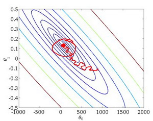

# 大规模数据的梯度下降

[TOC]


## 1.数据集增大是否有用

首先我们要确定数据集的正大是否对我们的训练模型有用

我们可以从一个1000个的小数据集开始训练


首先应该做的事是去检查一个这么大规模的训练集是否真的必要，也许我们只用1000个训练集也能获得较好的效果，我们可以绘制学习曲线来帮助判断。

- 高方差通过增大数据集是有效果的
- 高偏差通过增大数据集是无效的

## 2.随机梯度下降SGD（Stochastic Gradient Descent）

普通情况下我们的代价函数和梯度下降为

$J\left( \theta  \right)=\frac{1}{2m}\sum\limits_{i=1}^{m}{{{\left( {h_{\theta}}\left( {x^{(i)}} \right)-{y^{(i)}} \right)}^{2}}}​$

$\theta_j := \theta_j - \alpha \frac{1}{m}\sum\limits_{i=1}^{m}{{\left( {h_\theta}\left( \mathop{x}^{\left( i \right)} \right)-\mathop{y}^{\left( i \right)} \right)}}\mathop{x}_{j}^{(i)}$ 

- **随机梯度下降**

我们定义一个损失函数**cost它是单一样本的代价**

$$cost\left(  \theta, \left( {x}^{(i)} , {y}^{(i)} \right)  \right) = \frac{1}{2}\left( {h}_{\theta}\left({x}^{(i)}\right)-{y}^{{(i)}} \right)^{2}​$$

于是代价函数可以表示为所有样本代价的和

$J\left( \theta  \right)=\frac{1}{m}\sum\limits_{i=1}^{m}cost\left(  \theta, \left( {x}^{(i)} , {y}^{(i)} \right)  \right) $

首先对训练集随机洗牌，然后

 Repeat (usually anywhere between1-10){

  **for** $i = 1:m${

 ​       $\theta:={\theta}_{j}-\alpha\left( {h}_{\theta}\left({x}^{(i)}\right)-{y}^{(i)} \right){{x}_{j}}^{(i)}$      

​        (**for** $j=0:n$)

 ​    }
 }

- 梯度下降是在求和代价函数然后求偏微分，对每个样本遍历完以后才更新参数
- SGD是在每个样本算完以后就更新参数，后一个样本的参数已经被前一个样本更新过了。
  - 相当于普通梯度下降分解成小碎步

在梯度下降算法还没有完成一次迭代时，随机梯度下降算法便已经走出了很远。但是这样的算法存在的问题是，不是每一步都是朝着”正确”的方向迈出的。因此算法虽然会逐渐走向全局最小值的位置，但是可能无法站到那个最小值的那一点，而是在最小值点附近徘徊。


## 3.小批量梯度下降MBGD（Mini-Batch Gradient Descent ）

**批量梯度下降**： 计算所有样本后才更新参数

**SGD**：每一个样本计算完后就更新参数

- **MBGD是介于批量梯度下降和SGD之间的算法**

**每计算常数$b$次训练实例，便更新一次参数  ${{\theta }}$ 。**

 **for** $i = 1:m${

 ​       $\theta:={\theta}_{j}-\alpha\frac{1}{b}\sum_\limits{k=i}^{i+b-1}\left( {h}_{\theta}\left({x}^{(k)}\right)-{y}^{(k)} \right){{x}_{j}}^{(k)}$      

​       (**for** $j=0:n$)

​      $ i +=10 $   

 ​     }
 }

通常我们会令 $b$ 在 2-100 之间。这样做的好处在于，我们可以用**向量化的方式**来循环 $b$个训练实例，

如果我们用的线性代数函数库比较好，能够支持平行处理，那么算法的总体表现将不受影响（与随机梯度下降相同）。


## 4.随机梯度下降的收敛

在批量梯度下降中，我们可以令代价函数$J$为迭代次数的函数，绘制图表，根据图表来判断梯度下降是否收敛。但是，在大规模的训练集的情况下，这是不现实的，因为计算代价太大了。


- **随机梯度下降的收敛**

我们在每一次**更新 ${{\theta }}$ 之前**都计算一次这个样本的代价cost，然后每$x$次迭代后，求出这$x$次对训练实例计算代价的**平均值**，然后绘制这些平均值与$x$次迭代的次数之间的函数图表。

- **更新 ${{\theta }}$ 之前计算** 这是因为更新后，这个样本的代价肯定已经减小了
- 这$x$次对训练实例计算代价的**平均值**，通常是样本最后的1000个样本或者5000等等
  - 取最后的样本，意思是前面大部分样本更新后，梯度下降的大方向已经确定了，用最后的一部分样本平均cost来代替样本总共的J


- 左上第一幅图，
  - **蓝色线**整体cost实在下降的最终平稳之后收敛
  - **红色**表示用更小的学习率，所以下降的慢，平稳收敛的也慢，而且收敛时候的cost更小
- 右上第二幅图
  - **蓝色**表示用1000个样本的平均cost，曲线是震荡的
  - **红色**表示用5000个样本的平均cost，曲线平滑一些，因为5000更能反应整体的代价
- 左下第三幅图
  - **蓝色**表示用1000个样本计算平均cost，但是你的模型有问题，没有下降而是在一个平台震荡
  - **粉色**表示如果你用5000个样本计算平均cost，就发现震荡减小了，但是你的模型依然有问题，代价没有下降
  - 问题可能是总样本量不够，特征值不对，学习率太大等等
    - 如果是改进了问题，比如增大样本量，那么你会得到**红色**的曲线，cost开始下降了，但是下降的非常缓慢
- 右下第四幅图
  - 你的cost是增长的，说明你的模型有问题。可能需要一个较小的歇息率


当SGD下降到最小值的附近时候，和批量梯度下降不同，它会在最小值的附近来回徘徊，因为是每个样本都更新参数，相当于在目标点来回小碎步。这时候我们需要让学习率动态变化了

- **学习率动态变化**

可以令学习率随着迭代次数的增加而减小，例如令：

​							$$\alpha = \frac{const1}{iterationNumber + const2}$$

学习率随着迭代次数的增加逐渐变小，意味着接近目标时候小碎步变得很小很小。那么SGD在最值点的徘徊程度会降低，更加接近最值点。



但是通常我们不需要这样做便能有非常好的效果了，对$α$进行调整所耗费的计算通常不值得，这取决于你的计算性能。


## 5.在线学习

SGD可以看做是每个样本学习之后更新我们的模型，那么我们拓展一下思路，这个样本可以不是固定的已经取得的，而是即时的，在线获得的新样本。

- **在线学习**

如果我们有一个网站或者类似的系统，可以连续的获得实时数据流，那么我们可以仿照SGD，每一个实时的样本都用来更新我们的参数，更新完后就可以不用了，这就是在线学习

在线学习的好处就是可以实时的掌握这一段时间内用户的偏好。

- 例子

假使我们正在经营一家物流公司，每当一个用户询问从地点A至地点B的快递费用时，我们给用户一个报价，该用户可能选择接受（$y=1$）或不接受（$y=0$）。

现在，我们希望构建一个模型，来预测用户接受报价使用我们的物流服务的可能性。因此报价
是我们的一个特征，其他特征为距离，起始地点，目标地点以及特定的用户数据。模型的输出是:$p(y=1)$。

在线学习的算法与随机梯度下降算法有些类似，我们对单一的实例进行学习，而非对一个提前定义的训练集进行循环。
 Repeat forever (as long as the website is running) {
  Get $\left(x,y\right)$ corresponding to the current user 
​        $\theta:={\theta}_{j}-\alpha\left( {h}_{\theta}\left({x}\right)-{y} \right){{x}_{j}}$
​       (**for** $j=0:n​$) 
    }

一旦对一个数据的学习完成了，我们便可以丢弃该数据，不需要再存储它了。这种方式的好处在于，我们的算法可以很好的适应用户的倾向性，算法可以针对用户的当前行为不断地更新模型以适应该用户。

每次交互事件并不只产生一个数据集，例如，我们一次给用户提供3个物流选项，用户选择2项，我们实际上可以获得3个新的训练实例，因而我们的算法可以一次从3个实例中学习并更新模型。


# python代码

- 

## 4.随机梯度下降SGD

### 4.1 随机下降回归

```python
sklearn.linear_model.SGDRegressor
(loss='squared_loss', *, penalty='l2', alpha=0.0001, l1_ratio=0.15, fit_intercept=True, max_iter=1000, tol=0.001, shuffle=True, verbose=0, epsilon=0.1, random_state=None, learning_rate='invscaling', eta0=0.01, power_t=0.25, early_stopping=False, validation_fraction=0.1, n_iter_no_change=5, warm_start=False, average=False)
```

- **参数**
  - **loss： str, default=’squared_loss’**
    - 损失函数，字符串 默认是最小二乘损失
    - ‘huber’： 平滑的最小二乘，在小于参数ε时为最小二乘，当Huber损失在[0-δ,0+δ]之间时，等价为MSE，而在[-∞,δ]和[δ,+∞]时为MAE。
    - “ epsilon_insensitive” 忽略小于 ε的误差。使用的是SVR的损失函数。
    - “squared_epsilon_insensitive”  超过ε容差后变为平方损耗
    - https://scikit-learn.org/stable/modules/sgd.html#sgd-mathematical-formulation 参考公式
  - **penalty : {‘l2’, ‘l1’, ‘elasticnet’}, default=’l2’**
    - 默认值为“ l2”，这是线性SVM模型的标准正则化器。“ l1”和“ elasticnet”可能会给模型带来稀疏性（功能选择），而“ l2”是无法实现的。
      - **“ l2”** L2正则化
      - **‘l1’** L1正则化
      - **‘elasticnet’** L1和L2的联合
  - **alpha ：float, default=0.0001**
    - 正则化系数，越大正则化惩罚力度越大
  - **l1_ratio ：float, default=0.15**
    - **‘elasticnet’的参数 **其中0 <= l1_ratio <=1。l1_ratio = 0对应于L2惩罚，l1_ratio = 1到L1。仅在`penalty`为“ elasticnet”时使用。
  - **fit_intercept ：bool, default=True**
    - 默认为True,是否计算该模型的截距。如果使用中心化的数据，可以考虑设置为False,不考虑截距。注意这里是考虑，一般还是要考虑截距
  - **max_iter ： int, default=1000**
    - 最大迭代次数
  - **tol ：float, default=1e-3**
    - 迭代收敛的精度
  - **shuffle ：bool, default=True**
    - 在每一轮迭代之后是或否重新洗牌
  - **verbose : int, default=0**
    - 整数，可选的，控制调试信息的详尽程度
  - **epsilon : float, default=0.1**
    - 仅当`loss`是“ huber”，“ epsilon_insensitive”或“ squared_epsilon_insensitive”时
    - 调整这些loss函数中的ε阈值
  - **random_state : int, RandomState instance, default=None**
    - 当`shuffle`设置为`True`时候洗牌的参数
    - 如果为整数，则它指定了随机数生成器的种子。
    - 如果为RandomState实例，则指定了随机数生成器。
    - 如果为None，则使用默认的随机数生成器。
  - **learning_rate ： string, default=’invscaling’**
    - 字符串，学习率的侧罗
    - ‘constant’：eta=eta0  ，常数，学习率不变
    - ‘optimal’：eta = 1.0 / (alpha * (t + t0))默认值， 优化的学习率，会随着梯度调整
    - ‘invscaling’：eta = eta0 / pow(t, power_t)
    - ‘adaptive’ 自适应
  - **eta0  : double, default=0.01**
    - 浮点数，参与learning_rate计算，默认值为0
  - **power_t : double, default=0.25**
    - 参与learning_rate计算，默认值为0.5
  - **early_stopping : bool, default=False**
    - 当验证分数没有提高时是否使用提前停止来终止训练
    - 如果设置为True，它将自动预留一部分训练数据作为验证，并在该`score`方法返回的验证份数无法提高时终止训练
  - **validation_fraction : float, default=0.1**
    - 预留的训练数据比例作为早期停止的验证集。必须介于0和1之间。仅在`early_stopping`为True时使用。
  - **n_iter_no_change : int, default=5**
    - 训练器训练到无提升的情况后再迭代的次数
  - **warm_start : bool, default=False**
    - 设置为True时，使用之前的拟合得到的解继续拟合
  - **average : bool or int, default=False**
    - 布尔值，整数，可选的。True时，计算平均SGD权重并存储于coef_属性中。设置为大于1的整数时，拟合使用过的样本数达到average时，开始计算平均权重

- **属性**
  - **coef_**：数组，shape=(1, n_features)二元分类；(n_classes, n_features)多元分类
    - 训练器的参数w
  - **intercept_**：数组，决策函数中常量b。shape=(1, )二元分类；(n_classes, )多元分类
    - 截距
  - **average_intercept_ ：ndarray of shape (1,)**
    - 平均截距项。仅在时可用`average=True`。
  - **n_iter：整数**，
    - 训练结束时，实际的迭代次数。对于多元分类来说，该值为所有二元拟合过程中迭代次数最大的
  - **t_  ：int**
    - 权重的更新次数

- **方法**
  - **densify（）**
    - 将系数矩阵转换为密集阵列格式。
  - **fit(*X*, *y*, *sample_weight=None*)**
    - 训练分类器模型
  - **get_params(deep=True)**
    - deep ： bool 默认为True
    - 返回字典，估计器的各个设置参数
  - **predict（X）**
    - 用估计其预测X，得到预测值
  - **partial_fit（X，y，*sample_weight =无）**
    - 执行一次迭代得到的结果，在意外停止或者最后一次调用计算cost等情况下使用
  - **score(X,y,sample_weight)：**
    - 返回（X，y）上的准确率  R^2^
  - **sparsify()**：
    - 将系数矩阵转换为稀疏格式。
  - **set_params()**
    - 该估计其的设置


### 4.2 随机下降分类

```python
sklearn.linear_model.SGDClassifier
(loss='hinge', *, penalty='l2', alpha=0.0001, l1_ratio=0.15, fit_intercept=True, max_iter=1000, tol=0.001, shuffle=True, verbose=0, epsilon=0.1, n_jobs=None, random_state=None, learning_rate='optimal', eta0=0.0, power_t=0.5, early_stopping=False, validation_fraction=0.1, n_iter_no_change=5, class_weight=None, warm_start=False, average=False)
```

- **参数**
  - **loss： str, default=’hinge’**
    - 'hinge'：默认的loss函数，这是SVM的函数
    - ‘log’：对数损失函数，表示逻辑回归模型
    - ‘modified_huber’：’hing’和’log’损失函数的结合，表现两者的优点
    - ‘squared_hinge’：平方合页损失函数，表示线性SVM模型
    - ‘perceptron’：感知机损失函数
    - 回归的损失函数，也可以用于分类，详情见SGD线性回归: ‘squared_loss’, ‘huber’, ‘epsilon_insensitive’, or ‘squared_epsilon_insensitive’.
  - **penalty : {‘l2’, ‘l1’, ‘elasticnet’}, default=’l2’**
    - 默认值为“ l2”，这是线性SVM模型的标准正则化器。“ l1”和“ elasticnet”可能会给模型带来稀疏性（功能选择），而“ l2”是无法实现的。
      - **“ l2”** L2正则化
      - **‘l1’** L1正则化
      - **‘elasticnet’** L1和L2的联合
  - **alpha ：float, default=0.0001**
    - 正则化系数，越大正则化惩罚力度越大
  - **l1_ratio ：float, default=0.15**
    - **‘elasticnet’的参数 **其中0 <= l1_ratio <=1。l1_ratio = 0对应于L2惩罚，l1_ratio = 1到L1。仅在`penalty`为“ elasticnet”时使用。
  - **fit_intercept ：bool, default=True**
    - 默认为True,是否计算该模型的截距。如果使用中心化的数据，可以考虑设置为False,不考虑截距。注意这里是考虑，一般还是要考虑截距
  - **max_iter ： int, default=1000**
    - 最大迭代次数
  - **tol ：float, default=1e-3**
    - 迭代收敛的精度
  - **shuffle ：bool, default=True**
    - 在每一轮迭代之后是或否重新洗牌
  - **verbose : int, default=0**
    - 整数，可选的，控制调试信息的详尽程度
  - **epsilon : float, default=0.1**
  - **n_jobs ：int, default=None**
    - 并行计算的设置，-1 表示使用所有的cpu处理器
  - **random_state : int, RandomState instance, default=None**
    - 当`shuffle`设置为`True`时候洗牌的参数
    - 如果为整数，则它指定了随机数生成器的种子。
    - 如果为RandomState实例，则指定了随机数生成器。
    - 如果为None，则使用默认的随机数生成器。
  - **learning_rate ： string, default=’invscaling’**
    - 字符串，学习率的侧罗
    - ‘constant’：eta=eta0  ，常数，学习率不变
    - ‘optimal’：eta = 1.0 / (alpha * (t + t0))默认值， 优化的学习率，会随着梯度调整
    - ‘invscaling’：eta = eta0 / pow(t, power_t)
    - ‘adaptive’ 自适应
  - **eta0  : double, default=0.01**
    - 浮点数，参与learning_rate计算，默认值为0
  - **power_t : double, default=0.25**
    - 参与learning_rate计算，默认值为0.5
  - **early_stopping : bool, default=False**
    - 当验证分数没有提高时是否使用提前停止来终止训练
    - 如果设置为True，它将自动预留一部分训练数据作为验证，并在该`score`方法返回的验证份数无法提高时终止训练
  - **validation_fraction : float, default=0.1**
    - 预留的训练数据比例作为早期停止的验证集。必须介于0和1之间。仅在`early_stopping`为True时使用。
  - **n_iter_no_change : int, default=5**
    - 训练器训练到无提升的情况后再迭代的次数
  - **warm_start : bool, default=False**
    - 设置为True时，使用之前的拟合得到的解继续拟合
  - **average : bool or int, default=False**
    - 布尔值，整数，可选的。True时，计算平均SGD权重并存储于coef_属性中。设置为大于1的整数时，拟合使用过的样本数达到average时，开始计算平均权重
  - **class_weight :dict or ‘balanced’, default=None**
    - 与形式的类有关的权重。如果未给出，则所有类均应具有权重。`{class_label: weight}`
    - “balanced”模式使用y的值来自动调整与输入数据中的类频率成反比的权重。`n_samples / (n_classes * np.bincount(y))`
    - 请注意，如果指定了sample_weight，则这些权重将与sample_weight（通过fit方法传递）相乘

- **属性**
  - **coef_**：数组，shape=(1, n_features)二元分类；(n_classes, n_features)多元分类
    - 训练器的参数w
  - **intercept_**：数组，决策函数中常量b。shape=(1, )二元分类；(n_classes, )多元分类
    - 截距
  - **n_iter：整数**，
    - 训练结束时，实际的迭代次数。对于多元分类来说，该值为所有二元拟合过程中迭代次数最大的
  - **t_  ：int**
    - 权重的更新次数
  - **loss_function_**：使用的损失函数
  - **classes_*****array of shape (n_classes,)***

​	

- **方法**
  - **decision_function(X)**：
    - 对样本预测置信度得分
    - 二分类时候， 概率>0则为分类为1
  - **densify（）**
    - 将系数矩阵转换为密集阵列格式。
  - **fit(*X*, *y*, *sample_weight=None*)**
    - 训练分类器模型
  - **get_params(deep=True)**
    - deep ： bool 默认为True
    - 返回字典，估计器的各个设置参数
  - **predict（X）**
    - 用估计其预测X，得到预测值
  - **partial_fit（X，y，*sample_weight =无）**
    - 执行一次迭代得到的结果，在意外停止或者最后一次调用计算cost等情况下使用
  - **score(X,y,sample_weight)：**
    - 返回（X，y）上的的平均准确度
  - **sparsify()**：
    - 将系数矩阵转换为稀疏格式。
  - **set_params()**
    - 该估计其的设置