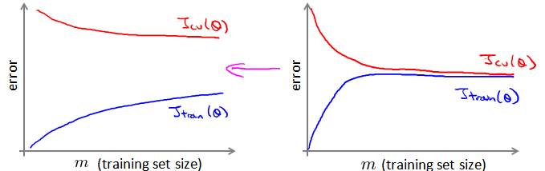

# 大规模数据的梯度下降

[TOC]

## 1.数据集增大是否有用

首先我们要确定数据集的正大是否对我们的训练模型有用

我们可以从一个1000个的小数据集开始训练

首先应该做的事是去检查一个这么大规模的训练集是否真的必要，也许我们只用1000个训练集也能获得较好的效果，我们可以绘制学习曲线来帮助判断。

- 高方差通过增大数据集是有效果的
- 高偏差通过增大数据集是无效的

## 2.随机梯度下降SGD（Stochastic Gradient Descent）

普通情况下我们的代价函数和梯度下降为

$J\left( \theta  \right)=\frac{1}{2m}\sum\limits_{i=1}^{m}{{{\left( {h_{\theta}}\left( {x^{(i)}} \right)-{y^{(i)}} \right)}^{2}}}​$

$\theta_j := \theta_j - \alpha \frac{1}{m}\sum\limits_{i=1}^{m}{{\left( {h_\theta}\left( \mathop{x}^{\left( i \right)} \right)-\mathop{y}^{\left( i \right)} \right)}}\mathop{x}_{j}^{(i)}$ 

- **随机梯度下降**

我们定义一个损失函数**cost它是单一样本的代价**

$$cost\left(  \theta, \left( {x}^{(i)} , {y}^{(i)} \right)  \right) = \frac{1}{2}\left( {h}_{\theta}\left({x}^{(i)}\right)-{y}^{{(i)}} \right)^{2}​$$

于是代价函数可以表示为所有样本代价的和

$J\left( \theta  \right)=\frac{1}{m}\sum\limits_{i=1}^{m}cost\left(  \theta, \left( {x}^{(i)} , {y}^{(i)} \right)  \right) $

首先对训练集随机洗牌，然后

 Repeat (usually anywhere between1-10){

  **for** $i = 1:m${

 ​       $\theta:={\theta}_{j}-\alpha\left( {h}_{\theta}\left({x}^{(i)}\right)-{y}^{(i)} \right){{x}_{j}}^{(i)}$      

​        (**for** $j=0:n$)

 ​    }
 }

- 梯度下降是在求和代价函数然后求偏微分，对每个样本遍历完以后才更新参数
- SGD是在每个样本算完以后就更新参数，后一个样本的参数已经被前一个样本更新过了。
  - 相当于普通梯度下降分解成小碎步

在梯度下降算法还没有完成一次迭代时，随机梯度下降算法便已经走出了很远。但是这样的算法存在的问题是，不是每一步都是朝着”正确”的方向迈出的。因此算法虽然会逐渐走向全局最小值的位置，但是可能无法站到那个最小值的那一点，而是在最小值点附近徘徊。

## 3.小批量梯度下降MBGD（Mini-Batch Gradient Descent ）

**批量梯度下降**： 计算所有样本后才更新参数

**SGD**：每一个样本计算完后就更新参数

- **MBGD是介于批量梯度下降和SGD之间的算法**

**每计算常数$b$次训练实例，便更新一次参数  ${{\theta }}$ 。**

 **for** $i = 1:m${

 ​       $\theta:={\theta}_{j}-\alpha\frac{1}{b}\sum_\limits{k=i}^{i+b-1}\left( {h}_{\theta}\left({x}^{(k)}\right)-{y}^{(k)} \right){{x}_{j}}^{(k)}$      

​       (**for** $j=0:n$)

​      $ i +=10 $   

 ​     }
 }

通常我们会令 $b$ 在 2-100 之间。这样做的好处在于，我们可以用**向量化的方式**来循环 $b$个训练实例，

如果我们用的线性代数函数库比较好，能够支持平行处理，那么算法的总体表现将不受影响（与随机梯度下降相同）。

## 4.随机梯度下降的收敛

在批量梯度下降中，我们可以令代价函数$J$为迭代次数的函数，绘制图表，根据图表来判断梯度下降是否收敛。但是，在大规模的训练集的情况下，这是不现实的，因为计算代价太大了。

- **随机梯度下降的收敛**

我们在每一次**更新 ${{\theta }}$ 之前**都计算一次这个样本的代价cost，然后每$x$次迭代后，求出这$x$次对训练实例计算代价的**平均值**，然后绘制这些平均值与$x$次迭代的次数之间的函数图表。

- **更新 ${{\theta }}$ 之前计算** 这是因为更新后，这个样本的代价肯定已经减小了
- 这$x$次对训练实例计算代价的**平均值**，通常是样本最后的1000个样本或者5000等等
  - 取最后的样本，意思是前面大部分样本更新后，梯度下降的大方向已经确定了，用最后的一部分样本平均cost来代替样本总共的J

- 左上第一幅图，
  - **蓝色线**整体cost实在下降的最终平稳之后收敛
  - **红色**表示用更小的学习率，所以下降的慢，平稳收敛的也慢，而且收敛时候的cost更小
- 右上第二幅图
  - **蓝色**表示用1000个样本的平均cost，曲线是震荡的
  - **红色**表示用5000个样本的平均cost，曲线平滑一些，因为5000更能反应整体的代价
- 左下第三幅图
  - **蓝色**表示用1000个样本计算平均cost，但是你的模型有问题，没有下降而是在一个平台震荡
  - **粉色**表示如果你用5000个样本计算平均cost，就发现震荡减小了，但是你的模型依然有问题，代价没有下降
  - 问题可能是总样本量不够，特征值不对，学习率太大等等
    - 如果是改进了问题，比如增大样本量，那么你会得到**红色**的曲线，cost开始下降了，但是下降的非常缓慢
- 右下第四幅图
  - 你的cost是增长的，说明你的模型有问题。可能需要一个较小的歇息率

当SGD下降到最小值的附近时候，和批量梯度下降不同，它会在最小值的附近来回徘徊，因为是每个样本都更新参数，相当于在目标点来回小碎步。这时候我们需要让学习率动态变化了

- **学习率动态变化**

可以令学习率随着迭代次数的增加而减小，例如令：

​							$$\alpha = \frac{const1}{iterationNumber + const2}$$

学习率随着迭代次数的增加逐渐变小，意味着接近目标时候小碎步变得很小很小。那么SGD在最值点的徘徊程度会降低，更加接近最值点。

但是通常我们不需要这样做便能有非常好的效果了，对$α$进行调整所耗费的计算通常不值得，这取决于你的计算性能。

## 5.在线学习

SGD可以看做是每个样本学习之后更新我们的模型，那么我们拓展一下思路，这个样本可以不是固定的已经取得的，而是即时的，在线获得的新样本。

- **在线学习**

如果我们有一个网站或者类似的系统，可以连续的获得实时数据流，那么我们可以仿照SGD，每一个实时的样本都用来更新我们的参数，更新完后就可以不用了，这就是在线学习

在线学习的好处就是可以实时的掌握这一段时间内用户的偏好。

- 例子

假使我们正在经营一家物流公司，每当一个用户询问从地点A至地点B的快递费用时，我们给用户一个报价，该用户可能选择接受（$y=1$）或不接受（$y=0$）。

现在，我们希望构建一个模型，来预测用户接受报价使用我们的物流服务的可能性。因此报价
是我们的一个特征，其他特征为距离，起始地点，目标地点以及特定的用户数据。模型的输出是:$p(y=1)$。

在线学习的算法与随机梯度下降算法有些类似，我们对单一的实例进行学习，而非对一个提前定义的训练集进行循环。
 Repeat forever (as long as the website is running) {
  Get $\left(x,y\right)$ corresponding to the current user 
​        $\theta:={\theta}_{j}-\alpha\left( {h}_{\theta}\left({x}\right)-{y} \right){{x}_{j}}$
​       (**for** $j=0:n$) 
    }

一旦对一个数据的学习完成了，我们便可以丢弃该数据，不需要再存储它了。这种方式的好处在于，我们的算法可以很好的适应用户的倾向性，算法可以针对用户的当前行为不断地更新模型以适应该用户。

每次交互事件并不只产生一个数据集，例如，我们一次给用户提供3个物流选项，用户选择2项，我们实际上可以获得3个新的训练实例，因而我们的算法可以一次从3个实例中学习并更新模型。

# python代码

## sklearn  SGDClassifier

- **sklearn.linear_model.SGDClassifier ** 随机梯度下降分类

- **(*loss=’hinge’*,            *penalty=’l2’*,                     *alpha=0.0001*,                            *l1_ratio=0.15*, *fit_intercept=True*,                   *max_iter=None*,                       *tol=None*,                      *shuffle=True*, *verbose=0*,                               *epsilon=0.1*,                             *n_jobs=1*,                       *random_state=None*,                            *learning_rate=’optimal’*,                        *eta0=0.0*, *power_t=0.5*,                                *class_weight=None*,                               *warm_start=False*, *average=False*, *n_iter=None*)**

  - **loss**：字符串，损失函数的类型。默认值为’hinge’

  - - ‘hinge’：合页损失函数，表示线性SVM模型
    - ‘log’：对数损失函数，表示逻辑回归模型
    - ‘modified_huber’：’hing’和’log’损失函数的结合，表现两者的优点
    - ‘squared_hinge’：平方合页损失函数，表示线性SVM模型
    - ‘perceptron’：感知机损失函数

  - **penalty**：字符串，罚项类型

  - - ‘l2’：2-范数罚项，默认值，线性SVM的标准正则化函数
    - ‘l1’：1-范数罚项
    - ‘elasticnet’：l2和l1的组合。

  - **alpha**：浮点数，罚项前的系数，默认值为0.0001。当参数learning_rate被设置成optimal的时候，该参数参与learning_rate值的计算

  - **l1_ratio**：浮点数，elasticnet罚项中l2和l1的权重。取值范围0<=l1_ratio<=1。默认值为0.15

  - **fit_intercept**：布尔值，是否估计截距，如果为假，认为数据已经中心化

  - **max_iter**：整数，可选的。迭代的最大次数，只影响fit方法，默认值为5。从0.21版以后，如果参数tol不是空，则默认值为1000

  - **tol**：浮点数或None，可选的。训练结束的误差边界。如果不是None，则当previous_loss-cur_loss<tol时，训练结束。默认值为None，从0.21版以后，默认值为0.001

  - - shuffle：布尔值，可选的。每轮迭代后是否打乱数据的顺序，默认为True
    - verbose：整数，可选的，控制调试信息的详尽程度
    - n_jobs：整数，可选的。训练多元分类模型时，使用CPUs的数量，-1为使用全部，默认值为1

  - **random_state**：打乱数据顺序的方式

  - **learning_rate**：字符串，可选的。学习速率的策略

  - - ‘constant’：eta=eta0
    - ‘optimal’：eta=1.0/(alpha*(t+t0))，默认值
    - ‘invscaling’：eta=eta0/pow(t, power_t)

  - **eta0**：浮点数，参与learning_rate计算，默认值为0

  - **power_t**：参与learning_rate计算，默认值为0.5

  - **class_weight**：词典{class_label:weight}或’balanced’或None，可选的。类别的权重。如果为None，则所有类的权重为1，’balanced’则根据y自动调节权重，使其反比于类别频率n_samples/(n_classes*np.bincount(y))

  - **warm_start**：布尔值，可选的。设置为True时，使用之前的拟合得到的解继续拟合

  - **average**：布尔值，整数，可选的。True时，计算平均SGD权重并存储于coef_属性中。设置为大于1的整数时，拟合使用过的样本数达到average时，开始计算平均权重

**属性**

- **coef_**：数组，shape=(1, n_features)二元分类；(n_classes, n_features)多元分类
- **intercept_**：数组，决策函数中常量b。shape=(1, )二元分类；(n_classes, )多元分类
- **n_iter：整数**，训练结束时，实际的迭代次数。对于多元分类来说，该值为所有二元拟合过程中迭代次数最大的
- **loss_function_**：使用的损失函数

**方法**

- **decision_function(X)**：对样本预测置信度得分
- **densify()**：将协方差矩阵转成数组
- **fit(X, y[, coef_init, intercept_init_,…])**：随机梯度下降法拟合线性模型
- **get_params([deep])**：返回分类器参数
- **partial_fit(X, y[, classes, sample_weight])**：增量拟合
- **score(X, y[, sample_weight])**：返回模型平均准确率
- **set_params(*args, **kwargs)**：设置模型参数
- **sparsify()**：将未知数矩阵w转成稀疏格式

## sklearn  SGDRgressor

**SGDRegressor**使用的参数与SGDClassifier模块中使用的参数几乎相同。区别在于“损失”参数。对于**SGDRegressor**模块的loss参数，正值如下所示-

- **squared_loss-**它是指普通的最小二乘拟合。
- **Huber：SGDRegressor-**通过从平方损失切换到线性损失超过ε距离来校正异常值。“休伯”的工作是修改“ squared_loss”，以使算法较少关注校正异常值。
- **epsilon_insensitive-**实际上，它忽略小于epsilon的错误。
- **squaredepsiloninsensitive-**与epsilon_insensitive相同。唯一的区别是，它变成超过ε容差的平方损耗。

另一个区别是名为'power*t'的参数的默认值是0.25，而不是**SGDClassifier中的** 0.5 。此外，它没有'class*weight'和'n_jobs'参数。