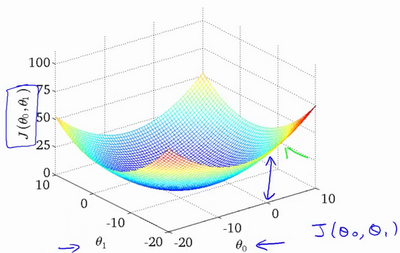
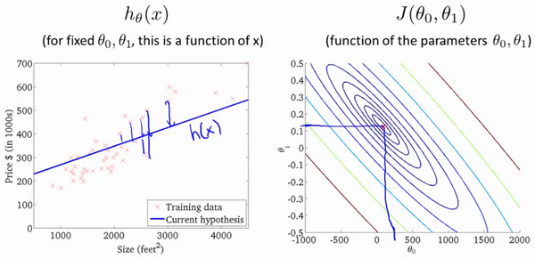
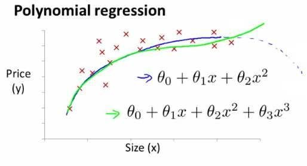

# 一机器学习

[TOC]

## 监督学习

- **监督学习**，给算法一个数据集，数据集由‘正确答案‘组成，然后根据已知的正确的样本来预测未知的数据结果
- ’**回归**：推测一系列连续值的结果
- **分类**：推测出离散的输出值：0或1
  - 可能不止两个值，而是很多和分类

## 无监督学习

- **无监督学习**：只有数据集但是未知标签和结果。

交给算法大量的数据，并让算法为我们从数据中找出某种结构

- **聚类算法**：无监督学习可能会把数据分成不同的簇

- **鸡尾酒问题和算法**：给定混合信号，如何分离出其中的不同的独立信号。


# 二、单变量线性回归（Linear Regression with One Variable）

- 线性回归的本质就是拟合一条曲线（多次项也可以看成一次项那么就是直线）h（x）
- 输出值就是连续的要得到的值
- 用拟合好的曲线来预测

## 1.单变量线性回归模型表示

- **监督学习**：数据集拥有正确的答案
- **回归问题**：根据之前数据预测出的一个准确的输出值。
- **分类**：推测出离散的输出值：0或1
  - 可能不止两个值，而是很多和分类

- **单变量线性回归**

我们将要用来描述这个回归问题的标记如下


- **𝑚** 代 表训练集中实例的数量
- **𝑥** 代表特征 /输入变量
- **𝑦** 代表目标变量 /输出变量
- **(𝑥,𝑦)** 代表训练集中的实例
- **(𝑥(𝑖),𝑦(𝑖))** 代表第 **𝑖** 个观察实例
- **ℎ** 代表学习算法的解决方案或函数也称为假设（ hypothesis）


一种可能的表达方式为（一次函数，直线）：
**ℎ𝜃(𝑥)=𝜃0+𝜃1𝑥**，因为只含有一个特征 /输入变量，因此这样
的问题叫作


## 2.假设函数h和代价函数J

- **ℎ𝜃(𝑥)=𝜃~0~+𝜃~1~𝑥** 这是假设函数
  - **𝜃<sub>0</sub>** 和 **𝜃<sub>1</sub>**表示**参数parameters**，在房价问题这个例子中便是直线的斜率和在y轴上的截距
  - **假设函数是关于样本特征X的函数**
-  $J \left( \theta_0, \theta_1 \right) = \frac{1}{2m}\sum\limits_{i=1}^m \left( h_{\theta}(x^{(i)})-y^{(i)} \right)^{2}$ **代价函数**
  - **代价函数是关于样本参数𝜃的函数**
  - 建模误差J （modeling error）**预测值和训练集汇总实际值回之间的差距
  - 使得建模误差的平方和能够最小的函数，这里用的是**误差平方函数**


## 3.代价函数 cost function理解

- **假设函数是关于样本特征X的函数**
  - 这里是个一次函数，表示一条直线
- **代价函数J 是关于样本参数𝜃的函数**
  - 每个𝜃都对应一个h
  - 是个二次函数，每个𝜃都对应一个代价，我们要找的就是使J最小的那个𝜃


- **简单情况，只有𝜃~0~没有𝜃~1~**


- **更复杂一点 同时拥有𝜃~0~𝜃~1~**
  - **h**是有截距的直线
  - **J**是个二元函数，空间曲面
    - 查看等高线





## 4.梯度下降

### 梯度

- **方向导数**

一元函数为切线，二元函数为切平面，那么二元函数在一点自然有无数条切线，所以多元函数的切线和方向有关。

一个二元函数的方向导数沿着 **e= （cosα，sinα）**方向的方向导数为


- **关于梯度**

  - 方向导数沿任意方向有无数个导数，哪个方向的导数变化率最快呢，求得上式中的**α**使得方向导数最大即可
    - 即当**e**这个方向和**g=f~x~ + f~y~** 的方向一致时，变化率最大，这个g就是梯度。

  - 梯度方向是函数值变化最快的方向，变化率大小就是梯度的模
    - 为什么非要求偏导，就是因为这是变化最快的方向


- **梯度下降**

-  知道了梯度的方向，每次将参数沿着这个反方向移动一点距离，反复迭代
  - **反方向**就是减，不管这一点的正负
  - 一点距离就是乘以**学习率**，因为梯度大小（变化率大小）不等于函数实际上会减小多少。有可能在这一点变化率很大但是函数减小慢慢变缓，所以学习率很重要
  - **对于一元函数只有正i和负i所以导数的大小其实不重要，你随便给一个值不是正方向就是反方向，**
    - **但是对于多元函数就不一样的了，方向有无数条，只有偏导的大小方向才是最快的方向。**


### 梯度下降

梯度下降是一个用来求函数最小值的算法，我们将使用梯度下降算法来求出代价函数$J(\theta_{0}, \theta_{1})$ 的最小值。

- 开始时我们随机选择一个参数的组合$\left( {\theta_{0}},{\theta_{1}},......,{\theta_{n}} \right)$，计算代价函数，然后我们寻找下一个能让代价函数值**下降最多的参数组合**。
- 我们持续这么做直到找到一个**局部最小值**（**local minimum**）

梯度下降注意点是：

- 通常最开从0开始

- 不能确定我们得到的**局部最小值**是否便是**全局最小值**（**global minimum**），
- **选择不同的初始参数组合，可能会找到不同的局部最小值。**


- **批量梯度下降**（**batch gradient descent**）算法的公式为：


- 其中

  - $a​$是**学习率**（**learning rate**），它决定了我们沿着能让代价函数下降程度最大的方向向下**迈出的步子**有多大。
    - α太小，你的跌打步数会太大
    - α太大，你的迭代不容易收敛，容易发散
    - 我们不用改变阿尔法的值，因为在解禁局部最小值时候，导数会逐渐趋向于0，所以卖出的步伐也会越来越小。

  **同步更新** 在批量梯度下降中，我们每一次都同时让所有的参数减去学习速率乘以代价函数的导数。


### 梯度下降的线性回归

对于单变量的线性回归用梯度下降算法，关键在于求出代价函数的导数

**$\frac{\partial }{\partial {{\theta }_{j}}}J({{\theta }_{0}},{{\theta }_{1}})=\frac{\partial }{\partial {{\theta }_{j}}}\frac{1}{2m}{{\sum\limits_{i=1}^{m}{\left( {{h}_{\theta }}({{x}^{(i)}})-{{y}^{(i)}} \right)}}^{2}}$**

$j=0$  时：$\frac{\partial }{\partial {{\theta }_{0}}}J({{\theta }_{0}},{{\theta }_{1}})=\frac{1}{m}{{\sum\limits_{i=1}^{m}{\left( {{h}_{\theta }}({{x}^{(i)}})-{{y}^{(i)}} \right)}}}​$

$j=1$  时：$\frac{\partial }{\partial {{\theta }_{1}}}J({{\theta }_{0}},{{\theta }_{1}})=\frac{1}{m}\sum\limits_{i=1}^{m}{\left( \left( {{h}_{\theta }}({{x}^{(i)}})-{{y}^{(i)}} \right)\cdot {{x}^{(i)}} \right)}$

则算法改写成：（Repeat）是迭代的意思

**Repeat {**

​                ${\theta_{0}}:={\theta_{0}}-a\frac{1}{m}\sum\limits_{i=1}^{m}{ \left({{h}_{\theta }}({{x}^{(i)}})-{{y}^{(i)}} \right)}$

​                ${\theta_{1}}:={\theta_{1}}-a\frac{1}{m}\sum\limits_{i=1}^{m}{\left( \left({{h}_{\theta }}({{x}^{(i)}})-{{y}^{(i)}} \right)\cdot {{x}^{(i)}} \right)}$

​               **}**

- **批量梯度下降**
  - 每一步我们都用到了所有的训练样本


# 三、多变量线性回归

## 1.多维特征

- **多维特征**

  -  **n**代表特征的数量

  - ${x^{\left( i \right)}}$代表第 $i$ 个训练实例，是特征矩阵中的第$i$行，是一个**向量**（**vector**）。

    ​				比方说，上图的

    ​					${x}^{(2)}\text{=}\begin{bmatrix} 1416\\\ 3\\\ 2\\\ 40 \end{bmatrix}$，这其实是一个行向量

    - ${x}_{j}^{\left( i \right)}$代表特征矩阵中第 $i$ 行的第 $j$ 个特征，也就是第 $i$ 个训练实例的第 $j​$ 个特征。

      ​			如上图的$x_{2}^{\left( 2 \right)}=3,x_{3}^{\left( 2 \right)}=2$，

      

- 支持多变量的**假设 $h$** 表示为：$h_{\theta}\left( x \right)={\theta_{0}}+{\theta_{1}}{x_{1}}+{\theta_{2}}{x_{2}}+...+{\theta_{n}}{x_{n}}$，

  - 这个公式中有**$n+1​$个参数和$n​$个变量**，为了使得公式能够简化一些，引入$x_{0}=1​$，则公式转化为：$h_{\theta} \left( x \right)={\theta_{0}}{x_{0}}+{\theta_{1}}{x_{1}}+{\theta_{2}}{x_{2}}+...+{\theta_{n}}{x_{n}}​$

此时模型中的参数是一个$n+1$维的向量，任何一个训练实例也都是$n+1$维的向量，


## 2.矩阵形式的假设函数

- **特征矩阵$X$的维度是  $m*(n+1)$**

 因此公式可以简化为：

- $h_{\theta} \left( x \right)={\theta^{T}}X$，其中上标$T$代表矩阵转置。（因为这里都是列向量，所以要转置）
  - X可以是m行N列也可以是n行m列，相应的公式会左乘或者右乘，X特征和y展开的方向是一样的
  - 所有的一维向量都是列向量，哪怕你取出行来也是列向量，把列向量展开就从变成行然后展开
    - （m，n） dot （n，1） = （m，1）
    - （1，n）dot（n，m）=（1，n）
    - 把m个样本看做一个样本Xn


## 3.多变量梯度下降

和单变量相似，我们也构建一个代价函数

$J\left( {\theta_{0}},{\theta_{1}}...{\theta_{n}} \right)=\frac{1}{2m}\sum\limits_{i=1}^{m}{{{\left( h_{\theta} \left({x}^{\left( i \right)} \right)-{y}^{\left( i \right)} \right)}^{2}}}$ ，

其中：$h_{\theta}\left( x \right)=\theta^{T}X={\theta_{0}}+{\theta_{1}}{x_{1}}+{\theta_{2}}{x_{2}}+...+{\theta_{n}}{x_{n}}$ ，

我们的目标和单变量线性回归问题中一样，是要找出使得代价函数最小的一系列参数。


求导后得到


当$n>=1$时，
${{\theta }_{0}}:={{\theta }_{0}}-a\frac{1}{m}\sum\limits_{i=1}^{m}{({{h}_{\theta }}({{x}^{(i)}})-{{y}^{(i)}})}x_{0}^{(i)}$

${{\theta }_{1}}:={{\theta }_{1}}-a\frac{1}{m}\sum\limits_{i=1}^{m}{({{h}_{\theta }}({{x}^{(i)}})-{{y}^{(i)}})}x_{1}^{(i)}$

${{\theta }_{2}}:={{\theta }_{2}}-a\frac{1}{m}\sum\limits_{i=1}^{m}{({{h}_{\theta }}({{x}^{(i)}})-{{y}^{(i)}})}x_{2}^{(i)}$

我们开始随机选择一系列的参数值，计算所有的预测结果后，再给所有的参数一个新的值，如此循环直到收敛。

**Python** 代码：

代价函数的实现

```python
def computeCost(X, y, theta):
    # numpy的数组 都是行为一维的，m个样本n个特征数量所以是X * theta.T，power是数组元素求n次方
    inner = np.power(((X * theta.T) - y), 2)
    return np.sum(inner) / (2 * len(X)) # 长度是m
```

梯度下降的实现

```python
def gradientDescent(X, y, theta, alpha, iters):
    temp = np.matrix(np.zeros(theta.shape))
    parameters = int(theta.ravel().shape[1])#展开
    cost = np.zeros(iters)
    
    for i in range(iters):
        error = (X * theta.T) - y
        
        for j in range(parameters):
            term = np.multiply(error, X[:,j])
            temp[0,j] = theta[0,j] - ((alpha / len(X)) * np.sum(term))
            
        theta = temp
        cost[i] = computeCost(X, y, theta)
        
    return theta, cost
```


### 3.1.梯度下降法实践1-特征缩放（feature scaling）——特征归一化 

在我们面对多维特征问题的时候，我们要保证这些特征都具有相近的尺度，这将帮助梯度下降算法更快地收敛。

以房价问题为例，尺寸的值为 0-2000平方英尺，而房间数量的值则是0-5，数量级相差太大，看出图像会显得很扁，梯度下降算法需要非常多次的迭代才能收敛。

解决的方法

- 是尝试将所有**特征的尺度**都尽量缩放到**-1到1**之间。如图：
  - 这里是将X1 X2特征值缩放到一个相同的尺度内
  - 同时可以做mean normalization 即特征值的平均值变成0
    - **X  变成 （X -mean（X））/S **   S是范围


python代码  用均值特征归一化

```python
data2 = (data2 - data2.mean()) / data2.std()
```


### 3.2梯度下降法实践2—学习率learning rate α

梯度下降算法的每次迭代受到学习率的影响，

- 如果学习率$a$过小，则达到收敛所需的迭代次数会非常高；

- 如果学习率$a$过大，每次迭代可能不会减小代价函数，可能会越过局部最小值导致无法收敛

通常可以考虑尝试些学习率：

$\alpha=0.01，0.03，0.1，0.3，1，3，10$

迭代次数和代价函数的曲线


也有一些自动测试是否收敛的方法，例如将代价函数的变化值与某个阀值（例如0.001）进行比较，但通常看上面这样的图表更好。

## 4特征的选择，和多项式回归

例如一个房价问题，给出的特征是房子的长fronttage和宽depth，我们可能会用这两个特征来给出假设函数

​					$h_{\theta}\left( x \right)={\theta_{0}}+{\theta_{1}}\times{frontage}+{\theta_{2}}\times{depth}$ 

但是其实长和宽并非独立性的，真正的特征应当是长乘以宽的面积所以

​					$x=frontage*depth=area​$

则假设函数应当为

​					${h_{\theta}}\left( x \right)={\theta_{0}}+{\theta_{1}}x$。

- **多项式回归**

- 线性回归并不适合所有的数据，有时候我们需要**多次方的多项式**
  - 一个二次方模型：$h_{\theta}\left( x \right)={\theta_{0}}+{\theta_{1}}{x_{1}}+{\theta_{2}}{x_{2}^2}​$
  - 三次方模型： $h_{\theta}\left( x \right)={\theta_{0}}+{\theta_{1}}{x_{1}}+{\theta_{2}}{x_{2}^2}+{\theta_{3}}{x_{3}^3}$ 



- **多项式回归的本质还是线性回归。要改变的只是你的特征值而已**

  - 我们可以令：

    ${{x}_{2}}=x_{2}^{2},{{x}_{3}}=x_{3}^{3}$，从而将模型转化为线性回归模型。

  - 根据函数图形特性，我们还可以使：

    ${{{h}}_{\theta}}(x)={{\theta }_{0}}\text{+}{{\theta }_{1}}(size)+{{\theta}_{2}}{{(size)}^{2}}$

    或者:

    ${{{h}}_{\theta}}(x)={{\theta }_{0}}\text{+}{{\theta }_{1}}(size)+{{\theta }_{2}}\sqrt{size}$

- **多项式回归必须注意特征值的归一化，**如果我们采用多项式回归模型，在运行梯度下降算法前，特征缩放非常有必要。

  - 比如X的范围是1~1000，你使用x的3次方后范围就变成 1—1000000000


# 四，正规方程算法处理线性回归

## 1.正规方程

到目前为止，我们都在使用梯度下降算法，但是对于某些线性回归问题，正规方程方法是更好的解决方案。如：


正规方程是通过求解下面的方程来找出使得代价函数最小的参数的：$\frac{\partial}{\partial{\theta_{j}}}J\left( {\theta_{j}} \right)=0$ 

假设我们的训练集特征矩阵为 $X$（包含了 ${{x}_{0}}=1$）并且我们的训练集结果为向量 $y$，则利用正规方程解出向量

- ​                                $\theta ={{\left( {X^T}X \right)}^{-1}}{X^{T}}y​$ 。
  - 上标**T**代表矩阵转置，上标-1 代表矩阵的逆。设矩阵$A={X^{T}}X$，则：

${{\left( {X^T}X \right)}^{-1}}={A^{-1}}​$

**如果我们的X矩阵十分简单的话，可以直接带入上式直接求出$\theta​$**

- **注意这里的X矩阵**每个样本是作为行向量存在的，那么X矩阵是个1Xm的列向量

- **注**：**对于那些不可逆的矩阵**（通常是因为特征之间不独立，如同时包含英尺为单位的尺寸和米为单位的尺寸两个特征，也有可能是特征数量大于训练集的数量），**正规方程方法是不能用的**。
  - 因为可逆矩阵一定是方阵，列或行线性相关一定不可逆


举个例子


梯度下降与正规方程的比较：

| 梯度下降                      | 正规方程                                                     |
| ----------------------------- | ------------------------------------------------------------ |
| 需要选择学习率$\alpha$        | 不需要                                                       |
| 需要多次迭代                  | 一次运算得出                                                 |
| 当特征数量$n$大时也能较好适用 | 需要计算${{\left( {{X}^{T}}X \right)}^{-1}}$ 如果特征数量n较大则运算代价大，因为矩阵逆的计算时间复杂度为$O\left( {{n}^{3}} \right)$，通常来说当$n$小于10000 时还是可以接受的 |
| 适用于各种类型的模型          | 只适用于线性模型，不适合逻辑回归模型等其他模型               |


正规方程的**python**实现：

```python
import numpy as np
    
 def normalEqn(X, y):
    
   theta = np.linalg.inv(X.T@X)@X.T@y 
#np.linalg.inv 意思为矩阵求逆
#X.T@X等价于X.T.dot(X)
    
   return theta
```


### 1.1正规方程求导详细过程

https://zhuanlan.zhihu.com/p/60719445详细对代价函数求导的过程,步骤如下：

**增加内容：**

$\theta ={{\left( {X^{T}}X \right)}^{-1}}{X^{T}}y$ 的推导过程：

$J\left( \theta  \right)=\frac{1}{2m}\sum\limits_{i=1}^{m}{{{\left( {h_{\theta}}\left( {x^{(i)}} \right)-{y^{(i)}} \right)}^{2}}}$
其中：${h_{\theta}}\left( x \right)={\theta^{T}}X={\theta_{0}}{x_{0}}+{\theta_{1}}{x_{1}}+{\theta_{2}}{x_{2}}+...+{\theta_{n}}{x_{n}}$ X是特征矩阵

将向量表达形式转为矩阵表达形式，则有$J(\theta )=\frac{1}{2}{{\left( X\theta -y\right)}^{2}}​$ ，其中$X​$为$m​$行$n​$列的矩阵（$m​$为样本个数，$n​$为特征个数），$\theta​$为$n​$行1列的矩阵，$y​$为$m​$行1列的矩阵，对$J(\theta )​$进行如下变换

- **这里X是 个m行n列的矩阵，在最开始的公式中时一个n行m列的矩阵**

- **（Xθ-Y）是一个一维向量，一维向量和他的转置相乘就是平方的一维向量**

$J(\theta )=\frac{1}{2}{{\left( X\theta -y\right)}^{T}}\left( X\theta -y \right)​$

​     $=\frac{1}{2}\left( {{\theta }^{T}}{{X}^{T}}-{{y}^{T}} \right)\left(X\theta -y \right)$

​     $=\frac{1}{2}\left( {{\theta }^{T}}{{X}^{T}}X\theta -{{\theta}^{T}}{{X}^{T}}y-{{y}^{T}}X\theta -{{y}^{T}}y \right)$

接下来对$J(\theta )​$偏导，需要用到以下几个矩阵的求导法则:

$\frac{dAB}{dB}={{A}^{T}}$ 

$\frac{d{{X}^{T}}AX}{dX}=2AX$                            

所以有:

$\frac{\partial J\left( \theta  \right)}{\partial \theta }=\frac{1}{2}\left(2{{X}^{T}}X\theta -{{X}^{T}}y -{}({{y}^{T}}X )^{T}-0 \right)​$

$=\frac{1}{2}\left(2{{X}^{T}}X\theta -{{X}^{T}}y -{{X}^{T}}y -0 \right)$

​           $={{X}^{T}}X\theta -{{X}^{T}}y$

令$\frac{\partial J\left( \theta  \right)}{\partial \theta }=0$,

则有$\theta ={{\left( {X^{T}}X \right)}^{-1}}{X^{T}}y$


# 五，sklearn 和python

## 1用python处理线性回归

```python
# 梯度下降
def gradientDescent(X, y, theta, alpha, iters):
    temp = np.matrix(np.zeros(theta.shape))
    parameters = int(theta.ravel().shape[1])
    cost = np.zeros(iters)
    
    for i in range(iters):
        error = (X * theta.T) - y
        
        for j in range(parameters):
            term = np.multiply(error, X[:,j])
            temp[0,j] = theta[0,j] - ((alpha / len(X)) * np.sum(term))
            
        theta = temp
        cost[i] = computeCost(X, y, theta)
        
    return theta, cost
#计算损失值
def computeCost(X, y, theta):
    inner = np.power(((X * theta.T) - y), 2)
    return np.sum(inner) / (2 * len(X))

path =  'ex1data2.txt'
data2 = pd.read_csv(path, header=None, names=['Size', 'Bedrooms', 'Price'])
alpha = 0.01
iters = 1000
# 添加一列1
data2.insert(0, 'Ones', 1)

# X 训练集和y训练集
cols = data2.shape[1]
X2 = data2.iloc[:,0:cols-1]
y2 = data2.iloc[:,cols-1:cols]

# 
X2 = np.matrix(X2.values)
y2 = np.matrix(y2.values)
theta2 = np.matrix(np.array([0,0,0]))

# 梯度下降
g2, cost2 = gradientDescent(X2, y2, theta2, alpha, iters)

# 迭代后算
cost_last = computeCost(X2, y2, g2)
# 画图
fig, ax = plt.subplots(figsize=(12,8))
ax.plot(np.arange(iters), cost2, 'r')
ax.set_xlabel('Iterations')
ax.set_ylabel('Cost')
ax.set_title('Error vs. Training Epoch')
plt.show()
```

## 2 用sklern处理线性回归

- 定义一个线性回归对象**lr = sklearn.linear_model.LinearRegression(fit_intercept=True, normalize=False, copy_X=True, n_jobs=1)**
  - **fit_intercept :** 默认为True,是否计算该模型的截距。如果使用中心化的数据，可以考虑设置为False,不考虑截距。注意这里是考虑，一般还是要考虑截距
  - **normalize:** 默认为false. 当fit_intercept设置为false的时候，这个参数会被自动忽略。如果为True,回归器会标准化输入参数：减去平均值，并且除以相应的二范数。当然啦，在这里还是建议将标准化的工作放在训练模型之前。通过设置**sklearn.preprocessing.StandardScaler**来实现，而在此处设置为false
  - **copy_X :** 默认为True, 否则X会被改写
  - **n_jobs:** int 默认为1. 当-1时默认使用全部CPUs ??(这个参数有待尝试)
- 用该对象训数据**lr.fit(X,y,sample_weight=None):**
  - **X**: array, 稀疏矩阵 [n_samples,n_features]
  - **y**: array [n_samples, n_targets]
  - **sample_weight**: 权重 array [n_samples]

线性回归对象可调用的**属性**

- **lr.coef**_：训练后的输入端模型系数，如果label有两个，即y值有两列。那么是一个2D的array
- **lr.intercept_**：截距

线性回归对象可调用的**方法**

- 用该对象训数据**lr.fit(X,y,sample_weight=None):**
  - **X**: array, 稀疏矩阵 [n_samples,n_features]
  - **y**: array [n_samples, n_targets]
  - **sample_weight**: 权重 array [n_samples]

- **get_params(deep=True)：** 返回对regressor 的设置值

- **lr.predict(x_test)**：预测数据
- **lr.score**(x_test,y_test)：评估,最好是1.0
  - 定义为(1-u/v)，其中u = （（y_true - y_pred）^2）.sum()，而v=((y_true-y_true.mean())**2).mean()

```python
from sklearn import linear_model

model = linear_model.LinearRegression()
model.fit(X, y)# 用训练集训练

x = np.array(X[:, 1].A1)
f = model.predict(X).flatten() # 用训练好的模型预测

fig, ax = plt.subplots(figsize=(12,8))
ax.plot(x, f, 'r', label='Prediction')
ax.scatter(data.Population, data.Profit, label='Traning Data')
ax.legend(loc=2)
ax.set_xlabel('Population')
ax.set_ylabel('Profit')
ax.set_title('Predicted Profit vs. Population Size')
plt.show()
```

- **sklearn.linear_model.Ridge:**岭回归 就是l2正则化
- **sklearn.linear_model.Lasso:**罗森回归就是l1正则化


## 3正规方程的实现

- $\theta ={{\left( {X^{T}}X \right)}^{-1}}{X^{T}}y​$

```python
# 正规方程
def normalEqn(X, y):
    theta = np.linalg.inv(X.T@X)@X.T@y
    # inv是求矩阵的逆
    #X.T@X等价于X.T.dot(X)
    return theta
```

