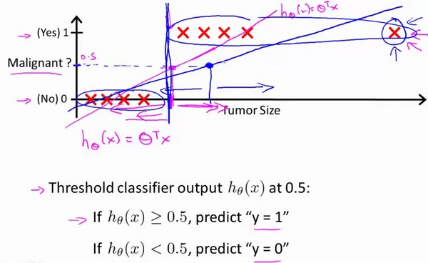
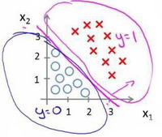
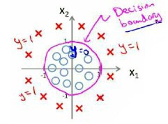
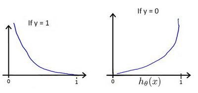

# 逻辑回归（Logistic Regression）

[TOC]


**虽然叫逻辑回归，但是它是一个分类算法，本质还是线性回归，用激活函数添加了非线性项**

- 逻辑回归的本质就是画出**决策边界**来分割样本数据达到分类效果
  - h（x）就是拟合决策边界（多次项就是曲线，也可以看成直线）
  - sigmod函数把决策边界输出成概率
  - **逻辑回归其实也是回归算法，通过sigmod函数算出概率值，概率值本身是连续的非离散的，所以叫回归**

**适用于标签y取值离散的情况**

## 1.分类问题

我们从一个二元分类问题来讨论

- 二元分类问题的预测值只有**0或者1**，逻辑回归的假设h在0和1 之间

- **分类问题用线性回归是不合适的**。，因为线性回归的假设函数h可能大于1或者小于0.
  - 当样本数据变的多起来的时候，模型就会发生奇怪的偏离
    - 比如添加了最优边的一个数据，h图像就从红色变成蓝色直线，第5个数据就预测不准了




## 2.逻辑回归的假设函数h

为了将h（x）的输入限定在0到1之间我们利用sigmod函数

- 逻辑回归模型的假设是： $h_\theta \left( x \right)=g\left(\theta^{T}X \right)​$
  - $X$ 代表特征向量
  -  $g\left( z \right)=\frac{1}{1+{{e}^{-z}}}$，sigmod函数
    - $g$ 代表逻辑函数（**logistic function**)是一个常用的逻辑函数为**S**形函数（**Sigmoid function**）


**python**代码实现：

```python
import numpy as np
    
def sigmoid(z):
    
   return 1 / (1 + np.exp(-z))
```


- **逻辑回归的假设函数本质**

  ​		         $h_\theta \left( x \right)=g\left(\theta^{T}X \right)=\frac{1}{1+{{e}^{\theta^{T}}}}​$

  h(X)是对于给定的输入变量，根据选择的参数计算输出变量=1的**可能性概率**（**estimated probablity**），即

  - ​	$h_\theta \left( x \right)=P\left( y=1|x;\theta \right)​$			

  例如，如果对于给定的$x$，通过已经确定的参数计算得出$h_\theta \left( x \right)=0.7$，则表示有70%的几率$y$为正向类，相应地$y$为负向类的几率为1-0.7=0.3。	

  - 同理我们有 $P\left( y=1|x;\theta \right)+P\left( y=0|x;\theta \right)=1$


## 3.逻辑回归的本质—决策边界

- **决策边界(decision boundary)**
  - 逻辑回归的本质就是来拟合决策边界来分类
  - 当样本数据代入h就会得到在决策边界外或内（>0或<0)，
  - 然后通过sigmod函数转化为>0.5或者<0.5,进而判断概率值的大小


根据上面绘制出的 **S** 形函数图像，我们知道当

$z=0$ 时 $g(z)=0.5$

$z>0$ 时 $g(z)>0.5​$

$z<0$ 时 $g(z)<0.5$

又 $z={\theta^{T}}x$ ，即：
${\theta^{T}}x>=0$  时，预测 $y=1$
${\theta^{T}}x<0$  时，预测 $y=0​$

现在假设我们有一个模型：


并且参数$\theta$ 是向量[-3 1 1]。 则当$-3+{x_1}+{x_2} \geq 0$，即${x_1}+{x_2} \geq 3$时，模型将预测 $y=1$。
我们可以绘制直线${x_1}+{x_2} = 3$，这条线便是我们模型的分界线，将预测为1的区域和预测为 0的区域分隔开。



同理，对月复杂的图像。我们可以使用多次多项式来拟合决策边界



二次方特征：${h_\theta}\left( x \right)=g\left( {\theta_0}+{\theta_1}{x_1}+{\theta_{2}}{x_{2}}+{\theta_{3}}x_{1}^{2}+{\theta_{4}}x_{2}^{2} \right)$是[-1 0 0 1 1]，则我们得到的判定边界恰好是圆点在原点且半径为1的圆形。


## 4.代价函数

- **代价函数的本质**：或者说误差函数，衡量你的模型输出值和真实值之间的比较
  - 线性回归的cost用最小二乘法。所有误差的平方和
    - 求cost的最小值就是所有误差和的最小值

逻辑回归的代价函数cost**不适合**用**最小二乘法**。

- 原因是因为分类问题的真实值只有1和0，而逻辑回归h的输出值是连续的0到1之间的概率，很难出现最小值
- 由于sigmod函数是非线性函数，把${h_\theta}\left( x \right)=\frac{1}{1+{e^{-\theta^{T}x}}}​$代入$J\left( {\theta_{}} \right)=\frac{1}{2m}\sum\limits_{i=1}^{m}{{{\left( h_{\theta} \left({x}^{\left( i \right)} \right)-{y}^{\left( i \right)} \right)}^{2}}}​$ ， J本身是个二次函数，代入h是一个非线性函数，J就会变成一个**非凸函数**（**non-onvexfunction**）
  - 非凸函数有很多局部最小值（本质也是因为非线性sigmod存在有局部收敛），非常影响梯度下降，所以不适合用。

  

**我们重新定义逻辑回归的代价函数为：**

​				$J\left( \theta  \right)=\frac{1}{m}\sum\limits_{i=1}^{m}{{Cost}\left( {h_\theta}\left( {x}^{\left( i \right)} \right),{y}^{\left( i \right)} \right)}​$，

其中




$Cost\left( {h_\theta}\left( x \right),y \right)=-y\times log\left( {h_\theta}\left( x \right) \right)-(1-y)\times log\left( 1-{h_\theta}\left( x \right) \right)​$
带入代价函数得到：
$J\left( \theta  \right)=\frac{1}{m}\sum\limits_{i=1}^{m}{[-{{y}^{(i)}}\log \left( {h_\theta}\left( {{x}^{(i)}} \right) \right)-\left( 1-{{y}^{(i)}} \right)\log \left( 1-{h_\theta}\left( {{x}^{(i)}} \right) \right)]}​$
即：$J\left( \theta  \right)=-\frac{1}{m}\sum\limits_{i=1}^{m}{[{{y}^{(i)}}\log \left( {h_\theta}\left( {{x}^{(i)}} \right) \right)+\left( 1-{{y}^{(i)}} \right)\log \left( 1-{h_\theta}\left( {{x}^{(i)}} \right) \right)]}​$

- 这个代价函数的本质可以理解成**信息熵**，形式是一样的
  - 信息熵越大，代价函数越大，确定性越小。

- **这个代价函数的本质**就是对样本x进行**最大似然估计**
  - 最大似然估计就是已知结果（样本）找出使他概率最大的的参数描述
  - 最大似然估计的方程，和代价函数刚好相反，很好理解，损失越大，概率越小。


**Python**代码实现：

```python
import numpy as np
    
def cost(theta, X, y):
    
  theta = np.matrix(theta)
  X = np.matrix(X)
  y = np.matrix(y)
  first = np.multiply(-y, np.log(sigmoid(X* theta.T)))
  second = np.multiply((1 - y), np.log(1 - sigmoid(X* theta.T)))
# 第一项是-y所以
  return np.sum(first - second) / (len(X))
```

在得到这样一个代价函数以后，我们便可以用梯度下降算法


## 5.逻辑回归的梯度下降

代价函数

$J\left( \theta  \right)=-\frac{1}{m}\sum\limits_{i=1}^{m}{[{{y}^{(i)}}\log \left( {h_\theta}\left( {{x}^{(i)}} \right) \right)+\left( 1-{{y}^{(i)}} \right)\log \left( 1-{h_\theta}\left( {{x}^{(i)}} \right) \right)]}​$

考虑：
${h_\theta}\left( {{x}^{(i)}} \right)=\frac{1}{1+{{e}^{-{\theta^T}{{x}^{(i)}}}}}$
则：
${{y}^{(i)}}\log \left( {h_\theta}\left( {{x}^{(i)}} \right) \right)+\left( 1-{{y}^{(i)}} \right)\log \left( 1-{h_\theta}\left( {{x}^{(i)}} \right) \right)$
$={{y}^{(i)}}\log \left( \frac{1}{1+{{e}^{-{\theta^T}{{x}^{(i)}}}}} \right)+\left( 1-{{y}^{(i)}} \right)\log \left( 1-\frac{1}{1+{{e}^{-{\theta^T}{{x}^{(i)}}}}} \right)$
$=-{{y}^{(i)}}\log \left( 1+{{e}^{-{\theta^T}{{x}^{(i)}}}} \right)-\left( 1-{{y}^{(i)}} \right)\log \left( 1+{{e}^{{\theta^T}{{x}^{(i)}}}} \right)$

所以：
$\frac{\partial }{\partial {\theta_{j}}}J\left( \theta  \right)=\frac{\partial }{\partial {\theta_{j}}}[-\frac{1}{m}\sum\limits_{i=1}^{m}{[-{{y}^{(i)}}\log \left( 1+{{e}^{-{\theta^{T}}{{x}^{(i)}}}} \right)-\left( 1-{{y}^{(i)}} \right)\log \left( 1+{{e}^{{\theta^{T}}{{x}^{(i)}}}} \right)]}]​$
$=-\frac{1}{m}\sum\limits_{i=1}^{m}{[-{{y}^{(i)}}\frac{-x_{j}^{(i)}{{e}^{-{\theta^{T}}{{x}^{(i)}}}}}{1+{{e}^{-{\theta^{T}}{{x}^{(i)}}}}}-\left( 1-{{y}^{(i)}} \right)\frac{x_j^{(i)}{{e}^{{\theta^T}{{x}^{(i)}}}}}{1+{{e}^{{\theta^T}{{x}^{(i)}}}}}}]​$
$=-\frac{1}{m}\sum\limits_{i=1}^{m}{{y}^{(i)}}\frac{x_j^{(i)}}{1+{{e}^{{\theta^T}{{x}^{(i)}}}}}-\left( 1-{{y}^{(i)}} \right)\frac{x_j^{(i)}{{e}^{{\theta^T}{{x}^{(i)}}}}}{1+{{e}^{{\theta^T}{{x}^{(i)}}}}}]​$
$=-\frac{1}{m}\sum\limits_{i=1}^{m}{\frac{{{y}^{(i)}}x_j^{(i)}-x_j^{(i)}{{e}^{{\theta^T}{{x}^{(i)}}}}+{{y}^{(i)}}x_j^{(i)}{{e}^{{\theta^T}{{x}^{(i)}}}}}{1+{{e}^{{\theta^T}{{x}^{(i)}}}}}}​$
$=-\frac{1}{m}\sum\limits_{i=1}^{m}{\frac{{{y}^{(i)}}\left( 1\text{+}{{e}^{{\theta^T}{{x}^{(i)}}}} \right)-{{e}^{{\theta^T}{{x}^{(i)}}}}}{1+{{e}^{{\theta^T}{{x}^{(i)}}}}}x_j^{(i)}}​$
$=-\frac{1}{m}\sum\limits_{i=1}^{m}{({{y}^{(i)}}-\frac{{{e}^{{\theta^T}{{x}^{(i)}}}}}{1+{{e}^{{\theta^T}{{x}^{(i)}}}}})x_j^{(i)}}​$
$=-\frac{1}{m}\sum\limits_{i=1}^{m}{({{y}^{(i)}}-\frac{1}{1+{{e}^{-{\theta^T}{{x}^{(i)}}}}})x_j^{(i)}}​$
$=-\frac{1}{m}\sum\limits_{i=1}^{m}{[{{y}^{(i)}}-{h_\theta}\left( {{x}^{(i)}} \right)]x_j^{(i)}}​$
$=\frac{1}{m}\sum\limits_{i=1}^{m}{[{h_\theta}\left( {{x}^{(i)}} \right)-{{y}^{(i)}}]x_j^{(i)}}​$

**偏导数的结果**

- $\frac{\partial }{\partial {\theta_{j}}}J\left( \theta  \right)==\frac{1}{m}\sum\limits_{i=1}^{m}{[{h_\theta}\left( {{x}^{(i)}} \right)-{{y}^{(i)}}]x_j^{(i)}}$

  - 仔细看，这个形式和线性回归的公式一模一样，不同的其实就是假设函数h（x）的内容不同。所以线性回归和逻辑回归其本质并没有什么不同。

- 求导后迭代梯度下降即可：

  **Repeat** {
  $\theta_j := \theta_j - \alpha \frac{1}{m}\sum\limits_{i=1}^{m}{{\left( {h_\theta}\left( \mathop{x}^{\left( i \right)} \right)-\mathop{y}^{\left( i \right)} \right)}}\mathop{x}_{j}^{(i)}$ 
  **(simultaneously update all** )
  }


- **更负责的算法**：它们不用学习率。算的比梯度下降快，但是太复杂
  - 共轭梯度**（**Conjugate Gradient**），**
  - 局部优化法**(**Broyden fletcher goldfarb shann,BFGS**)**
  - 有限内存局部优化法**(**LBFGS**)

## 6.逻辑回归是分类为什么叫回归

**虽然叫逻辑回归，但是它是一个分类算法，本质还是线性回归，用激活函数添加了非线性项**

- 逻辑回归的本质就是画出**决策边界**来分割样本数据达到分类效果
  - h（x）就是拟合决策边界（多次项就是曲线，也可以看成直线）
  - sigmod函数把决策边界输出成概率
  - **逻辑回归其实也是回归算法，通过sigmod函数算出概率值，概率值本身是连续的非离散的，所以叫回归**

**适用于标签y取值离散的情况**


- **线性回归和逻辑回归的表达形式一样**，因为他们都是线性回归的不同个例	

   				$h\left(\theta^{T}X \right)​$

  ​				$J\left( \theta  \right)=\frac{1}{m}\sum\limits_{i=1}^{m}{{Cost}\left( {h_\theta}\left( {x}^{\left( i \right)} \right),{y}^{\left( i \right)} \right)}​$，

  - **线性回归**：
    - $h\left(\theta^{T}X \right)$
    - **cost函数是最小二乘**$J \left( \theta_0, \theta_1 \right) = \frac{1}{2m}\sum\limits_{i=1}^m \left( h_{\theta}(x^{(i)})-y^{(i)} \right)^{2}​$  
  - **逻辑回归**
    -    $h_\theta \left( x \right)=g\left(\theta^{T}X \right)=\frac{1}{1+{{e}^{\theta^{T}}}}$
    - **cost函数是对数几率**$J\left( \theta  \right)=-\frac{1}{m}\sum\limits_{i=1}^{m}{[{{y}^{(i)}}\log \left( {h_\theta}\left( {{x}^{(i)}} \right) \right)+\left( 1-{{y}^{(i)}} \right)\log \left( 1-{h_\theta}\left( {{x}^{(i)}} \right) \right)]}$

  **所以逻辑回归就是线性回归的特例，加入了激活函数sigmoid并且两者的cost函数不同，或者叫loss函数不同**

## 7.多类别分类：一对多

我们可以用一对多的分类方式


现在我们有一个训练集，好比上图表示的有3个类别，我们用三角形表示 $y=1$，方框表示$y=2$，叉叉表示 $y=3$。我们下面要做的就是使用一个训练集，将其分成3个二元分类问题。

为了能实现这样的转变，我们将多个类中的一个类标记为正向类（$y=1$），然后将其他所有类都标记为负向类，这个模型记作$h_\theta^{\left( 1 \right)}\left( x \right)$。接着，类似地第我们选择另一个类标记为正向类（$y=2$），再将其它类都标记为负向类，将这个模型记作 $h_\theta^{\left( 2 \right)}\left( x \right)$,依此类推。

最后我们得到一系列的模型简记为： $h_\theta^{\left( i \right)}\left( x \right)=p\left( y=i|x;\theta  \right)$其中：$i=\left( 1,2,3....k \right)$ 

最后，在我们需要做预测时，我们将所有的分类机都运行一遍，然后对每一个输入变量，都选择**最高可能性**的输出变量。即$\mathop{\max}\limits_i\,h_\theta^{\left( i \right)}\left( x \right)$。

## 7，python代码实现

**python代码实现**

```python
import pandas as pd
import numpy as np
import matplotlib.pyplot as plt
import seaborn as sns
plt.style.use('fivethirtyeight')
import matplotlib.pyplot as plt
# import tensorflow as tf
from sklearn.metrics import classification_report#这个包是评价报告
```

```python
import numpy as np
import pandas as pd
import matplotlib.pyplot as plt
import scipy.optimize as opt

path = './python代码/ex2-logistic regression/ex2data1.txt'
data = pd.read_csv(path, header=None, names=['Exam 1', 'Exam 2', 'Admitted'])
print(data.head())
# sigmoid函数
def sigmoid(z):
    return 1 / (1 + np.exp(-z))
# 代价函数
def cost(theta, X, y):
    first = np.multiply(-y, np.log(sigmoid(X * theta.T)))
    second = np.multiply((1 - y), np.log(1 - sigmoid(X * theta.T)))
    return np.sum(first - second) / (len(X))

# 添加都为1的第0列
data.insert(0, 'Ones', 1)

#输入x  输出y
cols = data.shape[1]
X = data.iloc[:,0:cols-1]
y = data.iloc[:,cols-1:cols]

# 转化成数组
X = np.array(X.values)
print(X)
y = np.array(y.values)
print(y)
theta = np.zeros(3)

# 计算初始代价
print(cost(theta, X, y))
# 梯度计算函数偏导数，并有梯度下降这里
def gradient(theta, X, y):
    parameters = int(theta.shape[0])  # 特征的数量
    grad = np.zeros(parameters)
  
    error = sigmoid(X * theta.T) - y
    x1 = X[:, 1]

    for i in range(parameters): # 每个特征都要算，因为公式里有个Xj
        x1 =  X[:,i].reshape(100,1)

        term = np.multiply(error, x1)
        grad[i] = np.sum(term) / len(X)

    return grad
gradient(theta,X, y)
result = opt.fmin_tnc(func=cost, x0=theta, fprime=gradient, args=(X, y))

def predict(theta, X):
    probability = sigmoid(np.dot(X, theta.T))
    list1 = []
    for i in probability:
        if i >= 0.5:
            list1.append(1)
        else:list1.append(0)
    return list1

theta_min =result[0]

predictions = predict(theta_min, X)
print(predictions)
correct = [1 if ((a == 1 and b == 1) or (a == 0 and b == 0)) else 0 for (a, b) in zip(predictions, y)]
accuracy = (sum(map(int, correct)) % len(correct))
print ('accuracy = {0}%'.format(accuracy))
```

## **8.sklearn实现逻辑回归**

- - ## 

    ```python
    sklearn.linear_model.LogisticRegression
    (penalty='l2', *, dual=False, tol=0.0001, C=1.0, fit_intercept=True, intercept_scaling=1, class_weight=None, random_state=None, solver='lbfgs', max_iter=100, multi_class='auto', verbose=0, warm_start=False, n_jobs=None, l1_ratio=None)
    ```

    - **逻辑回归**

      - **penalty  ：{‘l1’, ‘l2’, ‘elasticnet’, ‘none’}, default=’l2’**

        -  字符串‘l1’或‘l2’或’elasticnet‘或者’none‘
        - **‘l1’**  L1正则化 使用SAGA求解器的惩罚为l1不能用其他
        - **‘l2’** L2正则化，'newton-cg'，'sag'和'lbfgs'只支持l2正则化
        - **’elasticnet‘**  L1和L2联合正则化
          - ElasticNet在我们发现用Lasso回归太过(太多特征被稀疏为0),而岭回归也正则化的不够(回归系数衰减太慢)的时候
          - 仅“ saga”求解器支持“ elasticnet”
        - **’none‘**  无正则化

      - **dual：bool, default=False**

        - Dual只适用于正则化相为l2的‘liblinear’的情况，通常样本数大于特征数的情况下，默认为False。

      - **tol :float, default=1e-4**

        - 意思应该是收敛的最小偏差。但是解释的和VIF以及容忍度有关，暂时不知道到底有关系没有。

      - **C ：float, default=1.0**

        -  C为正则化系数λ的倒数，必须为正数，默认为1。和SVM中的C一样，值越小，代表正则化越强

      - **fit_intercept:  bool, default=True***

        - 默认为True,是否计算该模型的截距。如果使用中心化的数据，可以考虑设置为False,不考虑截距。注意这里是考虑，一般还是要考虑截距

      - **intercept_scaling ：float, default=1**

        - 仅在正则化项为‘liblinear’，且fit_intercept设置为True时有用。
        - 变为[x，self.intercept_scaling]，即，将常量值等于intercept_scaling的“合成”特征附加到实例矢量。截距变为。intercept_scaling * synthetic_feature_weight

      - **class_weight :dict or ‘balanced’, default=None**

        - 与形式的类有关的权重。如果未给出，则所有类均应具有权重。`{class_label: weight}`
        - “balanced”模式使用y的值来自动调整与输入数据中的类频率成反比的权重。`n_samples / (n_classes * np.bincount(y))`
        - 请注意，如果指定了sample_weight，则这些权重将与sample_weight（通过fit方法传递）相乘。

      - **random_state : int, RandomState instance, default=None**

        - 在`solver`=='sag'，'saga'或'liblinear'时，用于洗牌数据的随机数
        - 如果为整数，则它指定了随机数生成器的种子。
        - 如果为RandomState实例，则指定了随机数生成器。
        - 如果为None，则使用默认的随机数生成器。 

      - **solver : {‘newton-cg’, ‘lbfgs’, ‘liblinear’, ‘sag’, ‘saga’}, default=’lbfgs’**

        - solver参数决定了我们对逻辑回归损失函数的优化方法，有四种算法可以选择。
        - a) **liblinear**：使用了开源的liblinear库实现，内部使用了坐标轴下降法来迭代优化损失函数。
        - b) **lbfgs**：拟牛顿法的一种，利用损失函数二阶导数矩阵即海森矩阵来迭代优化损失函数。
        - c) **newton-cg**：也是牛顿法家族的一种，利用损失函数二阶导数矩阵即海森矩阵来迭代优化损失函数。
        - d) **sag**：即随机平均梯度下降，是梯度下降法的变种，和普通梯度下降法的区别是每次迭代仅仅用一部分的样本来计算梯度，适合于样本数据多的时候。
          - 对于小型数据集，**“ liblinear”**是一个不错的选择，而对于大型数据集，**“ sag”**和“ **saga”**则更快。
          - 对于多类问题，只有**'newton-cg'，'sag'，'saga**'和**'lbfgs**'处理多项式损失。**“ liblinear”**仅限于“一站式”计划。
          - **'newton-cg'，'lbfgs'，'sag'**和**'saga'**处理L2或没有正则项
          - **'liblinear'和'saga'**也可以处理L1
          - **“ saga”**还支持**“ elasticnet”**惩罚
          - **'liblinear'**不支持设置 `penalty='none'`

        请注意，只有在比例大致相同的要素上才能确保“ sag”和“ saga”快速收敛。您可以使用sklearn.preprocessing中的缩放器对数据进行预处理。

      - **max_iter  : int, default=100**

        - 最大迭代次数

      - **multi_class  :{‘auto’, ‘ovr’, ‘multinomial’}, default=’auto’**

        - 默认是ovr（one-vs-rest(OvR)**，还有一种**Mvm（many-vs-many）**，如果是二元逻辑回归，ovr和multinomial并没有任何区别，区别主要在多元逻辑回归上。
        - **ovr**
          - 不论是几元回归，都当成二元回归来处理
          - OvR相对简单，但分类效果相对略差
          - 如果选择了ovr，则4种损失函数的优化方法liblinear，newton-cg,lbfgs和sag都可以选择
        - **MVM**
          - mvm从从多个类中每次选两个类进行二元回归。如果总共有T类，需要T(T-1)/2次分类。
          - MvM分类相对精确，但是分类速度没有OvR快。
          - 如果选择了multinomial,则只能选择newton-cg, lbfgs和sag了。

      - **verbose  : int, default=0**

        -  日志冗长度int：
          - 冗长度；0：不输出训练过程；
          - 1：偶尔输出；

      - **warm_start : bool, default=False**

        -  是否热启动，如果是，则下一次训练是以追加树的形式进行（重新使用上一次的调用作为初始化）。布尔型，默认False。

      - **n_jobs : int, default=None**

        - 并行数，int：个数；-1：跟CPU核数一致；1:默认值。

      - **l1_ratio : float, default=None**

        - 表征L1和L2的联合惩罚系数
        - 只在`penalty='elasticnet'`.时使用，范围0到1之间
        - 等于1时候相当于l1正则化
        - 等于0时候相当于l2正则化

    

    - **属性**
      - **classes_ :  ndarray of shape (n_classes, )**
        - 分类器已知的类别标签
      - **coef_  : ndarray of shape (1, n_features) or (n_classes, n_features)**
        - `coef_`当给定问题为二分类时，其形状为（1，n_features）
        - 特别地，当时`multi_class='multinomial'`，`coef_`对应于结果1（真），并且`-coef_`对应于结果0（假）。
      - **intercept_ : ndarray of shape (1,) or (n_classes,)**
        - 截距
        - 如果`fit_intercept`设置为False，则截距设置为零。
        -  `intercept_`当给定问题二分类时，其形状为（1，）。特别地，当时`multi_class='multinomial'`，`intercept_` 对应于结果1（真），并且`-intercept_`对应于结果0（假）。
      - **n_iter_ : ndarray of shape (n_classes,) or (1, )**
        - 所有类的实际迭代数，对于liblinear求解器，仅给出所有类的最大迭代次数。

    

    - **方法**

      - **decision_function（X）**
        - 预测样本的置信度概率

      - **densify（）**
        - 将系数矩阵转换为密集阵列格式。
      - **fit(*X*, *y*, *sample_weight=None*)**
        - 训练分类器模型
      - **get_params(deep=True)**
        - deep ： bool 默认为True
        - 返回字典，估计器的各个设置参数
      - **predict（X）**
        - 用估计其预测X，得到预测值
      - **predict_log_proba（*X*）**
        - 返回一个数组，数组的元素一次是 X 预测为各个类别的概率的对数值。
      - **predict_proba（X）：**
        -  返回一个数组，数组元素一次是 X 预测为各个类别的概率的概率值。
      - **score(X,y,sample_weight)：**
        - 返回（X，y）上的预测准确率（accuracy）。
      - **sparsify()**：
        - 将系数矩阵转换为稀疏格式。
      - **set_params()**
        - 该估计其的设置

```python
import numpy as np
from sklearn import linear_model, datasets
from sklearn.cross_validation import train_test_split
 
# 1.加载数据
iris = datasets.load_iris()
X = iris.data[:, :2]  # 使用前两个特征
Y = iris.target
#np.unique(Y)   # out: array([0, 1, 2])
 
# 2.拆分测试集、训练集。
X_train, X_test, Y_train, Y_test = train_test_split(X, Y, test_size=0.3, random_state=0)
# 设置随机数种子，以便比较结果。
 
# 3.标准化特征值
from sklearn.preprocessing import StandardScaler
sc = StandardScaler()
sc.fit(X_train)
X_train_std = sc.transform(X_train)
X_test_std = sc.transform(X_test)
 
# 4. 训练逻辑回归模型
logreg = linear_model.LogisticRegression(C=1e5)
logreg.fit(X_train, Y_train)
 
# 5. 预测
prepro = logreg.predict_proba(X_test_std)
acc = logreg.score(X_test_std,Y_test)
```


