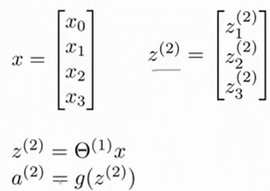
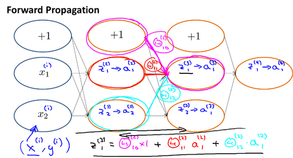
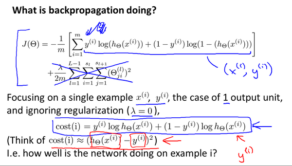

# 神经网络（Neural Networks：Representation）

[TOC]


## 1.非线性假设

- **线性模型**：简单的线性回归，简单的逻辑回归，
  - 直观感受是画直线
- **非线性模型**：多次项的线性回归，多次项的逻辑回归
  - 直观感受是画曲线。
  - 特殊的，单独特诊的多次项线性回归和逻辑回归也可以当成线性的。

无论是线性回归还是逻辑回归都有这样一个缺点，即：当特征太多时，**为了保证模型精确性我们需要构建多次项用非线性模型，但是这样一来计算的负荷会非常大。**

假如我们有100个变量，我们希望用这100个特征来构建一个非线性的多项式模型，结果将是数量非常惊人的特征组合，即便我们只采用两两特征的组合$(x_1x_2+x_1x_3+x_1x_4+...+x_2x_3+x_2x_4+...+x_{99}x_{100})$，我们也会有接近5000个组合而成的特征。这对于一般的逻辑回归来说需要计算的特征太多了。


## 2.神经网络模型表示1

**神经网络**模型建立在很多神经元之上，每一个神经元又是一个个学习模型。这些**神经元（也叫激活单元，activation unit）**采纳一些特征作为输出，并且根据本身的模型提供一个输出。下图是一个以逻辑回归模型作为自身学习模型的神经元示例，在神经网络中，**参数**又可被成为权重（**weight**）。


- $x_1$, $x_2$, $x_3$是**输入单元（input units）**
- $a_1$, $a_2$, $a_3$是**中间单元**，它们负责将数据进行处理，然后呈递到下一层
- 最后的一层是**输出单元**，输出最终计算的结果

下图为一个3层的神经网络，


- 第一层成为输入层（**Input Layer**）
- 中间一层成为隐藏层（**Hidden Layers**）
- 我们为每一层都增加一个偏差单位（**bias unit**）
- 最后一层称为输出层（**Output Layer**）

对于上图所示的模型，激活单元和输出分别表达为：

$a_{1}^{(2)}=g(\Theta _{10}^{(1)}{{x}_{0}}+\Theta _{11}^{(1)}{{x}_{1}}+\Theta _{12}^{(1)}{{x}_{2}}+\Theta _{13}^{(1)}{{x}_{3}})$
$a_{2}^{(2)}=g(\Theta _{20}^{(1)}{{x}_{0}}+\Theta _{21}^{(1)}{{x}_{1}}+\Theta _{22}^{(1)}{{x}_{2}}+\Theta _{23}^{(1)}{{x}_{3}})$
$a_{3}^{(2)}=g(\Theta _{30}^{(1)}{{x}_{0}}+\Theta _{31}^{(1)}{{x}_{1}}+\Theta _{32}^{(1)}{{x}_{2}}+\Theta _{33}^{(1)}{{x}_{3}})$
${{h}_{\Theta }}(x)=g(\Theta _{10}^{(2)}a_{0}^{(2)}+\Theta _{11}^{(2)}a_{1}^{(2)}+\Theta _{12}^{(2)}a_{2}^{(2)}+\Theta _{13}^{(2)}a_{3}^{(2)})$

- $a_{i}^{\left( j \right)}$ 代表第$j$ 层的第 $i$ 个**激活单元。**
- ${{\theta }^{\left( j \right)}}$代表从第 $j$ 层映射到第$ j+1$ 层时的**权重的矩阵**
  - 例如${{\theta }^{\left( 1 \right)}}$代表从第一层映射到第二层的权重的矩阵。
  - 其尺寸为：以第 $j+1$层的激活单元数量为行数，以第 $j$ 层的激活单元数加一为列数的矩阵。例如：上图所示的神经网络中${{\theta }^{\left( 1 \right)}}$的尺寸为 3*4。
    - 这里的形状其实就是列数为输入的个数，行数为神经元的个数。
    - 

（我们把这样从左到右的算法称为前向传播算法( **FORWARD PROPAGATION** )）

把$x$, $\theta$, $a$ 分别用矩阵表示：


我们可以得到$\theta \cdot X=a$ 。


## 3.神经网络模型表示2——用向量表示

利用向量化的方法会使得计算更为简便。以上面的神经网络为例，试着计算第二层的值：




我们令 ${{z}^{\left( 2 \right)}}={{\theta }^{\left( 1 \right)}}x$，则 ${{a}^{\left( 2 \right)}}=g({{z}^{\left( 2 \right)}})$ ，计算后添加 $a_{0}^{\left( 2 \right)}=1$。 计算输出的值为：


我们令 ${{z}^{\left( 3 \right)}}={{\theta }^{\left( 2 \right)}}{{a}^{\left( 2 \right)}}$，则 $h_\theta(x)={{a}^{\left( 3 \right)}}=g({{z}^{\left( 3 \right)}})$

如果我们要对整个训练集进行计算，我们需要将训练集特征矩阵进行转置，使得同一个实例的特征都在同一列里。即：
${{z}^{\left( 2 \right)}}={{\Theta }^{\left( 1 \right)}}\times {{X}^{T}} $  (这里就是nXm的矩阵了)

 ${{a}^{\left( 2 \right)}}=g({{z}^{\left( 2 \right)}})$


## 4.神经网络的本质——替我们选择特征值

为了更好了了解**Neuron Networks**的工作原理，我们先把左半部分遮住，这就是一个**逻辑回归**：

/Coursera-ML-AndrewNg-Notes/images/6167ad04e696c400cb9e1b7dc1e58d8a.png)

右半部分其实就是以$a_0, a_1, a_2, a_3$, 按照**Logistic Regression**的方式输出$h_\theta(x)$：

/Coursera-ML-AndrewNg-Notes/images/10342b472803c339a9e3bc339188c5b8.png)

其实神经网络就像是**logistic regression**，只不过我们把**logistic regression**中的输入向量$\left[ x_1\sim {x_3} \right]$ 变成了中间层的


$\left[ a_1^{(2)}\sim a_3^{(2)} \right]$, 即:  $h_\theta(x)=g\left( \Theta_0^{\left( 2 \right)}a_0^{\left( 2 \right)}+\Theta_1^{\left( 2 \right)}a_1^{\left( 2 \right)}+\Theta_{2}^{\left( 2 \right)}a_{2}^{\left( 2 \right)}+\Theta_{3}^{\left( 2 \right)}a_{3}^{\left( 2 \right)} \right)$ 


我们可以把$a_0, a_1, a_2, a_3$看成更为**高级的特征值**，也就是$x_0, x_1, x_2, x_3$的进化体，并且它们是由 $x$与$\theta$决定的，因**为是梯度下降的，所以$a$是变化的，并且变得越来越厉害**，所以这些更高级的特征值远比仅仅将 $x$次方厉害，也能更好的预测新数据。
**这就是神经网络相比于逻辑回归和线性回归的优势**。


## 5.神经元的本质—逻辑门

- **神经网络的本质**是自己帮助我们选择合适的特征值来。

- **神经元的本质**是通过学习计算成为逻辑门
  - 不同的神经元则组成不同的逻辑门


我们可以用一个神经元表示**AND**逻辑：

其中$\theta_0 = -30, \theta_1 = 20, \theta_2 = 20$
我们的输出函数$h_\theta(x)$即为：$h_\Theta(x)=g\left( -30+20x_1+20x_2 \right)$

所以我们有：$h_\Theta(x) \approx \text{x}_1 \text{AND} \, \text{x}_2$

- **AND**函数。


- **OR函数**

下图的神经元（三个权重分别为-10，20，20）可以被视为作用等同于逻辑或（**OR**）：


- **not函数**

下图的神经元（两个权重分别为 10，-20）可以被视为作用等同于逻辑非（**NOT**）：


- **复杂的神经元组合XNOR**

我们可以利用神经元来组合成更为复杂的神经网络以实现更复杂的运算。例如我们要实现**XNOR** 功能（输入的两个值必须一样，均为1或均为0），即 $\text{XNOR}=( \text{x}_1\, \text{AND}\, \text{x}_2 )\, \text{OR} \left( \left( \text{NOT}\, \text{x}_1 \right) \text{AND} \left( \text{NOT}\, \text{x}_2 \right) \right)$
首先构造一个能表达$\left( \text{NOT}\, \text{x}_1 \right) \text{AND} \left( \text{NOT}\, \text{x}_2 \right)​$部分的神经元：

/Coursera-ML-AndrewNg-Notes/images/4c44e69a12b48efdff2fe92a0a698768.png)

然后将表示 **AND** 的神经元和表示$\left( \text{NOT}\, \text{x}_1 \right) \text{AND} \left( \text{NOT}\, \text{x}_2 \right)$的神经元以及表示 OR 的神经元进行组合：


我们就得到了一个能实现 $\text{XNOR}$ 运算符功能的神经网络。

按这种方法我们可以逐渐构造出越来越复杂的函数，也能得到更加厉害的特征值。

这就是神经网络的厉害之处。


## 6神经网络处理多分类问题

- **one—hot编码**

当我们有多个分类的情况下，我们一般不用$y$=1,2,3….来表示分类。而是用one-hot编码来表示分类


- **神经网络**
  - **输入层X** 为（3，m）
  - **隐藏层L1**， 参数矩阵为（5,3）
    - 输出为（5,m）
  - **隐藏层L2** 参数矩阵为（5,5）
    - 输出为（5，m）
  - **输出层**为（4,5）
    - 输出为H最终值（4，m），即对应四种分类

## python代码实现神经网络

```python
# 定义onehot编码
def onhot(y):
    y_onehot = np.zeros((y.shape[0],10))
    for i ,j in enumerate(y):
        y_onehot[i, j[0]-1] = 1
    return y_onehot
# 将y变成one-hot编码
y = onhot(y)
```

```python
import matplotlib.pyplot as plt
import numpy as np
import pandas as pd
from scipy.io import loadmat

def sigmoid(z):
    return 1 / (1 + np.exp(-z))
# 加载数据
# 这是个字典，里面包含x所需的矩阵和y所需的矩阵
data = loadmat('./python代码/ex3-neural network/ex3data1.mat')
# 特征矩阵（5000,400）  目标值（5000,1），5000个样本，400个特征值
# 准备数据
X = data['X']
y = data["y"]
X = np.insert(X, 0, values=np.ones(X.shape[0]), axis=1) # 在第0列插入一列
print(X.shape,y.shape)
# 数据已经准备好了神经网络的权重
weight = loadmat('./python代码/ex3-neural network/ex3weights.mat')
theta1 = weight['Theta1'] # (25.401)
theta2 = weight['Theta2'] # (10,26)
print(theta1.shape, theta2.shape)
# 前向传播
a1 = X
z2 = a1 @ theta1.T # (5000, 401) @ (25,401).T = (5000, 25)
z2 = np.insert(z2, 0 , values=np.ones(z2.shape[0]), axis=1)

a2 = sigmoid(z2) # (5000, 26)

z3 = a2 @ theta2.T # (5000,10)

a3 = sigmoid(z3) # (5000,10)

y_pred = np.argmax(a3, axis=1) +1
print(y_pred.shape)
y_true = data['y'].flatten()
y_bool = (y_pred == y_true)
print(y_bool.sum()/y.shape[0])
```


# 神经网络—反向传播

## 1.神经网络的代价函数

引入一些标记表示

- 假设神经网络的训练样本有$m$个，每个包含一组输入$x$和一组输出信号$y$，
- $L​$表示神经网络层数，
- $S_I$表示每层的**neuron**个数($S_l$表示输出层神经元个数)，$S_L$代表最后一层中处理单元的个数。

如此我们可以处理二分类和多分类

- **二类分类**：$S_L=0, y=0\, or\, 1​$表示哪一类；

- **$K$类分类**：$S_L=k, y_i = 1$表示分到第$i$类；$(k>2)$

对于一个逻辑回归，代价函数为

$  J\left(\theta \right)=-\frac{1}{m}\left[\sum_\limits{i=1}^{m}{y}^{(i)}\log{h_\theta({x}^{(i)})}+\left(1-{y}^{(i)}\right)log\left(1-h_\theta\left({x}^{(i)}\right)\right)\right]+\frac{\lambda}{2m}\sum_\limits{j=1}^{n}{\theta_j}^{2}  $

但是在神经网络里，我们的$h_\theta(x)$是一个维度为$K$的向量，并且我们训练集中的因变量也是同样维度的一个向量，因此我们的代价函数会比逻辑回归更加复杂一些，为：$\newcommand{\subk}[1]{ #1_k }​$

$$h_\theta\left(x\right)\in \mathbb{R}^{K}$$ $${\left({h_\theta}\left(x\right)\right)}_{i}={i}^{th} \text{output}$$

$J(\Theta) = -\frac{1}{m} \left[ \sum\limits_{i=1}^{m} \sum\limits_{k=1}^{k} {y_k}^{(i)} \log \subk{(h_\Theta(x^{(i)}))} + \left( 1 - y_k^{(i)} \right) \log \left( 1- \subk{\left( h_\Theta \left( x^{(i)} \right) \right)} \right) \right] $

​						$+ \frac{\lambda}{2m} \sum\limits_{l=1}^{L-1} \sum\limits_{i=1}^{s_l} \sum\limits_{j=1}^{s_{l+1}} \left( \Theta_{ji}^{(l)} \right)^2$

- 代价函数是将最终k个分类输出的损失都加和
- 正则项因为抛弃了偏置项bias，即排除了了每一层$\theta_0$后，每一层的$\theta$ 矩阵的和。
  - 最里层的循环$j$循环所有的行（，就是列数，输出个数，由$s_{l+1}$  决定），循环$i$则循环所有的列，由该层（就是行数，输入个数，$s_l$决定。）
  - 即：$h_\theta(x)$与真实值之间的距离为每个样本-每个类输出的加和，对参数进行**regularization**的**bias**项处理所有参数的平方和。

## 2.反向传播算法

为了计算代价函数的偏导数$\frac{\partial}{\partial\Theta^{(l)}_{ij}}J\left(\Theta\right)$，我们需要采用一种反向传播算法，也就是首先计算最后一层的误差，然后再一层一层反向求出各层的误差，直到倒数第二层。

**例子**

假设我们的训练集只有一个样本$\left({x}^{(1)},{y}^{(1)}\right)$，我们的神经网络是一个四层的神经网络，其中$K=4，S_{L}=4，L=4$：

**前向传播算法**


**反向传播算法**

**链式法则为**


- 最后一层开始，我们用$\delta$来表示每一层的权重造成的误差，则：$\delta^{(4)}=a^{(4)}-y$

- 我们利用这个误差值来计算前一层的误差：$\delta^{(3)}=\left({\Theta^{(3)}}\right)^{T}\delta^{(4)}\ast g'\left(z^{(3)}\right)​$

  - 其中 $g'(z^{(3)})$是 $S$ 形函数的导数，$g'(z^{(3)})=a^{(3)}\ast(1-a^{(3)})$
  - 而$(θ^{(3)})^{T}\delta^{(4)}​$则是权重导致的误差的和
  - **注意矩阵的的形状，一般是**$\delta^{(4)}(θ^{(3)})^{T}​$

- 继续计算上一层第二层的误差$ \delta^{(2)}=(\Theta^{(2)})^{T}\delta^{(3)}\ast g'(z^{(2)})​$

- 因为第一层是输入变量，不存在误差。

  

  

我们计算出偏导数假设$λ=0​$，即我们不做任何正则化处理时有：
				$\frac{\partial}{\partial\Theta_{ij}^{(l)}}J(\Theta)=a_{j}^{(l)} \delta_{i}^{l+1}​$

重要的是清楚地知道上面式子中上下标的含义：

- $l​$ 代表目前所计算的是第几层。

- $j$ 代表目前计算层中的激活单元的下标，也将是下一层的第$j$个输入变量的下标。

- $i$ 代表下一层中误差单元的下标，是受到权重矩阵中第$i​$行影响的下一层中的误差单元的下标。


**考虑正则项，和矩阵运算**


我们用$\Delta^{(l)}_{ij}$来表示这个误差矩阵。第 $l$  层的第 $i$ 个激活单元受到第 $j$ 个参数影响而导致的误差。

$\Delta^{(l)}_{ij}$ 就是由$\frac{\partial}{\partial\Theta_{ij}^{(l)}}J(\Theta)=a_{j}^{(l)} \delta_{i}^{l+1}$组成的矩阵（**感觉交误差矩阵不太对劲，叫偏导矩阵更好**）


即首先用正向传播方法计算出每一层的激活单元，利用训练集的结果与神经网络预测的结果求出最后一层的误差，然后利用该误差运用反向传播法计算出直至第二层的所有误差。

在求出了$\Delta_{ij}^{(l)}$之后，我们便可以计算代价函数的偏导数了，计算方法如下：
$ D_{ij}^{(l)} :=\frac{1}{m}\Delta_{ij}^{(l)}+\lambda\Theta_{ij}^{(l)}$              ${if}\; j \neq  0$

$ D_{ij}^{(l)} :=\frac{1}{m}\Delta_{ij}^{(l)}$                             ${if}\; j = 0​$


## 3.反向传播的直观理解（求权重对误差的影响）

**前向传播的过程** ：计算z和a



**反向传播的过程**




- 代价函数的主体其实就是cost函数，可以理解为和目标值的误差 $\delta^{(l)}_{j}="error" \ of cost \  for \ a^{(l)}_{j} \ (unit \ j \ in \ layer \ l)$ 理解如下
  - $\delta^{(l)}_{j}$ 相当于是第 $l$ 层的第 $j$ 单元中得到的激活项的“误差”，即”正确“的 $a^{(l)}_{j}$ 与计算得到的 $a^{(l)}_{j}$ 的差。
  - 而 $a^{(l)}_{j}=g(z^{(l)})$ ，（g为sigmoid函数）。我们可以想象 $\delta^{(l)}_{j}$ 为函数求导时迈出的那一丁点微分，所以更准确的说 $\delta^{(l)}_{j}=\frac{\partial}{\partial z^{(l)}_{j}}cost(i)$
- 反向传播其实就在计算各个神经元的误差，然后同时更新，达到减小总误差的目的。


## 4.梯度检验

- **梯度检验**

当我们对一个较为复杂的模型使用梯度下降算法时，可能会存在一些不容易察觉的小错误，虽然代价函数在不断减小，但最终结果可能不是最优解

为了避免梯度下降的小错误，我们需要对我们的模型计算出来的梯度进行**数值检验**（**Numerical Gradient Checking**）

- **梯度估值**
  - 即对于某个特定的 $\theta$，我们计算出在 $\theta$-$\varepsilon $ 处和 $\theta$+$\varepsilon $ 的代价值，然后求两个代价的平均，用以估计在 ​$\theta$ 处的代价值。
  - $\varepsilon $是一个非常小的值，通常选取 0.001


当$\theta$是一个向量时，我们则需要对偏导数进行检验。因为代价函数的偏导数检验只针对一个参数的改变进行检验，下面是一个只针对$\theta_1$进行检验的示例：
				$$ \frac{\partial}{\partial\theta_1}=\frac{J\left(\theta_1+\varepsilon_1,\theta_2,\theta_3...\theta_n \right)-J \left( \theta_1-\varepsilon_1,\theta_2,\theta_3...\theta_n \right)}{2\varepsilon} $$

我们针对每一个 $\theta$ 都计算一个近似的梯度值，将这些值存储于一个近似梯度矩阵中，最终将得出的这个矩阵同 $D_{ij}^{(l)}$ 进行比较。

如果我们的梯度下降过程没有什么问题，就可以关闭梯度检验。

## 5.随机初始化参数

到目前为止我们都是初始所有参数为0，这样的初始方法对于逻辑回归来说是可行的，但是对于神经网络来说是不可行的。如果我们令所有的初始参数都为0，这将意味着我们第二层的所有激活单元都会有相同的值。同理，如果我们初始所有的参数都为一个非0的数，结果也是一样的。这样梯度下降就毫无意义了。

**我们通常初始参数为正负ε之间的随机值**


## 6.搭建一个完整的神经网络

- **设计网络结构**
  - 决定有多少层，每层有多少个激活单元
  - 第一层的数量是我们的训练集的**特征数量**
  - 最后一层的单元数是我们训练集的**结果分类的类数量**
  - 如果隐藏层数大于1，最好确保每个影藏层的**单元数相同**
    - 单元数越多越好，意味着特征组合越多，误差越分散
- **训练神经网络**
- **前向传播**
  - 参数的随机初始化，**正负ε之间**，不能用相同的数值初始化
  - 正向传播计算所有的$h_{\theta}(x)$
  - 编写计算代价函数 $J$ 的代码
- **反向传播**
  - 利用反向传播计算所有的**偏导数**
    - 利用数值检验方法检测偏导数计算是否有错误
    - 通常这个过程它繁琐了。
  - 更新权重，梯度下降迭代， 使用优化算法来最小化代价函数
    - 梯度下降只是其中一种优化算法


# python代码

```python
import pandas as pd
import numpy as np
import scipy.optimize as opt
import scipy.io as sio
from sklearn.metrics import classification_report


def load_data(path, transpose=True):
    '''加载数据函数'''
    data = sio.loadmat(path)
    y = data['y']  # （5000，1）
    y = y.reshape(y.shape[0])
    X = data["X"]  # (5000,400) 5000个样本，400个特征
    return X, y


def expand_y(y):
    '''onehot编码'''
    res = []
    for i in y:
        y_zeros = np.zeros(10)
        y_zeros[i - 1] = 1
        res.append(y_zeros)
    return np.array(res)


def load_weight(path):
    data = sio.loadmat(path)
    return data['Theta1'], data['Theta2']


def sigmoid(z):
    return 1 / (1 + np.exp(-z))


def serialize(a, b):
    return np.concatenate((np.ravel(a), np.ravel(b)))


def deserialize(seq):
    #     """into ndarray of (25, 401), (10, 26)"""
    return seq[:25 * 401].reshape(25, 401), seq[25 * 401:].reshape(10, 26)


def feed_forwards(theta, X):
    '''前向传播 函数h'''
    theta1, theta2 = deserialize(theta)
    a1 = X  # (5000,401)
    z2 = a1 @ theta1.T  # (5000,25)=(5000.401)@(401,25)
    a2 = np.insert(sigmoid(z2), 0, np.ones(z2.shape[0]), axis=1)
    z3 = a2 @ theta2.T  # (5000,10)= (5000,26)@(26,10)
    h = sigmoid(z3)
    return a1, z2, a2, z3, h


def cost(theta, X, y):
    '''代价函数'''
    _, _, _, _, h = feed_forwards(theta, X)
    cost1 = -np.multiply(y, np.log(h)) - np.multiply((1 - y), np.log(1 - h))
    return cost1.sum() / X.shape[0]


def regularized_cost(theta, X, y, l=1):
    '''正则化代价函数'''
    m = X.shape[0]
    theta1, theta2 = deserialize(theta)
    # this is how you ignore first col
    reg_t1 = (l / (2 * m)) * np.power(theta1[:, 1:], 2).sum()
    reg_t2 = (l / (2 * m)) * np.power(theta2[:, 1:], 2).sum()

    return cost(theta, X, y) + reg_t1 + reg_t2


def sigmoid_gradient(z):
    """
    sigmoid函数求导
    """
    return np.multiply(sigmoid(z), 1 - sigmoid(z))


def gradient(theta, X, y):
    '''梯度函数'''
    m = X.shape[0]
    theta1, theta2 = deserialize(theta)
    delta1 = np.zeros(theta1.shape)
    delta2 = np.zeros(theta2.shape)
    a1, z2, a2, z3, h = feed_forwards(theta, X)

    a1i = a1  # (5000, 401)
    z2i = z2  # (5000, 25)
    a2i = a2  # (5000, 26)

    hi = h  # (5000, 10)
    yi = y  # (5000, 10)

    d3i = hi - yi  # (5000, 10)

    z2i = np.insert(z2i, 0, np.ones(z2i.shape[0]), axis=1)  # （5000,26）

    d2i = np.multiply((theta2.T @ d3i.T).T, sigmoid_gradient(z2i))  # （5000,26）

    delta2 += d3i.T @ a2i  # (5000, 10).T @ (5000, 26) -> (10, 26)
    delta1 += d2i[:, 1:].T @ a1i  # (5000, 25).T @ (5000, 401) -> (25, 401)

    delta1 = delta1 / m
    delta2 = delta2 / m

    return delta1, delta2


def regularized_gradient(theta, X, y, l=1):
    ''' 带正则化的梯度函数'''
    m = X.shape[0]
    theta1, theta2 = deserialize(theta)
    delta1, delta2 = gradient(theta, X, y)
    theta1[:, 0] = 0
    reg_term_d1 = (l / m) * theta1
    delta1 = delta1 + reg_term_d1

    theta2[:, 0] = 0
    reg_term_d2 = (l / m) * theta2
    delta2 = delta2 + reg_term_d2

    return delta1, delta2


def random_init(size):
    '''初始化参数'''
    return np.random.uniform(-0.12, 0.12, size)


def nn_training(X, y, a=0.1):
    '''神经网络训练'''
    t1, t2 = load_weight('./python代码/ex4-NN back propagation/ex4weights.mat')

    init_theta = random_init(10285)
    # 梯度下降
    for i in range(1000):
        d1, d2 = regularized_gradient(init_theta, X, y)
        t1 = t1 - a * d1
        t2 = t2 - a * d2
        init_theta = serialize(t1, t2)

        if i % 100 == 0:
            print(i)
            if i % 1000 == 0:
                res = regularized_cost(init_theta, X, y)
                print(res)
    print(t1.shape, t2.shape)

    return regularized_cost(init_theta, X, y), init_theta


def show_accuracy(theta, X, y):
    _, _, _, _, h = feed_forwards(theta, X)

    y_pred = np.argmax(h, axis=1) + 1
    y_bool = (y_pred == y_yrue)
    print(y_bool.sum() / 5000)


if __name__ == "__main__":
    X, y_yrue = load_data('./python代码/ex4-NN back propagation/ex4data1.mat')
    X = np.insert(X, 0, np.ones(X.shape[0]), axis=1)  # 增加一列偏置
    y = expand_y(y_yrue)  # 用转换成onehot编码
    print(X.shape, y.shape)  # (5000,401) (5000,10)
    t1, t2 = load_weight('./python代码/ex4-NN back propagation/ex4weights.mat')
    # print(t1.shape, t2.shape)  # (25,401) (10,26) 需要转置
    theta = serialize(t1, t2)

    # _, _, _, _, h = feed_forwards(theta, X)
    # print(h.shape)
    # print(h.shape)  # 假设函数
    # print(regularized_cost(t1, t2, X, y))  # 第一次代价函数求值
    # d1, d2 = gradient(t1, t2, X, y)
    # print(d1.shape, d2.shape)  # 求偏导矩阵
    res = nn_training(X, y)
    print(res[0])
    print(res[1].shape)
    show_accuracy(res[1], X, y_yrue)

```


# sklearn

**sklearn.neural_network**中存放，有三个类。

- **neural_network.BernoulliRBM([n_components, …])** 伯努利受限玻尔兹曼机（RBM）
- **neural_network.MLPClassifier([…])** 多层感知分类器
- **neural_network.MLPRegressor([…])** 多层感知回归


**API**

**class sklearn.neural_network.MLPClassifier**(hidden_layer_sizes=(100, ),            activation=’relu’,                 solver=’adam’, alpha=0.0001,              batch_size=’auto’,                   learning_rate=’constant’,                 learning_rate_init=0.001, power_t=0.5,                max_iter=200,                   shuffle=True,
random_state=None,              tol=0.0001,           verbose=False, warm_start=False,                       momentum=0.9, nesterovs_momentum=True, 
early_stopping=False,                    validation_fraction=0.1, beta_1=0.9,                    beta_2=0.999,               epsilon=1e-08, n_iter_no_change=10)[source]

| hidden_layer_sizes  | tuple，length = n_layers - 2，默认值（100，）第i个元素表示第i个隐藏层中的神经元数量。 |
| ------------------- | ------------------------------------------------------------ |
| activation=’relu’   | {‘identity’，‘logistic’，‘tanh’，‘relu’}，默认’relu’ 隐藏层的激活函数：‘identity’，无操作激活，对实现线性瓶颈很有用，返回f（x）= x；‘logistic’，logistic sigmoid函数，返回f（x）= 1 /（1 + exp（-x））；‘tanh’，双曲tan函数，返回f（x）= tanh（x）；‘relu’，整流后的线性单位函数，返回f（x）= max（0，x） |
| slover              | {‘lbfgs’，‘sgd’，‘adam’}，默认’adam’。权重优化的求解器：'lbfgs’是准牛顿方法族的优化器；'sgd’指的是随机梯度下降。'adam’是指由Kingma，Diederik和Jimmy Ba提出的基于随机梯度的优化器。注意：默认解算器“adam”在相对较大的数据集（包含数千个训练样本或更多）方面在训练时间和验证分数方面都能很好地工作。但是，对于小型数据集，“lbfgs”可以更快地收敛并且表现更好。 |
| alpha               | float，可选，默认为0.0001。L2惩罚（正则化项）参数。          |
| batch_size          | int，optional，默认’auto’。用于随机优化器的minibatch的大小。如果slover是’lbfgs’，则分类器将不使用minibatch。设置为“auto”时，batch_size = min（200，n_samples） |
| learning_rate       | {‘常数’，‘invscaling’，‘自适应’}，默认’常数"。 用于权重更新。仅在solver ='sgd’时使用。'constant’是’learning_rate_init’给出的恒定学习率；'invscaling’使用’power_t’的逆缩放指数在每个时间步’t’逐渐降低学习速率learning_rate_， effective_learning_rate = learning_rate_init / pow（t，power_t）；只要训练损失不断减少，“adaptive”将学习速率保持为“learning_rate_init”。每当两个连续的时期未能将训练损失减少至少tol，或者如果’early_stopping’开启则未能将验证分数增加至少tol，则将当前学习速率除以5。 |
| learning_rate_init  | double，可选，默认为0.001。使用初始学习率。它控制更新权重的步长。仅在solver ='sgd’或’adam’时使用。 |
| power_t             | double，可选，默认为0.5。反缩放学习率的指数。当learning_rate设置为“invscaling”时，它用于更新有效学习率。仅在solver ='sgd’时使用。 |
| max_iter            | int，optional，默认值200。最大迭代次数。solver迭代直到收敛（由’tol’确定）或这个迭代次数。对于随机解算器（‘sgd’，‘adam’），请注意，这决定了时期的数量（每个数据点的使用次数），而不是梯度步数。 |
| shuffle             | bool，可选，默认为True。仅在solver ='sgd’或’adam’时使用。是否在每次迭代中对样本进行洗牌。 |
| random_state        | int，RandomState实例或None，可选，默认无随机数生成器的状态或种子。如果是int，则random_state是随机数生成器使用的种子;如果是RandomState实例，则random_state是随机数生成器;如果为None，则随机数生成器是np.random使用的RandomState实例。 |
| tol                 | float，optional，默认1e-4 优化的容忍度，容差优化。当n_iter_no_change连续迭代的损失或分数没有提高至少tol时，除非将learning_rate设置为’adaptive’，否则认为会达到收敛并且训练停止。 |
| verbose             | bool，可选，默认为False 是否将进度消息打印到stdout。         |
| warm_start          | bool，可选，默认为False，设置为True时，重用上一次调用的解决方案以适合初始化，否则，只需擦除以前的解决方案。请参阅词汇表。 |
| momentum            | float，默认0.9，梯度下降更新的动量。应该在0和1之间。仅在solver ='sgd’时使用。 |
| nesterovs_momentum  | 布尔值，默认为True。是否使用Nesterov的势头。仅在solver ='sgd’和momentum> 0时使用。 |
| early_stopping      | bool，默认为False。当验证评分没有改善时，是否使用提前停止来终止培训。如果设置为true，它将自动留出10％的训练数据作为验证，并在验证得分没有改善至少为n_iter_no_change连续时期的tol时终止训练。仅在solver ='sgd’或’adam’时有效 |
| validation_fraction | float，optional，默认值为0.1。将训练数据的比例留作早期停止的验证集。必须介于0和1之间。仅在early_stopping为True时使用 |
| beta_1              | float，optional，默认值为0.9，估计一阶矩向量的指数衰减率应为[0,1)。仅在solver ='adam’时使用 |
| beta_2              | float，可选，默认为0.999,估计一阶矩向量的指数衰减率应为[0,1)。仅在solver ='adam’时使用 |
| epsilon             | float，optional，默认值1e-8, adam稳定性的价值。 仅在solver ='adam’时使用 |
| n_iter_no_change    | int，optional，默认值10,不符合改进的最大历元数。 仅在solver ='sgd’或’adam’时有效 |


**属性**

| 属性            | 备注                                                         |
| --------------- | ------------------------------------------------------------ |
| classes_        | array or list of array of shape （n_classes，）每个输出的类标签。 |
| loss_           | float,使用损失函数计算的当前损失。                           |
| coefs_          | list，length n_layers - 1,列表中的第i个元素表示对应于层i的权重矩阵。 |
| intercepts_     | list，length n_layers - 1,列表中的第i个元素表示对应于层i + 1的偏置矢量。 |
| n_iter_         | int，迭代次数。                                              |
| n_layers_       | int,层数。                                                   |
| n_outputs_      | int,输出的个数。                                             |
| out_activation_ | string，输出激活函数的名称。                                 |

**方法**

| 方法                            | 备注                                 |
| ------------------------------- | ------------------------------------ |
| fit（X，y）                     | 使模型适合数据矩阵X和目标y。         |
| get_params（[deep]）            | 获取此估算器的参数。                 |
| predict（X）                    | 使用多层感知器分类器进行预测         |
| predict_log_proba（X）          | 返回概率估计的对数。                 |
| predict_proba（X）              | 概率估计。                           |
| score（X，y [，sample_weight]） | 返回给定测试数据和标签的平均准确度。 |
| set_params（** params）         | 设置此估算器的参数。                 |

```python
# First 声明神经网络回归函数
NNmodel = MLPClassifier([10,6],learning_rate_init= 0.001,activation='relu',\
     solver='adam', alpha=0.0001,max_iter=30000)  # 神经网络
#Second 训练数据
print('start train!')
NNmodel.fit(X_train,y_train)
print('end train!')
#Third 检验训练集的准确性
ppp = NNmodel.predict(X_train)
dd = np.mean(np.square(ppp - y_train))
print(dd)
```

