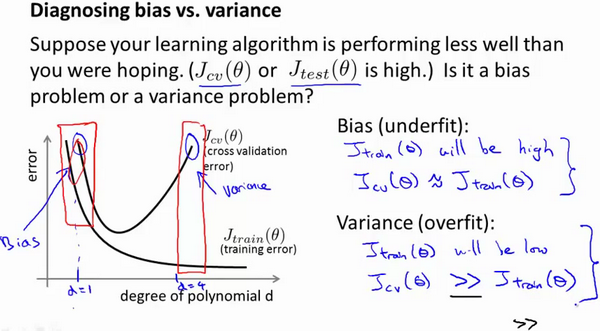
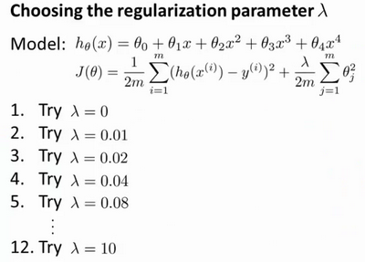
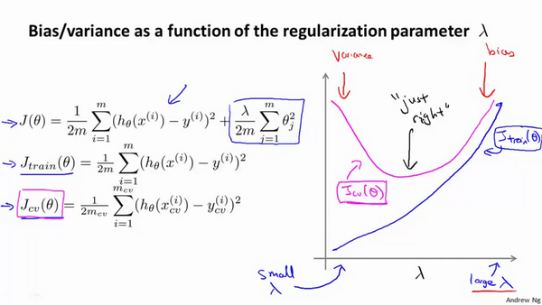

# 机器学习系统诊断和建议

[TOC]

我们可能在设计一个机器学习系统时话费大量的时间去做如下事情:

1. 获得更多的训练样本——通常是有效的，但代价较大，下面的方法也可能有效，可考虑先采用下面的几种方法。
2. 尝试减少特征的数量
3. 尝试获得更多的特征
4. 尝试增加多项式特征
5. 尝试减少正则化程度$\lambda$
6. 尝试增加正则化程度$\lambda$

接下来我们会介绍一些诊断方法帮助指明改进算法的方向,而不是浪费时间.

## 1.评估模型参数(划分训练集和测试集)

如何评价我们用数据样本训练出来的参数是否合理呢?

我们需要一种方法来评估我们的假设函数是否过拟合,或者是否欠拟合

- **将数据样本分为训练集train和测试集test**
- 分割前需要'洗牌'保证每个数据集都有各种数据
  - 训练集train占70%
  - 测试集test占30%
- 训练集得出模型参数后,对测试集运用该模型参数得到**计算误差**
  - **线性回归的误差**,我们利用测试集数据计算代价函数           			$J\left( \theta  \right)=\frac{1}{2m}\sum\limits_{i=1}^{m}{{{\left( {h_{\theta}}\left( {x^{(i)}} \right)-{y^{(i)}} \right)}^{2}}}$
  - **逻辑回归的误差**
    - **代价函数**$$ J_{test}{(\theta)} = -\frac{1}{{m}_{test}}\sum_\limits{i=1}^{m_{test}}\log{h_{\theta}(x^{(i)}_{test})}+(1-{y^{(i)}_{test}})\log{h_{\theta}(x^{(i)}_{test})}$$
    - 误分率,错误分类的个数占整体样本的个数

## 2选择哪个多次项模型(交叉验证集)

我们并不知道应该用哪个多次项的模型,假设们要要在10个不同模型中选择

- **交叉训练集**:使用60%的数据作为训练集，使用 20%的数据作为交叉验证集，使用20%的数据作为测试集

模型选择的方法为：

- 使用训练集训练出10个模型

**Training error:**

​				$J_{train}(\theta) = \frac{1}{2m}\sum_\limits{i=1}^{m}(h_{\theta}(x^{(i)})-y^{(i)})^2$

- 用10个模型分别对交叉验证集计算得出交叉验证误差（代价函数的值）

**Cross Validation error:**

​				$J_{cv}(\theta) = \frac{1}{2m_{cv}}\sum_\limits{i=1}^{m}(h_{\theta}(x^{(i)}_{cv})-y^{(i)}_{cv})^2​$

- 选取代价函数值最小的模型

- 用步骤3中选出的模型对测试集计算得出推广误差（代价函数的值）

  **Test error:**

  ​			$J_{test}(\theta)=\frac{1}{2m_{test}}\sum_\limits{i=1}^{m_{test}}(h_{\theta}(x^{(i)}_{cv})-y^{(i)}_{cv})^2$

### 2.2诊断偏差和方差(欠拟合还是过拟合)

如何分辨我们的模型究竟是欠拟合还是过拟合,即究竟是和偏差有关还是和方差有关?

- 我们需要用**训练集的代价函数**和**交叉验证集的代价函数**作图比较
- **选择交叉误差最小的情况**

- **训练集的误差Training error:**对于训练集，当 $d$ 较小时，模型拟合程度更低，误差较大；随着 $d$ 的增长，拟合程度提高，误差减小。		  $J_{train}(\theta) = \frac{1}{2m}\sum_\limits{i=1}^{m}(h_{\theta}(x^{(i)})-y^{(i)})^2$

- **交叉验证集的误差Cross Validation error:**对于交叉验证集，当 $d$ 较小时，模型拟合程度低，误差较大；但是随着 $d$ 的增长，误差呈现先减小后增大的趋势，转折点是我们的模型开始过拟合训练数据集的时候。

     			$J_{cv}(\theta) = \frac{1}{2m_{cv}}\sum_\limits{i=1}^{m}(h_{\theta}(x^{(i)}_{cv})-y^{(i)}_{cv})^2$

我们的**交叉验证集误差较大，**我们如何判断是方差还是偏差呢？根据上面的图表，我们知道:

- 前提是误差很大
- **训练集误差和交叉验证集误差近似时：偏差/欠拟合**,上图左边红框
  - d太小，模型太简单，训练集和交叉集误差都很大
- **交叉验证集误差远大于训练集误差时：方差/过拟合**,上图右边红框
  - d太大，训练集算出来的模型太复杂，只适合训练集，训练集误差小，交叉集误差大

## 3.正则化参数λ选多大(偏差和方差)

我们在选择λ的值时也需要思考与刚才选择多项式模型次数类似的问题。

**这里针对的是一个模型**我们选择一系列的想要测试的 $\lambda$ 值，通常是 0-10之间的呈现2倍关系的值（如：$0,0.01,0.02,0.04,0.08,0.15,0.32,0.64,1.28,2.56,5.12,10​$共12个）。 我们同样把数据分为训练集、交叉验证集和测试集。

选择$\lambda$的方法为：

1. 使用训练集训练出12个不同程度正则化的模型
2. 用12个模型分别对交叉验证集计算的出交叉验证误差（不用带正则项）
3. 选择得出交叉验证误差**最小**的模型
4. 运用步骤3中选出模型对测试集计算得出推广误差，我们也可以同时将训练集和交叉验证集模型的代价函数误差与λ的值绘制在一张图表上：

- **只有训练集的代价函数有正则项**
- 当 $\lambda$ 较小时，训练集误差较小（**过拟合**）而交叉验证集误差较大
  - 正则项惩罚力度太小，容易过拟合，训练集误差小，但是交叉集不适应，误差大
-  随着 $\lambda$ 的增加，训练集误差不断增加（**欠拟合**），而交叉验证集误差则是先减小后增加
  - 正则项惩罚力度太大，欠拟合，训练集误差大，而交叉集也误差大

## 4.学习曲线（判断欠拟合和过拟合，样本数量的影响）

学习曲线就是一种很好的工具，我经常使用学习曲线来判断某一个学习算法是否处于偏差、方差问题

。学习曲线是将训练集误差和交叉验证集误差作为训练集样本数量（$m​$）的函数绘制的图表。

- **学习曲线**：
  -  当数量较少时，训练集的误差小，而cv集的误差大（不适应cv集）
  - 随着样本数量增加，训练集误差变大，CV集误差变小

如何利用学习曲线识别欠拟合和过拟合，**且数量级增大在高方差下可以提高模型质量**

- **欠拟合情况下的学习曲线**
  - 样本少时，，训练集误差小， 验证集误差大
  - 样本大时，两者趋于一致，因为欠拟合状态下两者偏差都大。
  - **在高偏差下增加数据集的数量没有用**

- **过拟合情况下的学习曲线**
  - 样本少时，，训练集误差小， 验证集误差大
  - 两者都随着样本数量增大而下降，但是验证集和训练集的误差相比有很大的高度差，这是因为过拟合不适应验证集。
  - **样本数量增大，验证集误差下降，可以提高模型效果**

## 5. 判断你的模型

判断你的模型当前处于偏差还是方差情况

1. 获得更多的训练样本——解决高方差
2. 尝试减少特征的数量——解决高方差
3. 尝试获得更多的特征——解决高偏差
4. 尝试增加多项式特征——解决高偏差
5. 尝试减少正则化程度λ——解决高偏差
6. 尝试增加正则化程度λ——解决高方差

- 使用较小的神经网络，类似于参数较少的情况，容易导致高偏差和欠拟合
- 使用较大的神经网络，类似于参数较多的情况，容易导致高方差和过拟合，虽然计算代价比较大，但是可以通过正则化手段来调整而更加适应数据。

# 机器学习系统的设计

## 1.首先做什么（特征提取的想法）

本周以一个垃圾邮件分类器算法为例进行讨论。
	
为了解决这样一个问题，我们首先要做的决定是如何选择并表达特征向量$x$。我们可以选择一个由100个最常出现在垃圾邮件中的词所构成的列表，根据这些词是否有在邮件中出现，来获得我们的特征向量（出现为1，不出现为0），尺寸为100×1。

为了构建这个分类器算法，我们可以做很多事，例如：

1. 收集更多的数据，让我们有更多的垃圾邮件和非垃圾邮件的样本
2. 基于邮件的路由信息开发一系列复杂的特征
3. 基于邮件的正文信息开发一系列复杂的特征，包括考虑截词的处理
4. 为探测刻意的拼写错误（把**watch** 写成**w4tch**）开发复杂的算法

## 2.误差分析改进模型（用交叉集误差）

构建一个学习算法的推荐方法为：
	

1. 从一个简单的能快速实现的算法开始，实现该算法并用交叉验证集数据测试这个算法

2. 绘制学习曲线，决定是增加更多数据，或者添加更多特征，还是其他选择
3. 进行误差分析：人工检查交叉验证集中我们算法中产生预测误差的样本，看看这些样本是否有某种系统化的趋势。

在模型比较时，用数值来判断哪一个模型更好更有效，通常我们是看**交叉验证集的误差**

在我们的垃圾邮件分类器例子中，对于“我们是否应该将**discount/discounts/discounted/discounting**处理成同一个词？”如果这样做可以改善我们算法，我们会采用一些截词软件。误差分析不能帮助我们做出这类判断，我们只能尝试采用和不采用截词软件这两种不同方案，然后根据数值检验的结果来判断哪一种更好。

**强烈推荐在交叉验证集上来实施误差分析，而不是在测试集上**。

## 3.模型评估

- **分类问题**
  - 准确率，查准率，查全率，F1score
- **回归问题**
  - 代价函数值
  - 均方误差（不是标准差，是和真实值对比）RMSE（p -a)^2^/n
  - RSE 相对平方误差（p -a)^2^/(mean(a) - a)^2^
  - MAE平均绝对误差|p-a|/n
  - RMAE相对绝对误差|p -a|/|mean(a) - a|
  - R决定性系数1-    （p -a)^2^/(a - mean(a) )^2^      0到1之间，为1则说明是完美的
- **过拟合：高方差**
- **欠拟合：高偏差**

### 3.1.偏斜类的度量（查准率和召回率）

- 如果一个二分类，1的占比很小很小，那么准确率这个误差分析将毫无意义。

例如我们希望用算法来预测癌症是否是恶性的，在我们的训练集中，只有0.5%的实例是恶性肿瘤。假设我们编写一个非学习而来的算法，在所有情况下都预测肿瘤是良性的，那么误差只有0.5%。然而我们通过训练而得到的神经网络算法却有1%的误差。这时，误差的大小是不能视为评判算法效果的依据的。

 我们将算法预测的结果分成四种情况：
	

1. **正确的1（****True Positive,TP**）：预测为真，实际为真

2. **正确的0**（**True Negative,TN**）：预测为假，实际为假
   
3. **错误的1**（**False Positive,FP**）：预测为真，实际为假
   
4. **错误的0**（**False Negative,FN**）：预测为假，实际为真

|            |              | **预测值**   |             |
| ---------- | ------------ | ------------ | ----------- |
|            |              | **Positive** | **Negtive** |
| **实际值** | **Positive** | **TP**       | **FN**      |
|            | **Negtive**  | **FP**       | **TN**      |

- **准确率=(TP + TN) / (FP +FN)**
- **查准率（Precision） = TP /(TP+FP) **所有我们查出来为1的样本，实际为1的样本概率
- **召回率（Recall）= TP/(TP+FN)**  或者叫**查全率**，即所有实际为1的样本，我们预测为1的样本，召回了多少

这样，对于我们刚才那个总是预测病人肿瘤为良性的算法，其查全率是0。查准率也是0

### 3.2.如何权衡查准率和查全率(F1score)

查准率和查全率其实和选择的阈值有很大关系，在正常的逻辑回归假设函数中，我们的阈值选择是0.5

- **查准率(Precision)=TP/(TP+FP)**，我们想提高查准率的话，就要提高阈值，但是相应的会漏掉很多，于是召回率会下降
- **查全率(Recall)=TP/(TP+FN)**，我们想提高查全率的话，就要降低阈值，让更多的真实被判定为1，但是查准率会下降

**总结**

- 提高阈值，查准率上升，查全率下降
- 降低阈值，查准率下降，查全率上升

那么我们如何权衡查准率和查全率在什么样的组合下的模型算是好模型呢

我们希望有一个帮助我们选择这个阀值的方法。一种方法是计算**F1 值**（**F1 Score**），其计算公式为：

${{F}_{1}}Score:2\frac{PR}{P+R}$

我们选择使得**F1**值最高的阈值。公式的本质就是让越接近0的权重越大，只有当两个同事接近于1，F1的值才会上升。

### 3.3.相似度函数（距离公式）

- **闵可夫斯基距离Minkowski/**

  - **（当$p=2$时为欧氏距离)** 

    ​	$dist(X,Y)={{\left( {{\sum\limits_{i=1}^{n}{\left| {{x}_{i}}-{{y}_{i}} \right|}}^{p}} \right)}^{\frac{1}{p}}}$

  

- **杰卡德相似系数(**Jaccard**)：**

  ​		$J(A,B)=\frac{\left| A\cap B \right|}{\left|A\cup B \right|}$

两个集合的交集占并集的比例

- **余弦相似度**(**cosine similarity**)

n维向量​$x$和​$y$的夹角记做​$\theta$，根据余弦定理，其余弦值为：

​		 $cos (\theta )=\frac{{{x}^{T}}y}{\left|x \right|\cdot \left| y \right|}=\frac{\sum\limits_{i=1}^{n}{{{x}_{i}}{{y}_{i}}}}{\sqrt{\sum\limits_{i=1}^{n}{{{x}_{i}}^{2}}}\sqrt{\sum\limits_{i=1}^{n}{{{y}_{i}}^{2}}}}$

两个向量的方向的相似度，若为1表示两个向量同向

- **Pearson皮尔逊相关系数：**
  ${{\rho }_{XY}}=\frac{\operatorname{cov}(X,Y)}{{{\sigma }_{X}}{{\sigma }_{Y}}}=\frac{E[(X-{{\mu }_{X}})(Y-{{\mu }_{Y}})]}{{{\sigma }_{X}}{{\sigma }_{Y}}}=\frac{\sum\limits_{i=1}^{n}{(x-{{\mu }_{X}})(y-{{\mu }_{Y}})}}{\sqrt{\sum\limits_{i=1}^{n}{{{(x-{{\mu }_{X}})}^{2}}}}\sqrt{\sum\limits_{i=1}^{n}{{{(y-{{\mu }_{Y}})}^{2}}}}}$

这就是矩阵的相关系数（协方差

### 3.4.聚类的衡量指标

- **均一性：$p$**

类似于**精确率**，一个簇中只包含一个类别的样本，则满足均一性。其实也可以认为就是正确率(每个 聚簇中正确分类的样本数占该聚簇总样本数的比例和)

 **完整性：r​**

类似于**召回率**，同类别样本被归类到相同簇中，则满足完整性;每个聚簇中正确分类的样本数占该 
类型的总样本数比例的和

- **V-measure**:

均一性和完整性的加权平均 ，有点像F1score

$V = \frac{(1+\beta^2)*pr}{\beta^2*p+r}$

- **轮廓系数**

样本$i$的轮廓系数：$s(i)$

簇内不相似度:计算样本$i$到同簇其它样本的平均距离为$a(i)$，应尽可能小。

簇间不相似度:计算样本$i$到其它簇$C_j$的所有样本的平均距离$b_{ij}$，应尽可能大。

**轮廓系数：**$s(i)$值越接近1表示样本$i$聚类越合理，

​			越接近-1，表示样本$i$应该分类到 另外的簇中，

​			近似为0，表示样本$i$应该在边界上;

​		所有样本的$s(i)$的均值被成为聚类结果的轮廓系数。 

​			$s(i) = \frac{b(i)-a(i)}{max\{a(i),b(i)\}}$

- **ARI**

数据集$S$共有$N$个元素，  两个聚类结果分别是：

$X=\{{{X}_{1}},{{X}_{2}},...,{{X}_{r}}\},Y=\{{{Y}_{1}},{{Y}_{2}},...,{{Y}_{s}}\}$

$X$和$Y$的元素个数为：

$a=\{{{a}_{1}},{{a}_{2}},...,{{a}_{r}}\},b=\{{{b}_{1}},{{b}_{2}},...,{{b}_{s}}\}$

/Coursera-ML-AndrewNg-Notes/images/Ari11.png)

记：${{n}_{ij}}=\left| {{X}_{i}}\cap {{Y}_{i}} \right|$

C是排列组合里的组合数

$ARI=\frac{\sum\limits_{i,j}{C_{{{n}_{ij}}}^{2}}-\left[ \left( \sum\limits_{i}{C_{{{a}_{i}}}^{2}} \right)\cdot \left( \sum\limits_{i}{C_{{{b}_{i}}}^{2}} \right) \right]/C_{n}^{2}}{\frac{1}{2}\left[ \left( \sum\limits_{i}{C_{{{a}_{i}}}^{2}} \right)+\left( \sum\limits_{i}{C_{{{b}_{i}}}^{2}} \right) \right]-\left[ \left( \sum\limits_{i}{C_{{{a}_{i}}}^{2}} \right)\cdot \left( \sum\limits_{i}{C_{{{b}_{i}}}^{2}} \right) \right]/C_{n}^{2}}$

ARI = 配对数 - 期望配对数/最大配对数- 期望配对数

# pythoon

## 网格搜索

## .网格搜索调参

- **class `sklearn.model_selection.``GridSearchCV`(estimator, param_grid, scoring=None, fit_params=None, n_jobs=1, iid=True, refit=True, cv=None, verbose=0, pre_dispatch=‘2*n_jobs’, error_score=’raise’, return_train_score=’warn’)**

  - **estimator**

    选择使用的分类器，并且传入除需要确定最佳的参数之外的其他参数。每一个分类器都需要一个scoring参数，或者score方法：estimator=RandomForestClassifier(min_samples_split=100,min_samples_leaf=20,max_depth=8,max_features='sqrt',random_state=10),

    **（2）**       **param_grid**

    需要最优化的参数的取值，值为字典或者列表，例如：param_grid =param_test1，param_test1 = {'n_estimators':range(10,71,10)}。

    **（3）**       **scoring=None**

    模型评价标准，默认None,这时需要使用score函数；或者如scoring='roc_auc'，根据所选模型不同，评价准则不同。字符串（函数名），或是可调用对象，需要其函数签名形如：scorer(estimator, X, y)；如果是None，则使用estimator的误差估计函数。具体值的选取看本篇第三节内容。

    **（4）**       **fit_params=None**

    **（5）**       **n_jobs=1**

    n_jobs: 并行数，int：个数,-1：跟CPU核数一致, 1:默认值

    **（6）**       **iid=True**

    **iid**:默认True,为True时，默认为各个样本fold概率分布一致，误差估计为所有样本之和，而非各个fold的平均。

    **（7）**       **refit=True**

    默认为True,程序将会以交叉验证训练集得到的最佳参数，重新对所有可用的训练集与开发集进行，作为最终用于性能评估的最佳模型参数。即在搜索参数结束后，用最佳参数结果再次fit一遍全部数据集。

    **（8）**        **cv=None**

    交叉验证参数，默认None，使用三折交叉验证。指定fold数量，默认为3，也可以是yield训练/测试数据的生成器。

    **（9）**       **verbose=0, scoring=None**

    **verbose**：日志冗长度，int：冗长度，0：不输出训练过程，1：偶尔输出，>1：对每个子模型都输出。

    **（10）**   **pre_dispatch=‘2\*n_jobs’**

    指定总共分发的并行任务数。当n_jobs大于1时，数据将在每个运行点进行复制，这可能导致OOM，而设置pre_dispatch参数，则可以预先划分总共的job数量，使数据最多被复制pre_dispatch次

    **（11）**   **error_score=’raise’**

    **（12）**   **return_train_score=’warn’**

    如果“False”，cv_results_属性将不包括训练分数

- **方法：**
  - **decision_function**（X）：使用找到的最佳参数在估计器上
  - **decision_function**，X：可索引，长度为n_samples；
    fit（X, y=None, groups=None, **fit_params）：与所有参数组合运行。
  - **get_params**（[deep]）：获取此分类器的参数。
  - **inverse_transform**（Xt）使用找到的最佳参数在分类器上调用
  - **inverse_transform**。
  - **predict**（X）调用使用最佳找到的参数对估计量进行预测，X：可索引，长度为n_samples；
  - **score**（X, y=None）返回给定数据上的分数，X： [n_samples，n_features]输入数据，其中n_samples是样本的数量，n_features是要素的数量。y： [n_samples]或[n_samples，n_output]，可选，相对于X进行分类或回归; 无无监督学习。
  - 

- **属性**：
  - **cv_results_** :将键作为列标题和值作为列的字典，可将其导入到pandas DataFrame中。
  - **best_estimator_** : estimator或dict；由搜索选择的估算器，即在左侧数据上给出最高分数（或者如果指定最小损失）的估算器。 如果refit = False，则不可用。
  - **best_params_** : dict；在保持数据上给出最佳结果的参数设置。对于多度量评估，只有在指定了重新指定的情况下才会出现。
  - **best_score_** : float；best_estimator的平均交叉验证分数，对于多度量评估，只有在指定了重新指定的情况下才会出现。
  - **n_splits**：整数，交叉验证拆分的数量（折叠/迭代）。