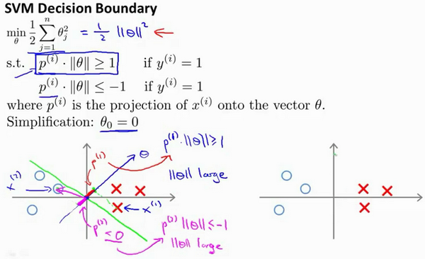

# 支持向量机(Support Vector Machines)

[TOC]


## 1.从逻辑回归到支持向量机SVM

我们首先来回顾一下逻辑回归

激活函数为sigmoid函数：添加非线性因素同时把结果输出在0和1之间


这里我们将$\theta^Tx$作为$z$ ，然后用sigmoid激活

**原理**：


总的代价函数是每个样本的误差累加和，然后除以m得到的均值

- 如果有一个 $y=1$的样本，现在我们希望${{h}_{\theta }}\left( x \right)$ 趋近1，这就意味着当 ${{h}_{\theta }}\left( x \right)$趋近于1时，$\theta^Tx$或者说Z 应当远大于0，这里的$>>$意思是远远大于0，相应的cost应该趋近于0
  - 对应公式第一项和左图
- 相反地，如果我们有另一个样本，即$y=0$。我们希望假设函数的输出值将趋近于0，这对应于$\theta^Tx$，或者就是 $z$ 会远小于0，因为对应的假设函数的输出值趋近0。相应的cost趋近于0
  - 赌赢公式第二项和右图

**支持向量机**

- 假如我们用图中的粉色直线来代替cost函数，我们会发现其实两者非常的接近。那么这个模型应该也能做逻辑回归所做的结果，并且更加简洁。

- 左边的函数，我称之为${\cos}t_1{(z)}$，同时，右边函数我称它为${\cos}t_0{(z)}$。这里的下标是指在代价函数中，对应的 $y=1$ 和 $y=0$ 的情况

  


**支持向量机代价函数和假设函数**


**和逻辑回归的不同点本质是loss函数不同**


- **去掉m项:**支持向量机的代价函数不需要再对样本m求均值了，我们要除去$1/m$这一项，如下图，事实上逻辑回归也是同样，只不过我们的习惯所导致
- **用参数C来优化：**$A+\lambda\times B$相当于用$\lambda$来优化B，但是我们这里用的形式是$C×A+B$，本质是$C=1/\lambda$来优化代价函数
- **输出值**
  - 逻辑回归的假设输出值为概率，以阈值（0.5）划分
  - 支持向量机的输出就为0或者1，


## 2.大边界的直观理解

**SVN的安全因子**


这是SVM的代价函数图，在左边这里我画出了关于$z$的代价函数${\cos}t_1{(z)}$，此函数用于正样本，而在右边这里我画出了关于$z$的代价函数

**相比于逻辑回归，添加了一个安全因子，这里为1和负1**

- $\theta^Tx>=1$时候才会给出判断为1的预测
- $\theta^Tx<=1$时候才会给出判断为0的预测


**SVM的大边界，SVM是大间距分类器**

最小化代价函数就是寻找它为0的解，对于代价函数

$\min_\limits{\theta}C\sum_\limits{i=1}^{m}\left[y^{(i)}{\cos}t_{1}\left(\theta^{T}x^{(i)}\right)+\left(1-y^{(i)}\right){\cos}t\left(\theta^{T}x^{(i)}\right)\right]+\frac{1}{2}\sum_\limits{i=1}^{n}\theta^{2}_{j}$

- 输入一个训练样本标签为$y=1$，你想令第一项为0，你需要做的是找到一个${{\theta }}$，使得$\theta^Tx>=1$
- 对于一个训练样本，标签为$y=0$，为了使${\cos}t_0{(z)}$ 函数的值为0，我们需要$\theta^Tx<=-1$。

于是问题转化为，使得前面的非正则化为0，同时满足一下两个条件

- ：$\theta^Tx^{(i)}>=1​$，如果 $y^{(i)}​$是等于1 的，
- $\theta^Tx^{(i)}<=-1$。如果 $y^{(i)}$是等于0的，

而非正则化项为0，代价函数只剩下后面的正则化项，


**其他的分类可能会使用粉色线或者绿色线作为边界，但是SVM会选择黑色线，**

- **SVM会选择到两个分类样本最短距离和最大的那条直线作为边界**
- 这个间距要做支持向量机的间距，**被称为大间距分类器**


**C的取值**

- C其实就是1/λ，C取值很大时，非正则化项占主导，会尽量去拟合样本，比如添加一个样本就从下图从黑色变成份数


- 如果你将C设置的不要太大，则你最终会得到这条黑线


### 2.1 为什么SVM会寻找大间距边界作为分类

逻辑回归和SVM的最大不同就是**代价函数不同**

- 逻辑回归的loss是**对数概率**，用来输出连续的概率，用**梯度下降**寻求最小值
- SVM的loss是**hinge loss**，本质就是寻找最大间距的边界，下面给过分析过程

**第0步，回顾SVM的代价函数**

SVM的代价函数为


寻找最小值的过程简化为：在s.t.的条件下最小化正则项。（cost项是0）


**第一步：回顾向量的乘积**

- u = [u1,u2] 和v=[v1,v2]两个向量的内积$u^T v​$表示为|u||v|cosθ
- $u^T v$等于向量V在u上的投影p 乘以$\left\| u \right\|$
  - p=||v||  cosθ, θ的代销决定内积的正负
  - $\left\| u \right\|$表示$u$的范数，即$u$的长度$\left\| u \right\|=\sqrt{u_{1}^{2}+u_{2}^{2}}$
  - $u^Tv=v^Tu​$


**第二步，SVM约束条件转化**

举个简单例子，令${{\theta }_{0}}=0$,将特征数$n$置为2，因此我们仅有两个特征${{x}_{1}},{{x}_{2}}$，

- SVM的$J = \frac{1}{2}\left({\theta_1^2+\theta_2^2}\right)=\frac{1}{2}\left(\sqrt{\theta_1^2+\theta_2^2}\right)^2=\frac{1}{2}\left\| \theta \right\|^2​$
  - **最小化代价函数就是找θ这个向量的模最小，**

- **约束条件**
  - ，$\theta^Tx^{(i)}>=1​$，如果 $y^{(i)}​$是等于1
  - $\theta^Tx^{(i)}<=-1​$。如果 $y^{(i)}​$是等于0的

- - 


- 约束条件$\theta^Tx^{(i)}$相当于两者的内积，即$p^{(i)}\cdot{x}$，于是约束条件转化为
  - $θ^Tx^{(i)}=p^{(i)}\cdot{\left\| \theta \right\|}>=1​$ 如果 $y^{(i)}​$是等于1
  - $θ^Tx^{(i)}=p^{(i)}\cdot{\left\| \theta \right\|}<=-1如果 y^{(i)}$是等于0的
- 在此条件下$\frac{1}{2}\left\| \theta \right\|^2​$最小化


**第三步，求SVM代价函数最小值过程**

- 直线的系数向量和直线垂直，即**θ = [θ~1~, θ~2~] 和 θx~1~+θx~2~=0垂直**
  - **θx~1~+θx~2~=0**就是假设函数$θ^Tx^{(i)}$，也就是决策边界
    - 这里决策因子实际上算在了偏置θ~0~里，θ~0~这里假设为0
  - **θ = [θ~1~, θ~2~]**垂直于决策边界，因为θx~1~+θx~2~=0等价于$θ^Tx^{(i)}​$=0，**内积为0，两向量垂直**



- 由上图得出，如果边界处于一个小间距状态。**绿线所示**
  - 对于y=1的正样本（图中X），要求$p^{(i)}\cdot{\left\| \theta \right\|}>=1​$，$p^{(1)}​$是x^1^投影到θ上的投影，它很小，那么为了满足不等式必然$\left\| \theta \right\|​$很大
  - 同理对于y=0的负样本（图中O）要求$p^{(i)}\cdot{\left\| \theta \right\|}<=1​$，$p^{(2)}​$是x^2^投影到θ上的投影，它很小，那么为了满足不等式必然$\left\| \theta \right\|​$很大
- **得到结果是**$\left\| \theta \right\|​$**很大**，和我们的代价函数最小化$\frac{1}{2}\left\| \theta \right\|^2​$是违背的，必然代价函数不是最小值。因此这条参数不是我们要找的参数
- 那么想得到小的$\left\| \theta \right\|$，就需要$p^{(i)}$变大，也就是样本投影到θ上的投影越大。


- **因为我们要同时满足两个约束条件即**
  - - $θ^Tx^{(i)}=p^{(i)}\cdot{\left\| \theta \right\|}>=1$ 如果 $y^{(i)}$是等于1
    - $θ^Tx^{(i)}=p^{(i)}\cdot{\left\| \theta \right\|}<=1如果 y^{(i)}$是等于0的

- 如果太靠左边或者太靠右边都意味着有一边的p小一边的p大，那么自然**在中间的时候，两者都能取到最好的p让θ最小，从而得到最小的代价函数**

**这个决策边界就是SVM找到的最大间隔边界，它就是SVM代价函数寻找最小值的过程和结果**，

- SVM关注的是两个分类的边界和间隔，找寻最大间隔的边界

相比之下**逻辑回归是用对数概率作为代价函数，通过梯度下降寻找决策边界**

- 逻辑回归关注的两个分类输出概率的平均损失最小，关注的是每个样本和目标值的概率差。


## 3.软间隔

- **硬间隔**

在2中我们描述的其实是硬间隔的SVM，何为硬间隔，即对于代价函数，**满足约束条件损失就等于0**


- **软间隔**
  - 软间隔的意思就是在满足约束条件时，我们给一个松弛的损失，可以允许它不等于0
  - **松弛变量ξ > =0**


上式所述问题即软间隔支持向量机。软间隔可以解决那些界面模糊不清，寻找最大间隔艰难的分类情况，让最大间隔边界允许犯一小点错误。


## 4.核函数——SVM非线性

回顾之前，我们用多项式模型来达到非线性模型模拟无法用直线分类的状况


为了获得上图所示的判定边界，我们的模型可能是${{\theta }_{0}}+{{\theta }_{1}}{{x}_{1}}+{{\theta }_{2}}{{x}_{2}}+{{\theta }_{3}}{{x}_{1}}{{x}_{2}}+{{\theta }_{4}}x_{1}^{2}+{{\theta }_{5}}x_{2}^{2}+\cdots $的形式。**这里最大的问题就是我们不知道怎么选择多次项**

同时线性的SVM无法处理遮掩搞得问题

那么我们需要使用非线性的SVM


**相似度函数**

对于一系列样本x，我们用一些新的特征$f​$来替换模型中的每一项。例如上面情况令：
${{f}_{1}}={{x}_{1}},{{f}_{2}}={{x}_{2}},{{f}_{3}}={{x}_{1}}{{x}_{2}},{{f}_{4}}=x_{1}^{2},{{f}_{5}}=x_{2}^{2}​$

得到$h_θ(x)={{\theta }_{1}}f_1+{{\theta }_{2}}f_2+...+{{\theta }_{n}}f_n$。那么这个f怎么获得呢


给定一个训练样本$x$，我们利用$x$的各个特征与我们预先选定的**地标**(**landmarks**)$l^{(1)},l^{(2)},l^{(3)}$的近似程度来选取新的特征$f_1,f_2,f_3$。


1. ：${{f}_{1}}=similarity(x,{{l}^{(1)}})=e(-\frac{{{\left\| x-{{l}^{(1)}} \right\|}^{2}}}{2{{\sigma }^{2}}})​$
   - ${{f}_{1}}=similarity(x,{{l}^{(1)}})​$：similarity就是相似度函数，意思是f1这个特征通过样本原特征和地标l1经过相似度函数转换后获得。
   - 而$e(-\frac{{{\left\| x-{{l}^{(1)}} \right\|}^{2}}}{2{{\sigma }^{2}}})$称为**高斯核函数，是核函数的一种，也是相似度函数的一种**，是我们这里选择的相似度函数
     - ${{\left\| x-{{l}^{(1)}} \right\|}^{2}}=\sum{_{j=1}^{n}}{{({{x}_{j}}-l_{j}^{(1)})}^{2}}$，**为实例$x$中所有特征与地标$l^{(1)}$之间的距离的和。**
     - $\sigma​$是核函数的参数，用来表征核函数从1降落到0的快慢
     - 它和正态分布没什么关系，只是看起来像而已

这个核函数的作用是什么呢？

如果一个训练样本$x$与地标$l$之间的距离近似于0，则新特征 $f$近似于$e^{-0}=1$，如果训练样本$x$与地标$l$之间距离较远，则$f$近似于$e^{-(一个较大的数)}=0$。

- **简单说相似度函数后就是表征每个样本距离L1标记点的远近**
  - 距离l1近则为1，
  - 距离l1远则为0.


**核函数——非线性SVM**

**简单的例子**：两个特征[$x_{1}$ $x{_2}$]，给定地标$l^{(1)}$与不同的$\sigma$值，见下图：


图中水平面的坐标为 $x_{1}$，$x_{2}$而垂直坐标轴代表$f$。可以看出，只有当$x$与$l^{(1)}$重合时$f$才具有最大值。随着$x$的改变$f$值改变的速率受到$\sigma^2$的控制。

核函数的形貌就是一座山峰，封顶为1，底部为1.如过样本点靠近它，则为1，相反远离它则为0.

**同时$\sigma$是核函数的参数，用来表征核函数从1降落到0的快慢**


在上图中，当样本处于洋红色的点位置处，因为其离$l^{(1)}​$更近，但是离$l^{(2)}​$和$l^{(3)}​$较远，因此$f_1​$接近1，而$f_2​$,$f_3​$接近0。因此$h_θ(x)=θ_0+θ_1f_1+θ_2f_2+θ_1f_3>0​$，因此预测$y=1​$。

同理可以求出，对于离$l^{(2)}$较近的绿色点，也预测$y=1$，但是对于蓝绿色的点，因为其离三个地标都较远，预测$y=0$。

**我们将l1和l2两个标记点确定的一个范围（有点像能量）分为一类，因为会输出h_θ(x)>0，其他区域化为一个类，因为会输出  h_θ(x)<0**

**注意这里的θ因为我们便于讲解所以是我们事先设置好的，θ~3~=0，**

这样我们就得到了一个非线性的分类


## 5.核函数的本质

我们通常是根据训练集的数量选择地标的数量，即如果训练集中有$m$个样本，则我们选取$m$个地标，并且令:$l^{(1)}=x^{(1)},l^{(2)}=x^{(2)},.....,l^{(m)}=x^{(m)}​$。这样做的好处在于：现在我们得到的新特征是建立在原有特征与训练集中所有其他特征之间距离的基础之上的，即：


于是我们得到了m个新的特征，都表征的是每个样本的自己的势力范围。

- **新的SVM的假设h为**

• 给定$x$，计算新特征$f$，当$θ^Tf>=0$ 时，预测 $y=1$，否则反之。 

- **代价函数**$min C\sum\limits_{i=1}^{m}{[{{y}^{(i)}}cos {{t}_{1}}}( {{\theta }^{T}}{{f}^{(i)}})+(1-{{y}^{(i)}})cos {{t}_{0}}( {{\theta }^{T}}{{f}^{(i)}})]+\frac{1}{2}\sum\limits_{j=1}^{n=m}{\theta _{j}^{2}}$
  - 相应地修改代价函数为：$\sum{_{j=1}^{n=m}}\theta _{j}^{2}={{\theta}^{T}}\theta ​$，
    - 转置乘自身就是平方
    - 在具体实施过程中，我们还需要对最后的正则化项进行些微调整，在计算$\sum{_{j=1}^{n=m}}\theta _{j}^{2}={{\theta}^{T}}\theta $时，我们用$θ^TMθ$代替$θ^Tθ$，

其中$M$是根据我们选择的核函数而不同的一个矩阵。这样做的原因是为了简化计算。否则我们有m个样本就有m个特征，θ就是m维的向量，计算量太大了。


- **最小化向量的方法**

这是一个不等式约束的优化问题，太复杂了，https://zhuanlan.zhihu.com/p/77750026很好的解答了这个问题。

最终的记过就是转化成了一个只有一个约束的问题，然后依然是求偏导然后迭代等得到结果。


- **两个参数$C$和$\sigma$的影响：**

  - $C=1/\lambda​$

    **$C$ 较大时**，相当于$\lambda$较小，可能会导致**过拟合**，高方差；

    **$C$ 较小时**，相当于$\lambda$较大，可能会导致**低拟合**，高偏差；

  - **$\sigma$较大时**，高函数平缓，可能会导致低方差，高偏差；**欠拟合**

    **$\sigma$较小时**，高斯函数陡峭 ，可能会导致低偏差，高方差。**过拟合**

  

- **核函数的本质**

核函数的本质就是将这一维度解决不了的非线性问题转化为高纬度然后用线性解决。，核函数的作用的就是把当前为的特征转换成了高纬度的特征


## 6.SVM计算的细节

SVM的求解和优化太tm难了所以我强烈建议你直接调库！。

- **核函数**      除了高斯核函数还有很多核函数供选择

  - 在高斯核函数之外我们还有其他一些选择，如：

  - 线性核函数 X~i~^T^X~j~

  - 多项式核函数（**Polynomial Kerne**l）:(X~i~^T^X~j~)^d^

  - 字符串核函数（**String kernel**）

  - 卡方核函数（ **chi-square kernel**）

  - 直方图交集核函数（**histogram intersection kernel**）

    等等...

**这里面只有高斯核函数有参数需要调参，如果有人说他使用了线性核的**SVM**（支持向量机），这就意味这他使用了不带有核函数的**SVM**（支持向量机）。**


- **逻辑回归和SVM** SVM适合小型的，模型不复杂的
  - 如果相较于$m$而言，$n$要大许多，即训练集数据量不够支持我们训练一个复杂的非线性模型，我们选用逻辑回归模型或者不带核函数的支持向量机
  - 如果$n$较小，而且$m$大小中等，例如$n$在 1-1000 之间，而$m$在10-10000之间，使用高斯核函数的支持向量机。
  - 如果$n$较小，而$m$较大，例如$n$在1-1000之间，而$m$大于50000，则使用支持向量机会非常慢，解决方案是创造、增加更多的特征，然后使用逻辑回归或不带核函数的支持向量机。


值得一提的是，神经网络在以上三种情况下都可能会有较好的表现，但是训练神经网络可能非常慢，**选择支持向量机的原因主要在于它的代价函数是凸函数，不存在局部最小值。**

# python代码

## sklearn

自己写太复杂了，建议直接调库

- 线性SVM

- **svm=Sklearn.svm.LinearSVC(*penalty=’l2’*, *loss=’squared_hinge’*, *dual=True*, *tol=0.0001*, *C=1.0*, *multi_class=’ovr’*,*fit_intercept=True*, *intercept_scaling=1*, *class_weight=None*, *verbose=0*, *random_state=None*, *max_iter=1000*)**

  - **penalty** : string, ‘l1’ or ‘l2’ (default=’l2’)

    指定惩罚中使用的规范。 'l2'惩罚是SVC中使用的标准。 'l1'导致稀疏的coef_向量。

  - **loss** : string, ‘hinge’ or ‘squared_hinge’ (default=’squared_hinge’)

    指定损失函数。 “hinge”是标准的SVM损失（例如由SVC类使用），而“squared_hinge”是hinge损失的平方。

  - **dual** : bool, (default=True)

    选择算法以解决双优化或原始优化问题。 当n_samples> n_features时，首选dual = False。

  - **tol** : float, optional (default=1e-4)

    公差停止标准

  - **C** : float, optional (default=1.0)

    错误项的惩罚参数

  - **multi_class** : string, ‘ovr’ or ‘crammer_singer’ (default=’ovr’)

    如果y包含两个以上的类，则确定多类策略。 “ovr”训练n_classes one-vs-rest分类器，而“crammer_singer”优化所有类的联合目标。 虽然crammer_singer在理论上是有趣的，因为它是一致的，但它在实践中很少使用，因为它很少能够提高准确性并且计算成本更高。 如果选择“crammer_singer”，则将忽略选项loss，penalty和dual。

  - **fit_intercept** : boolean, optional (default=True)

    是否计算此模型的截距。 如果设置为false，则不会在计算中使用截距（即，预期数据已经居中）。

  - **intercept_scaling** : float, optional (default=1)

    当self.fit_intercept为True时，实例向量x变为[x，self.intercept_scaling]，即具有等于intercept_scaling的常量值的“合成”特征被附加到实例向量。 截距变为intercept_scaling *合成特征权重注意！ 合成特征权重与所有其他特征一样经受l1 / l2正则化。 为了减小正则化对合成特征权重（并因此对截距）的影响，必须增加intercept_scaling。

  - **class_weight** : {dict, ‘balanced’}, optional

    将类i的参数C设置为SVC的class_weight [i] * C. 如果没有给出，所有课程都应该有一个重量。 “平衡”模式使用y的值自动调整与输入数据中的类频率成反比的权重，如n_samples /（n_classes * np.bincount（y））

  - **verbose** : int, (default=0)

    启用详细输出。 请注意，此设置利用liblinear中的每进程运行时设置，如果启用，可能无法在多线程上下文中正常工作。

  - **random_state** : int, RandomState instance or None, optional (default=None)

    在随机数据混洗时使用的伪随机数生成器的种子。 如果是int，则random_state是随机数生成器使用的种子; 如果是RandomState实例，则random_state是随机数生成器; 如果为None，则随机数生成器是np.random使用的RandomState实例。

  - **max_iter** : int, (default=1000)

    要运行的最大迭代次数。

- **方法**


```python
	import numpy as np
import pandas as pd
import sklearn.svm
import seaborn as sns
import scipy.io as sio
import matplotlib.pyplot as plt

mat = sio.loadmat('./data/ex6data1.mat')
print(mat.keys())
data = pd.DataFrame(mat.get('X'), columns=['X1', 'X2'])
data['y'] = mat.get('y')
# c = 1
svc1 = sklearn.svm.LinearSVC(C=1, loss='hinge')
svc1.fit(data[['X1', 'X2']], data['y'])
svc1.score(data[['X1', 'X2']], data['y'])
# c = 100
svc100 = sklearn.svm.LinearSVC(C=100, loss='hinge')
svc100.fit(data[['X1', 'X2']], data['y'])
svc100.score(data[['X1', 'X2']], data['y'])
```


- **非线性SVM**

- **svm =sklearn.svm.SVC(C=1.0,       kernel='rbf',       degree=3, gamma='auto',         coef0=0.0,         shrinking=True, probability=False,           tol=0.001,         cache_size=200, class_weight=None,            verbose=False,           max_iter=-1, decision_function_shape=None,random_state=None)**
  - **C**：C-SVC的惩罚参数C?默认值是1.0
    C越大，相当于惩罚松弛变量，希望松弛变量接近0，即对误分类的惩罚增大，趋向于对训练集全分对的情况，这样对训练集测试时准确率很高，但泛化能力弱。C值小，对误分类的惩罚减小，允许容错，将他们当成噪声点，泛化能力较强。
  - **kerne** ：核函数，默认是rbf，可以是‘linear’, ‘poly’, ‘rbf’, ‘sigmoid’, ‘precomputed’
    – 线性：u’v
    – 多项式：(gamma*u’*v + coef0)^degree– RBF函数：exp(-gamma|u-v|^2)–sigmoid：tanh(gamma*u’*v + coef0)
  - **degree** ：多项式poly函数的维度，默认是3，选择其他核函数时会被忽略。
  - **gamma** ： ‘rbf’,‘poly’ 和‘sigmoid’的核函数参数。默认是’auto’，则会选择1/n_features
  - **coef0** ：核函数的常数项。对于‘poly’和 ‘sigmoid’有用。
  - **probability** ：是否采用概率估计.默认为False
    **布尔类型，可选，默认为False**
    决定是否启用概率估计。需要在训练fit()模型时加上这个参数，之后才能用相关的方法：predict_proba和predict_log_proba
  - **shrinking** ：是否采用shrinking heuristic方法，默认为true
  - **tol** ：停止训练的误差值大小，默认为1e-3
  - **cache_size** ：核函数cache缓存大小，默认为200
  - **class_weight** ：类别的权重，字典形式传递。设置第几类的参数C为weight*C(C-SVC中的C)
  - **verbose** ：允许冗余输出？
  - **max_iter** ：最大迭代次数。-1为无限制。
  - **decision_function_shape** ：‘ovo’, ‘ovr’ or None, default=None3
  - **random_state** ：数据洗牌时的种子值，int值


- **SVC的方法**

  1、**fit()**方法：用于训练SVM，具体参数已经在定义SVC对象的时候给出了，这时候只需要给出数据集X和X对应的标签y即可。

  2、**predict()**方法：基于以上的训练，对预测样本T进行类别预测，因此只需要接收一个测试集T，该函数返回一个数组表示个测试样本的类别。

  3、**predict_proba()**：返回每个输入类别的概率，这与predict方法不同，predict方法返回的输入样本属于那个类别，但没有概率。使用此方法时，需要在初始化时，将 probability参数设置为True。

- **属性**

  - **vc.n_support**_：各类各有多少个支持向量_
  - **svc.support_**：各类的支持向量在训练样本中的索引
  - **svc.support_vectors_**：各类所有的支持向量

```python
import matplotlib.pyplot as plt
from sklearn import svm
import numpy as np
import pandas as pd
import seaborn as sns
import scipy.io as sio

# kernek function 高斯核函数
def gaussian_kernel(x1, x2, sigma):
    return np.exp(- np.power(x1 - x2, 2).sum() / (2 * (sigma ** 2)))

mat = sio.loadmat('./data/ex6data2.mat')
print(mat.keys())
data = pd.DataFrame(mat.get('X'), columns=['X1', 'X2'])
data['y'] = mat.get('y')

svc = svm.SVC(C=100, kernel='rbf', gamma=10, probability=True)
svc.fit(data[['X1', 'X2']], data['y'])
svc.score(data[['X1', 'X2']], data['y'])
```

## 2.网格搜索调参

- **class `sklearn.model_selection.``GridSearchCV`(estimator, param_grid, scoring=None, fit_params=None, n_jobs=1, iid=True, refit=True, cv=None, verbose=0, pre_dispatch=‘2*n_jobs’, error_score=’raise’, return_train_score=’warn’)**

  -   **estimator**

    选择使用的分类器，并且传入除需要确定最佳的参数之外的其他参数。每一个分类器都需要一个scoring参数，或者score方法：estimator=RandomForestClassifier(min_samples_split=100,min_samples_leaf=20,max_depth=8,max_features='sqrt',random_state=10),

    **（2）**       **param_grid**

    需要最优化的参数的取值，值为字典或者列表，例如：param_grid =param_test1，param_test1 = {'n_estimators':range(10,71,10)}。

    **（3）**       **scoring=None**

    模型评价标准，默认None,这时需要使用score函数；或者如scoring='roc_auc'，根据所选模型不同，评价准则不同。字符串（函数名），或是可调用对象，需要其函数签名形如：scorer(estimator, X, y)；如果是None，则使用estimator的误差估计函数。具体值的选取看本篇第三节内容。

    **（4）**       **fit_params=None**

    **（5）**       **n_jobs=1**

    n_jobs: 并行数，int：个数,-1：跟CPU核数一致, 1:默认值

    **（6）**       **iid=True**

    **iid**:默认True,为True时，默认为各个样本fold概率分布一致，误差估计为所有样本之和，而非各个fold的平均。

    **（7）**       **refit=True**

    默认为True,程序将会以交叉验证训练集得到的最佳参数，重新对所有可用的训练集与开发集进行，作为最终用于性能评估的最佳模型参数。即在搜索参数结束后，用最佳参数结果再次fit一遍全部数据集。

    **（8）**        **cv=None**

    交叉验证参数，默认None，使用三折交叉验证。指定fold数量，默认为3，也可以是yield训练/测试数据的生成器。

    **（9）**       **verbose=0, scoring=None**

    **verbose**：日志冗长度，int：冗长度，0：不输出训练过程，1：偶尔输出，>1：对每个子模型都输出。

    **（10）**   **pre_dispatch=‘2\*n_jobs’**

    指定总共分发的并行任务数。当n_jobs大于1时，数据将在每个运行点进行复制，这可能导致OOM，而设置pre_dispatch参数，则可以预先划分总共的job数量，使数据最多被复制pre_dispatch次

    **（11）**   **error_score=’raise’**

    **（12）**   **return_train_score=’warn’**

    如果“False”，cv_results_属性将不包括训练分数


- **方法：**
  - **decision_function**（X）：使用找到的最佳参数在估计器上
  - **decision_function**，X：可索引，长度为n_samples；
    fit（X, y=None, groups=None, **fit_params）：与所有参数组合运行。
  - **get_params**（[deep]）：获取此分类器的参数。
  - **inverse_transform**（Xt）使用找到的最佳参数在分类器上调用
  - **inverse_transform**。
  - **predict**（X）调用使用最佳找到的参数对估计量进行预测，X：可索引，长度为n_samples；
  - **score**（X, y=None）返回给定数据上的分数，X： [n_samples，n_features]输入数据，其中n_samples是样本的数量，n_features是要素的数量。y： [n_samples]或[n_samples，n_output]，可选，相对于X进行分类或回归; 无无监督学习。
  - 


- **属性**：

  - **cv_results_** :将键作为列标题和值作为列的字典，可将其导入到pandas DataFrame中。

  - **best_estimator_** : estimator或dict；由搜索选择的估算器，即在左侧数据上给出最高分数（或者如果指定最小损失）的估算器。 如果refit = False，则不可用。

  - **best_params_** : dict；在保持数据上给出最佳结果的参数设置。对于多度量评估，只有在指定了重新指定的情况下才会出现。

  - **best_score_** : float；best_estimator的平均交叉验证分数，对于多度量评估，只有在指定了重新指定的情况下才会出现。

  - **n_splits**：整数，交叉验证拆分的数量（折叠/迭代）。