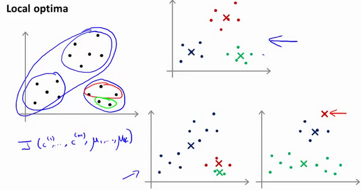

# 聚类

[TOC]


- **无监督学习**：在非监督学习中，我们的数据没有附带任何标签，我们拿到的数据就是这样的


在非监督学习中，我们需要将一系列无标签的训练数据，输入到一个算法中，然后我们告诉这个算法，快去为我们找找这个数据的内在结构给定数据。我们可能需要某种算法帮助我们寻找一种结构。**图上的数据看起来可以分成两个分开的点集（称为簇**），一个能够找到我圈出的这些点集的算法，就被称为聚类算法。

## 1. K-means 算法

- k-mean是一个**迭代**算法，其步骤为：
  1. 首先随机选择K个随机的点，聚类中心**（**cluster centroids**）；
  2. 对于所有数据，按照离聚类中心的距离远近进行分类，形成K给分类
  3. 计算每个分类的平均值，然后将聚类中心的中心店移动到平均值的位置。
  4. 重复2-4直到聚类中心不再移动


用$μ^1​$,$μ^2​$,...,$μ^k​$ 来表示聚类中心，用$c^{(1)}​$,$c^{(2)}​$,...,$c^{(m)}​$来存储与第$i​$个实例数据最近的聚类中心的索引，**K-均值**算法的如下：


**注意**

- k-means算法不再需要偏置项了，所以x样本是n维向量，而非n+1

- 第一个**for**循环是赋值步骤，即：对于每一个样例$i$，计算其应该属于的类。
  - $c^{(i)}$是第i个样本应该属于哪一个聚类中心k。
- 第二个**for**循环是聚类中心的移动，即：对于每一个类$K$，重新计算该类的质心。
  - 即计算这个K中心里所有样本x的均值，然后当做新的聚类中心

**k-means算法同样适用于没有非常明显区分的情况**


## 2.K-means 代价函数和优化（最小化）

首先明确一点$c^{(i)}$是第i个样本应该属于哪一个聚类中心k。即$\mu_{c^{(i)}}$

- **K-均值的代价函数（又称畸变函数 Distortion function）为：**

  ​	$$J(c^{(1)},...,c^{(m)},μ_1,...,μ_K)=\dfrac {1}{m}\sum^{m}_{i=1}\left\| X^{\left( i\right) }-\mu_{c^{(i)}}\right\| ^{2}​$$

其中${{\mu }_{{{c}^{(i)}}}}$代表与${{x}^{(i)}}$最近的聚类中心点。
我们的的优化目标便是找出使得代价函数最小的 $c^{(1)}$,$c^{(2)}$,...,$c^{(m)}$和$μ^1$,$μ^2$,...,$μ^k$：


回顾刚才的迭代步骤


- **第一个循环是用于减小$c^{(i)}$引起的代价（看做固定${{\mu }_{i}}$不变，意思是分类）**
- **而第二个循环则是用于减小${{\mu }_{i}}$引起的代价。（意思是重新定位类中心）**

迭代的过程一定会是每一次迭代都在减小代价函数，不然便是出现了错误。


## 3.随机初始化

- **我们应该选择$K<m$**，即聚类中心点的个数要小于所有训练集实例的数量
- **随机选择$K$个训练实例当做聚类中心**


因为初始化的聚类中心是随机的我们可能得到很多不同的结果，有的记过是不满足我们需求的



- **多次随机初始化**一般次数是50到1000次
- **找到代价函数J最小的那个分类情况**

为了解决这个问题，我们通常需要多次运行**K-均值**算法，每一次都重新进行随机初始化，最后再比较多次运行**K-均值**的结果，选择代价函数最小的结果。

这种方法在$K$较小的时候（2--10）还是可行的，但是如果$K$较大，这么做也可能不会有明显地改善


## 4.选择聚类数K

- **肘部法则**：选择不同的k然后绘制代价函数J的曲线


会出现一个k值让曲线出现很大的拐角，像人的肘部一样，那么这个k就是正确的分类

- 通常情况下很难得到精确的肘部，所以要按我们的需求来确定k值
  - 比如说下游需求要分类衬衫尺寸为s，m，l，我们就取k=3或者$XS,S,M,L,XL$，那么我们就取k=5


## 5.相似度/距离方法汇总

- **闵可夫斯基距离Minkowski/**

  - **（当$p=2$时为欧氏距离)** 

    ​	$dist(X,Y)={{\left( {{\sum\limits_{i=1}^{n}{\left| {{x}_{i}}-{{y}_{i}} \right|}}^{p}} \right)}^{\frac{1}{p}}}$

  

- **杰卡德相似系数(**Jaccard**)：**

  ​		$J(A,B)=\frac{\left| A\cap B \right|}{\left|A\cup B \right|}$

两个集合的交集占并集的比例


- **余弦相似度**(**cosine similarity**)

n维向量​$x​$和​$y​$的夹角记做​$\theta​$，根据余弦定理，其余弦值为：

​		 $cos (\theta )=\frac{{{x}^{T}}y}{\left|x \right|\cdot \left| y \right|}=\frac{\sum\limits_{i=1}^{n}{{{x}_{i}}{{y}_{i}}}}{\sqrt{\sum\limits_{i=1}^{n}{{{x}_{i}}^{2}}}\sqrt{\sum\limits_{i=1}^{n}{{{y}_{i}}^{2}}}}$

两个向量的方向的相似度，若为1表示两个向量同向


-  **Pearson皮尔逊相关系数：**
  ${{\rho }_{XY}}=\frac{\operatorname{cov}(X,Y)}{{{\sigma }_{X}}{{\sigma }_{Y}}}=\frac{E[(X-{{\mu }_{X}})(Y-{{\mu }_{Y}})]}{{{\sigma }_{X}}{{\sigma }_{Y}}}=\frac{\sum\limits_{i=1}^{n}{(x-{{\mu }_{X}})(y-{{\mu }_{Y}})}}{\sqrt{\sum\limits_{i=1}^{n}{{{(x-{{\mu }_{X}})}^{2}}}}\sqrt{\sum\limits_{i=1}^{n}{{{(y-{{\mu }_{Y}})}^{2}}}}}$

这就是矩阵的相关系数（协方差）


## 6.聚类的衡量指标

- **均一性：$p​$**

类似于**精确率**，一个簇中只包含一个类别的样本，则满足均一性。其实也可以认为就是正确率(每个 聚簇中正确分类的样本数占该聚簇总样本数的比例和)


 **完整性：r​**

类似于**召回率**，同类别样本被归类到相同簇中，则满足完整性;每个聚簇中正确分类的样本数占该 
类型的总样本数比例的和


-  **V-measure**:

均一性和完整性的加权平均 ，有点像F1score

$V = \frac{(1+\beta^2)*pr}{\beta^2*p+r}$


- **轮廓系数**

样本$i$的轮廓系数：$s(i)$

簇内不相似度:计算样本$i$到同簇其它样本的平均距离为$a(i)$，应尽可能小。

簇间不相似度:计算样本$i​$到其它簇$C_j​$的所有样本的平均距离$b_{ij}​$，应尽可能大。

**轮廓系数：**$s(i)$值越接近1表示样本$i$聚类越合理，

​			越接近-1，表示样本$i$应该分类到 另外的簇中，

​			近似为0，表示样本$i$应该在边界上;

​		所有样本的$s(i)​$的均值被成为聚类结果的轮廓系数。 

​			$s(i) = \frac{b(i)-a(i)}{max\{a(i),b(i)\}}$


- **ARI**

数据集$S​$共有$N​$个元素，  两个聚类结果分别是：

$X=\{{{X}_{1}},{{X}_{2}},...,{{X}_{r}}\},Y=\{{{Y}_{1}},{{Y}_{2}},...,{{Y}_{s}}\}$

$X$和$Y$的元素个数为：

$a=\{{{a}_{1}},{{a}_{2}},...,{{a}_{r}}\},b=\{{{b}_{1}},{{b}_{2}},...,{{b}_{s}}\}$

/Coursera-ML-AndrewNg-Notes/images/Ari11.png)

记：${{n}_{ij}}=\left| {{X}_{i}}\cap {{Y}_{i}} \right|$

C是排列组合里的组合数

$ARI=\frac{\sum\limits_{i,j}{C_{{{n}_{ij}}}^{2}}-\left[ \left( \sum\limits_{i}{C_{{{a}_{i}}}^{2}} \right)\cdot \left( \sum\limits_{i}{C_{{{b}_{i}}}^{2}} \right) \right]/C_{n}^{2}}{\frac{1}{2}\left[ \left( \sum\limits_{i}{C_{{{a}_{i}}}^{2}} \right)+\left( \sum\limits_{i}{C_{{{b}_{i}}}^{2}} \right) \right]-\left[ \left( \sum\limits_{i}{C_{{{a}_{i}}}^{2}} \right)\cdot \left( \sum\limits_{i}{C_{{{b}_{i}}}^{2}} \right) \right]/C_{n}^{2}}$


ARI = 配对数 - 期望配对数/最大配对数- 期望配对数


# 西瓜书9 聚类

## 1.聚类的度量数学表示

- **性能度量**

一类是将聚类结果与某个"**参考模型**" (reference model) 进行比较,  称为"**外部指标**" (external index) ; 另一
类是**直接考察聚类结果**而不利用任何参考模型,  称为"**内部指标**" (internal index).

- **外部指标**

对数据集 $D=\left\{\boldsymbol{x}_{1}, \boldsymbol{x}_{2}, \ldots, \boldsymbol{x}_{m}\right\}$ ,  假定通过聚类给出的簇划分为 $\mathcal{C}=\left\{C_{1}, C_{2}, \ldots, C_{k}\right\}$ ,  参考模型给出的簇划分为 $\mathcal{C}^{*}=\left\{C_{1}^{*}, C_{2}^{*}, \ldots, C_{s}^{*}\right\}$ .  相应的, 令 $\boldsymbol \lambda$ 与 $\boldsymbol \lambda^{*}$ 分别表示与 $C$ 和 $C^{*}$ 对应的簇标记向量.  将样本两两配对,  定义如下:
$$
a=|S S|, \quad S S=\left\{\left(\boldsymbol{x}_{i}, \boldsymbol{x}_{j}\right) | \lambda_{i}=\lambda_{j}, \lambda_{i}^{*}=\lambda_{j}^{*}, i<j\right) \}\tag{9.1}
$$

$$
b=|S D|, \quad S D=\left\{\left(\boldsymbol{x}_{i}, \boldsymbol{x}_{j}\right) | \lambda_{i}=\lambda_{j}, \lambda_{i}^{*} \neq \lambda_{j}^{*}, i<j\right) \}\tag{9.2}
$$

$$
c=|D S|, \quad D S=\left\{\left(\boldsymbol{x}_{i}, \boldsymbol{x}_{j}\right) | \lambda_{i} \neq \lambda_{j}, \lambda_{i}^{*}=\lambda_{j}^{*}, i<j\right) \}\tag{9.3}
$$

$$
d=|D D|, \quad D D=\left\{\left(\boldsymbol{x}_{i}, \boldsymbol{x}_{j}\right) | \lambda_{i} \neq \lambda_{j}, \lambda_{i}^{*} \neq \lambda_{j}^{*}, i<j\right) \}\tag{9.4}
$$

其中,  集合 $SS$ 包含了在 $C$ 中隶属于相同簇且在 $C^{*}$ 中也隶属于相同簇的样本对, 集合 $SD$  包含了在 $C$ 中隶属于相同簇但在 $C^{*}$ 中隶属于不同簇的样本对,  .......由于每个样本对 $\left(\boldsymbol{x}_{i}, \boldsymbol{x}_{j}\right)(i<j)$ 仅能出现在一个集合中, 因此有 $a+b+c+d=m(m-1) / 2$ 成立.


基于式 $(9.1) \sim(9.4)$ 可导出下面这些常用的聚类性能度量**外部指标**:

- Jaccard 系数 (简称 JC) 
  $$
  \mathrm{JC}=\frac{a}{a+b+c}\tag{9.5}
  $$

- FM 指数 (简称 FMI)
  $$
  \mathrm{FMI}=\sqrt{\frac{a}{a+b} \cdot \frac{a}{a+c}}\tag{9.6}
  $$

- Rand 指数 (简称 RI)
  $$
  \mathrm{RI}=\frac{2(a+d)}{m(m-1)}\tag{9.7}
  $$

上述的三个性能度量的结果**值均在 $[0,1]$ 区间, 且值越大越好.**


- **内部指标**

考虑聚类结果的簇划分 $\mathcal{C}=\left\{C_{1}, C_{2}, \ldots, C_{k}\right\}$ ,  
$$
\operatorname{avg}(C)=\frac{2}{|C|(|C|-1)} \sum_{1 \leqslant i<j \leqslant|C|} \operatorname{dist}\left(\boldsymbol{x}_{i}, \boldsymbol{x}_{j}\right)\tag{9.8}
$$

$$
\operatorname{diam}(C)=\max _{1 \leqslant i<j \leqslant|C|} \operatorname{dist}\left(\boldsymbol{x}_{i}, \boldsymbol{x}_{j}\right)\tag{9.9}
$$

$$
d_{\min }\left(C_{i}, C_{j}\right)=\min _{\boldsymbol{x}_{i} \in C_{i}, \boldsymbol{x}_{j} \in C_{j}} \operatorname{dist}\left(\boldsymbol{x}_{i}, \boldsymbol{x}_{j}\right)\tag{9.10}
$$

$$
d_{\mathrm{cen}}\left(C_{i}, C_{j}\right)=\operatorname{dist}\left(\boldsymbol{\mu}_{i}, \boldsymbol{\mu}_{j}\right)\tag{9.11}
$$

其中,  $\operatorname{dist}(\cdot, \cdot)$ 用于计算两个样本之间的距离;  $\boldsymbol \mu$ 代表簇 $C$ 的中心点 $\boldsymbol{\mu}=\frac{1}{|C|} \sum_{1 \leqslant i \leqslant|C|} \boldsymbol{x}_{i}$ .  

则 $\operatorname{avg}(C)$ 对应于簇 $C$ 内样本间的平均距离,  $\operatorname{diam}(C)$ 对应于簇 $C$ 内样本间的最远距离,  $d_{\min }\left(C_{i}, C_{j}\right)$ 对应于簇 $C_{i}$ 与簇 $C_{j}$ 最近样本间的距离, $d_{cen}(C_{i},C_{j})$ 对应于簇 $C_{i}$ 与簇 $C_{j}$ 中心点的距离.


基于式 $(9.8) \sim(9.11)$ 可导出下面这些常用的聚类性能度量内部指标:

- DB 指数 (简称 DBI)
  $$
  \mathrm{DBI}=\frac{1}{k} \sum_{i=1}^{k} \max _{j \neq i}\left(\frac{\operatorname{avg}\left(C_{i}\right)+\operatorname{avg}\left(C_{j}\right)}{d_{\operatorname{cen}}\left(C_{i},C_{j}\right)}\right)\tag{9.12}
  $$

- Dunn 指数 (简称 DI)
  $$
  \mathrm{DI}=\min _{1 \leqslant i \leqslant k}\left\{\min _{j \neq i}\left(\frac{d_{\min }\left(C_{i}, C_{j}\right)}{\max _{1 \leqslant l \leqslant k} \operatorname{diam}\left(C_{l}\right)}\right)\right\}\tag{9.13}
  $$

**显然,  DBI 的值越小越好,  而 DI 则相反,  值越大越好.**


## 2.原型聚类

原型聚类即“**基于原型的聚类**”（prototype-based clustering），原型表示模板的意思，就是通过参考一个模板向量或模板分布的方式来完成聚类的过程，常见的K-Means便是基于簇中心来实现聚类，混合高斯聚类则是基于簇分布来实现聚类。

- **K-means聚类**
- **学习向量量化（LVQ）**

与k 均值算法类似，"学习向量量化" (Learning Vector Quantization，简
称LVQ)也是试图找到一组原型向量来刻画聚类结构， 但与一般聚类算法不同的是， **LVQ 假设数据样本带有类别标记**，学习过程利用样本的这些监督信息来辅助聚类

**若划分结果正确，则对应原型向量向这个样本靠近一些**
**若划分结果不正确，则对应原型向量向这个样本远离一些**


- **高斯混合聚类**

现在可以看出K-Means与LVQ都试图以类中心作为原型指导聚类，高斯混合聚类则采用高斯分布来描述原型。现假设**每个类簇中的样本都服从一个多维高斯分布，那么空间中的样本可以看作由k个多维高斯分布混合而成**。


## 3.密度聚类

密度聚类则是基于密度的聚类，它从样本分布的角度来考察样本之间的可连接性，并基于可连接性（密度可达）不断拓展疆域（类簇）。其中最著名的便是**DBSCAN**算法，首先定义以下概念：


简单来理解DBSCAN便是：**找出一个核心对象所有密度可达的样本集合形成簇**。首先从数据集中任选一个核心对象A，找出所有A密度可达的样本集合，将这些样本形成一个密度相连的类簇，直到所有的核心对象都遍历完。DBSCAN算法的流程如下图所示


## 4.层次聚类

层次聚类是一种基于树形结构的聚类方法，常用的是**自底向上**的结合策略（**AGNES算法**）。假设有N个待聚类的样本，其基本步骤是：

> 1.初始化-->把每个样本归为一类，计算每两个类之间的距离，也就是样本与样本之间的相似度；
> 2.寻找各个类之间最近的两个类，把他们归为一类（这样类的总数就少了一个）；
> 3.重新计算新生成的这个**类与各个旧类之间的相似度**；
> 4.重复2和3直到所有样本点都归为一类，结束。

可以看出其中最关键的一步就是**计算两个类簇的相似度**，这里有多种度量方法：


容易看出：**单链接的包容性极强，稍微有点暧昧就当做是自己人了，全链接则是坚持到底，只要存在缺点就坚决不合并，均连接则是从全局出发顾全大局**。层次聚类法的算法流程如下所示：


# 代码

- **python**

```python
import matplotlib.pyplot as plt
import seaborn as sns
import pandas as pd
import scipy.io as sio
import numpy as np

# 加载数据2
mat = sio.loadmat('./python代码/ex7-kmeans and PCA/data/ex7data2.mat')
X2 = mat["X"]


# 每个点找到自己的簇
def find_closest_centroids(X, centroids):
    m = X.shape[0] #样本数量
    k = centroids.shape[0]  # 簇的树木
    idx = np.zeros(m)

    for i in range(m):
        min_dist = 1000000
        for j in range(k):
            dist = np.sum((X[i, :] - centroids[j, :]) ** 2)
            if dist < min_dist:
                min_dist = dist
                idx[i] = j

    return idx


# 计算簇中心
def compute_centroids(X, idx, k):
    m, n = X.shape
    centroids = np.zeros((k, n))

    for i in range(k):
        indices = np.where(idx == i) # 这个是找索引
        centroids[i, :] = (np.sum(X[indices, :], axis=1) / len(indices[0])).ravel()

    return centroids


# k-means算法
def run_k_means(X, initial_centroids, max_iters):
    m, n = X.shape
    k = initial_centroids.shape[0]
    idx = np.zeros(m)
    centroids = initial_centroids

    for i in range(max_iters):
        idx = find_closest_centroids(X, centroids)
        centroids = compute_centroids(X, idx, k)

    return idx, centroids

# 随机初始化簇中心
def init_centroids(X, k):
    m, n = X.shape
    centroids = np.zeros((k, n))
    idx = np.random.randint(0, m, k)

    for i in range(k):
        centroids[i, :] = X[idx[i], :]

    return centroids

initial_centroids = init_centroids(X2, 3) # 初始簇中心
idx, centroids = run_k_means(X2, initial_centroids, 10)
# 绘图
cluster1 = X2[np.where(idx == 0)[0],:]
cluster2 = X2[np.where(idx == 1)[0],:]
cluster3 = X2[np.where(idx == 2)[0],:]

fig, ax = plt.subplots(figsize=(12,8))
ax.scatter(cluster1[:,0], cluster1[:,1], s=30, color='r', label='Cluster 1')
ax.scatter(cluster2[:,0], cluster2[:,1], s=30, color='g', label='Cluster 2')
ax.scatter(cluster3[:,0], cluster3[:,1], s=30, color='b', label='Cluster 3')
ax.legend()
plt.show()
```


- **slearn**

- **sklearn.cluster.KMeans**(algorithm='auto',        copy_x=True,   init='k-means++',                  max_iter=300,
      n_clusters=16,                            n_init=100,                 n_jobs=-1, precompute_distances='auto',
      random_state=None,              tol=0.0001,                 verbose=0)

  

- 

  - **n_clusters**：整形，缺省值=8 生成的聚类数，即产生的质心（centroids）数。
  - **max_iter**：整形，缺省值=300
    执行一次k-means算法所进行的最大迭代数。
  - **n_init**：整形，缺省值=10
    用不同的质心初始化值运行算法的次数，最终解是在inertia意义下选出的最优结果。
  - **init**：有三个可选值：’k-means++’， ‘random’，或者传递一个ndarray向量。
    此参数指定初始化方法，默认值为 ‘k-means++’。
    （１）‘k-means++’ 用一种特殊的方法选定初始质心从而能加速迭代过程的收敛。k-means++算法选择初始seeds的基本思想就是：初始的聚类中心之间的相互距离要尽可能的远。
    （２）‘random’ 随机从训练数据中选取初始质心。
    （３）如果传递的是一个ndarray，则应该形如 (n_clusters,n_features) 并给出初始质心。
  - **precompute_distances**：三个可选值，‘auto’，True 或者 False。
    预计算距离，计算速度更快但占用更多内存。
    （１）‘auto’：如果 样本数乘以聚类数大于 12million 的话则不预计算距离。
    （２）True：总是预先计算距离。
    （３）False：永远不预先计算距离。
  - **tol**：float形，默认值= 1e-4　与inertia结合来确定收敛条件。
  - **n_jobs**：整形数。　指定计算所用的进程数。内部原理是同时进行n_init指定次数的计算。
    （１）若值为 -1，则用所有的CPU进行运算。若值为1，则不进行并行运算，这样的话方便调试。
    （２）若值小于-1，则用到的CPU数为(n_cpus + 1 + n_jobs)。因此如果 n_jobs值为-2，则用到的CPU数为总CPU数减1。
  - **random_state**：整形或 numpy.RandomState 类型，可选
    用于初始化质心的生成器（generator）。如果值为一个整数，则确定一个seed。此参数默认值为numpy的随机数生成器。
  - **copy_x**：布尔型，默认值=True
    当我们precomputing distances时，将数据中心化会得到更准确的结果。如果把此参数值设为True，则原始数据不会被改变。如果是False，则会直接在原始数据
    上做修改并在函数返回值时将其还原。但是在计算过程中由于有对数据均值的加减运算，所以数据返回后，原始数据和计算前可能会有细小差别。


- **属性：**
  - **cluster_centers**_：向量，[n_clusters, n_features] (聚类中心的坐标)_
  - **labels_**: 每个点的分类
  - **inertia_**：float形

- **方法**
  - **fit(X[,y])**:
    　计算k-means聚类。
  - **fit_predictt(X[,y]):**
    　计算簇质心并给每个样本预测类别。
  - **fit_transform(X[,y])**：
    计算簇并 transform X to cluster-distance space。
  - **get_params([deep])：**
    　取得估计器的参数。
  - **predict(X):predict(X)**
    　给每个样本估计最接近的簇。
  - **score(X[,y]):**
    　计算聚类误差
  - **set_params(**params):**
    　为这个估计器手动设定参数。
  - **transform(X[,y]): 将X转换为群集距离空间。**
    　在新空间中，每个维度都是到集群中心的距离。 请注意，即使X是稀疏的，转换返回的数组通常也是密集的。
- 压缩图片

```python
from sklearn.cluster import KMeans
import scipy.io as sio
import numpy as np
from skimage import io
import matplotlib.pyplot as plt

pic = io.imread('./python代码/ex7-kmeans and PCA/data/bird_small.png')/255
io.imshow(pic)
print(pic.shape)

X2 = pic.reshape(128*128, 3)

model = KMeans(n_clusters=16, n_init=100)
model.fit(X2)
# 最终的每个样本分类 （128*128，）
C = model.predict(X2)
print(C.shape)

# 最终簇的坐标 （16,3）
centroids = model.cluster_centers_
print(centroids.shape)
#
#  每个样本都用自己的分类簇坐标代替
compressed_pic = centroids[C].reshape((128,128,3))

fig, ax = plt.subplots(1, 2)
ax[0].imshow(pic)
ax[1].imshow(compressed_pic)
plt.show()
```

