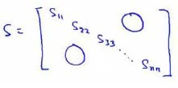

# 降维

[TOC]


## 1.高位降低维，数据压缩，数据可视化


- **将数据从二维降至一维：**

投射到一个一维直线上


- **将数据从三维降至二维：**
  我们将**三维向量投射到一个二维的平面上**，强迫使得所有的数据都在同一个平面上，降至二维的特征向量。


降维的另一个用处是数据可视化

比如我们有一个50维的数据


如果要将这个50维的数据可视化是不可能的。使用降维的方法将其降至2维，我们便可以将其可视化了。

## 2.主成分分析PCA（Principal Component Analysis）

- **投影误差** （**Projected Error**）

各个样本投射到向量上的均方误差，即到向量的**最短距离**

- **PCA**
  - 数据样本要归一化，

找到一个方向向量（**Vector direction**），当我们把所有的数据都投射到该向量上时，我们希望投射平均均方误差能尽可能地小。

方向向量是一个经过原点的向量，

而投射误差是从特征向量向该方向向量作垂线的长度。


- **PCA和线性回归的区别**
  - PCA是投影误差，是特征的降维
  - 线性回归是最小二乘距离，是垂直距离，是拟合目标函数


## 3.PCA分解和SVD分解

- **奇异值分解**

对于一个mXn的矩阵A我们可以将它进行奇异值分解成[U,S,V]三个矩阵，

U矩阵代表A的旋转,mXm

S矩阵代表A的伸缩，mXn

V矩阵代表A的另一个旋转，nXn


S矩阵就是一个形似对角化的矩阵，从大到小排列着奇异值而且减小的非常快。通常前10%的奇异值就占据了整个奇异值的90%


我们也可以用最大的k个的奇异值和对应的左右奇异向量来近似描述矩阵。U的前k个向量就对应着前k个奇异值。


- **PCA分解**
- PCA分解是SVD的一个特殊情形，假如A是方阵那么我们可以运用特征值分解，而PCA的求投影最小的过程其实就组建的一个协方差矩阵，而协方差矩阵就是方阵。

当我们求最小投影误差时，最终该问题会转化为如下矩阵


而这个矩阵刚好就是我们的协方差矩阵


其实两者之间也是有联系的：

1. 协方差代表两个向量之间的相关性，

2. 而降维后作为基向量实际要求基向量之间协方差COV为0

3. 同时最小投影误差就要求自身的方差最大（已经归一化了），投影误差就是均方误差最小。 这两者是等价的，因为是勾股定理的两个边

4. 对应的等于协方差矩阵Q,里的COV全为0，这个矩阵就是对角化。

5. 于是PCA等同于求协方差矩阵的特征分解。

     **协方差矩阵**（**covariance matrix**）$Σ$：
      				$\sum=\dfrac {1}{m}\sum^{n}_{i=1}\left( x^{(i)}\right) \left( x^{(i)}\right) ^{T}$

更一般的形式就是**X = XX^T^**


其中P列向量是特征向量，意思是表示A矩阵的旋转

Λ是对角阵，对角线元素为特征值λ，意思是表示A矩阵的伸缩

- **PCA降维**

​    新的维度特征**K = P X**

经过PCA降维后，会将一部分原来的特征降到接近于0，可以抛弃。


## 4.保留最多的信息（k值取值）

**PCA** 减少$n$维到$k$维：

由上一节直到PCA的目的是求最小的均方误差

或者求最大的方差$\dfrac {1}{m}\sum^{m}_{i=1}\left\| x^{\left( i\right) }\right\| ^{2}​$

- **丢掉了多少信息**

两者的比例$$\dfrac {\dfrac {1}{m}\sum^{m}_{i=1}\left\| x^{\left( i\right) }-x^{\left( i\right) }_{approx}\right\| ^{2}}{\dfrac {1}{m}\sum^{m}_{i=1}\left\| x^{(i)}\right\| ^{2}}$$衡量了PCA后你的矩阵信息扔掉了下了多少，或者说样本的方差我们没有保留的部分是多少

所以通常我们要求$$\dfrac {\dfrac {1}{m}\sum^{m}_{i=1}\left\| x^{\left( i\right) }-x^{\left( i\right) }_{approx}\right\| ^{2}}{\dfrac {1}{m}\sum^{m}_{i=1}\left\| x^{(i)}\right\| ^{2}}$$<0..01(1%)

- **保留了多少方差**

另一个角度，我们考虑特征矩阵Λ，主对角线就是特征值，特征值矩阵就是原矩阵的全部信息，其中前几个特征值保留了绝大多数信息，取k维就是取前k个特征值



我们可以使用这个矩阵来计算平均均方误差与训练集方差的比例：
$$\dfrac {\dfrac {1}{m}\sum^{m}_{i=1}\left\| x^{\left( i\right) }-x^{\left( i\right) }_{approx}\right\| ^{2}}{\dfrac {1}{m}\sum^{m}_{i=1}\left\| x^{(i)}\right\| ^{2}}=1-\dfrac {\Sigma^{k}_{i=1}S_{ii}}{\Sigma^{m}_{i=1}S_{ii}}\leq 1\%$$

也就是：$$\frac {\Sigma^{k}_{i=1}s_{ii}}{\Sigma^{n}_{i=1}s_{ii}}\geq0.99​$$

$$

- **K取值**

我们可以先令$k=1$，然后进行主要成分分析，获得$U_{reduce}$和$z$，然后计算比例是否小于1%。如果不是的话再令$k=2$，如此类推，直到找到可以使得比例小于1%的最小$k$ 值（原因是各个特征之间通常情况存在某种相关性）。

- **原特征和新特征之间的转换**
- K = P X，$z=U^{T}_{reduce}x$ 是一个等式

$z=U^{T}_{reduce}x​$，相反的方程为：$x_{appox}=U_{reduce}\cdot z​$,$x_{appox}\approx x​$。

在压缩过数据后，我们可以采用如下方法来近似地获得原有的特征：$$x^{\left( i\right) }_{approx}=U_{reduce}z^{(i)}$$


## 5.PCA的使用建议

- **对于验证集和CV集要用相同转换的PCA**
- **PCA不太适合用来组织过拟合**，推荐使用正则化
  - 因为PCA丢弃特征不考虑标签y，但是正则化会全部考虑
- **PCA不是必须的，原数据永远是最好的**
  - 只有当算法云心太慢，内存不够时，才考虑用PCA


# 西瓜书降维

## 1.低维嵌入

- **维度灾难**

例如假定属性维数为20，若要求样本满足密来样条件，则至少需(103)20 = 1060 个样本.现实应用中属性维数经常成千上万，要满足密采样条件所需的样本数目是无法达到的天文数字.

，在高维情形下出现的数据样本稀疏、距离计算困难等问题是所有机器学习方法共同面临的严重障碍， **被称为" 维数灾难" (curse ofdimensionality) .**


- **多维缩放" (Mult iple Dimensional Scaling，简称MDS)**


假定 $m$ 个样本在原始空间的距离矩阵为 $\mathbf{D} \in \mathbb{R}^{m \times m}$ ,  其第 $i$ 行 $j$ 列的元素 $dist_{ij}$ 为样本 $\boldsymbol x_{i}$ 到 $\boldsymbol x_{j}$ 的距离. 

目标是获得样本在 $d^{\prime}$ 维空间的表示 $\mathbf{Z} \in \mathbb{R}^{d^{\prime} \times m}, d^{\prime} \leqslant d$ ,  且任意两个样本在 $d^{\prime}$ 维空间中的欧氏距离等于原始空间中的距离,  即 $\left\|z_{i}-z_{j}\right\|=d i s t_{i j}$ .

令 $\mathbf{B}=\mathbf{Z}^{\mathrm{T}} \mathbf{Z} \in \mathbb{R}^{m \times m}$ ,  其中 $\mathbf{B}$ 为降维后样本的内积矩阵,  $b_{i j}=\boldsymbol{z}_{i}^{\mathrm{T}} \boldsymbol{z}_{j}$ ,  有:
$$
\color{red} \begin{aligned} \operatorname{dist}_{i j}^{2} &=\left\|z_{i}\right\|^{2}+\left\|z_{j}\right\|^{2}-2 \boldsymbol{z}_{i}^{\mathrm{T}} \boldsymbol{z}_{j} \\ &=b_{i i}+b_{j j}-2 b_{i j} \end{aligned}\tag{10.3}
$$
同时, 为了便于讨论,  令降维后的样本 $\mathbf{Z}$ 被中心化,  即 $\color{red}\sum_{i=1}^{m} \boldsymbol z_{i}=\boldsymbol 0$ . 那么,  矩阵 $\mathbf{B}$ 的行与列之和均为零,  即 $\color{red} \sum_{i=1}^{m} b_{i j}=\sum_{j=1}^{m} b_{i j}=0$ . 

其中,  $\operatorname{tr}(\cdot)$ 表示矩阵的迹 (trace),  $\operatorname{tr}(\mathbf{B})=\sum_{i=1}^{m}\left\|\boldsymbol{z}_{i}\right\|^{2}$ ,  令
$$
\begin{eqnarray*} \operatorname{dist}_{i \cdot}^{2} &=&\frac{1}{m} \sum_{j=1}^{m} d i s t_{i j}^{2}\tag{10.7} \\ d i s t_{\cdot j}^{2} &=&\frac{1}{m} \sum_{i=1}^{m} d i s t_{i j}^{2}\tag{10.8} \\ d i s t_{ \cdot \cdot}^{2} &=&\frac{1}{m^{2}} \sum_{i=1}^{m} \sum_{j=1}^{m} d i s t_{i j}^{2}\tag{10.9} \end{eqnarray*}
$$
根据式 (10.3) 和式 (10.4)~(10.9),  易得:
$$
\color{red} b_{i j}=-\frac{1}{2}\left(d i s t_{i j}^{2}-d i s t_{i \cdot}^{2}-d i s t_{\cdot j}^{2}+d i s t_{\cdot \cdot}^{2}\right)\tag{10.10}
$$
**由此即可通过降维前后不变的距离矩阵 $\mathbf{D}$ 求取内积矩阵 $\mathbf{B}$ .**


对矩阵 $\mathbf{B}$ 做特征值分解 (eigenvalue decomposition),  $\mathbf{B}=\mathbf{V} \mathbf{\Lambda} \mathbf{V}^{\mathrm{T}}$ ( 注:  $\mathbf{B}$ 是对称矩阵),  其中, $\mathbf{\Lambda}=\operatorname{diag}\left(\lambda_{1}, \lambda_{2}, \dots, \lambda_{d}\right)$ 为特征值构成的对角矩阵,  $\lambda_{1} \geqslant \lambda_{2} \geqslant \ldots \geqslant \lambda_{d}$ ,  $\mathbf{V}$ 为特征向量矩阵. 假定其中有 $d^{*}$ 个非零特征值,  它们构成对角矩阵 $\mathbf{\Lambda}_{*}=\operatorname{diag}\left(\lambda_{1}, \lambda_{2}, \ldots, \lambda_{d^{*}}\right)$ ,  令 $\mathbf{V^{*}}$ 表示相应的特征向量矩阵,  则 $\mathbf{Z}$ 可表达为:
$$
\mathbf{Z}=\mathbf{\Lambda}_{*}^{1 / 2} \mathbf{V}_{*}^{\mathrm{T}} \in \mathbb{R}^{d^{*} \times m}\tag{10.11}
$$


而在现实中, 为了有效降维,  往往仅需降维后的距离与原始空间中的距离尽可能接近,  而不必严格相等.  此时可取 $d^{\prime} \ll d$ 个最大特征值构成对角矩阵 $\tilde{\mathbf{\Lambda}}=\operatorname{diag}\left(\lambda_{1}, \lambda_{2}, \ldots, \lambda_{d^{\prime}}\right)$ ,  令 $\tilde{\mathbf{\Lambda}}$ 表示相应的特征向量矩阵, 则 $\mathbf{Z}$ 可表达为:
$$
\mathbf{Z}=\tilde{\mathbf{\Lambda}}^{1 / 2} \tilde{\mathbf{V}}^{\mathrm{T}} \in \mathbb{R}^{d^{\prime} \times m}\tag{10.12}
$$

- **高位空间的线性变换**

一般来说,  欲获得低维子空间,  最简单的是对**原始高维空间进行线性变换**. 给定 $d$  维空间中的样本 $\mathbf{X}=\left(\boldsymbol{x}_{1}, \boldsymbol{x}_{2}, \ldots, \boldsymbol{x}_{m}\right) \in \mathbb{R}^{d \times m}$ ,  变换之后得到 $d^{\prime} \leqslant d$ 维空间中的样本:
$$
\mathbf{Z}=\mathbf{W}^{\mathrm{T}} \mathbf{X}\tag{10.13}
$$
其中, $\mathbf{W} \in \mathbb{R}^{d \times d^{\prime}}$ 是变换矩阵,  $\mathbf{Z} \in \mathbb{R}^{d^{\prime} \times m}$ 是样本在新空间中的表示.


## 2.PCA主成分分析

参照吴恩达讲解的更简单一些西瓜书是公式原理推导


## 3.核化线性降维（非线性降维）

线性降维假设高位到低微的函数映射是线性的

但是很多情况下是非线性的，如果用线性降维会丢失原来的信息


如果把本真空间的嵌入三维空间再用线性降维，那么降维后的结果和原来的本真二维结构是区别很大的

因此必须考虑非线性降维

- **非线性降维**

引入核函数，先将样本映射到高维空间，然后再用线性降维

- **核化主成分分析（KPCA）**

先将样本映射到高维空间，然后再用线性降维（PCA),那么样本在映射到高位空间后的流程都是pca降维，我们先把这一部分写出来


这里的z是我们将样本映射到高位空间的见过，也就是说将原数据用过核函数映射为z，所以


最终我们就是对k进行特征值分解


## 4.流形学习

**流形学习（manifold learning）是一种借助拓扑流形概念的降维方法**，**流形是指在局部与欧式空间同胚的空间**，即在局部与欧式空间具有相同的性质，能用欧氏距离计算样本之间的距离。这样即使高维空间的分布十分复杂，但是在局部上依然满足欧式空间的性质，基于流形学习的降维正是这种**“邻域保持”**的思想。其中**等度量映射（Isomap）试图在降维前后保持邻域内样本之间的距离，而局部线性嵌入（LLE）则是保持邻域内样本之间的线性关系**，下面将分别对这两种著名的流行学习方法进行介绍。

- **等度量映射（lsomap）**

等度量映射的基本出发点是：高维空间中的直线距离具有误导性，因为有时高维空间中的直线距离在低维空间中是不可达的。**因此利用流形在局部上与欧式空间同胚的性质，可以使用近邻距离来逼近测地线距离**，即对于一个样本点，它与近邻内的样本点之间是可达的，且距离使用欧式距离计算，这样整个样本空间就形成了一张近邻图，高维空间中两个样本之间的距离就转为最短路径问题。可采用著名的**Dijkstra算法**或**Floyd算法**计算最短距离，得到高维空间中任意两点之间的距离后便可以使用MDS算法来其计算低维空间中的坐标。


需注意的是， Isomap 仅是得到了训练样本在低维空间的坐标，对于新样本，如何将其映射到低维空间呢?这个问题的常用解决方案，是将训练样本的高维空间坐标作为输入、低维空间坐标作为输出，训练一个回归学习器来对新样本的低维空间坐标进行预测.这显然仅是一个权宜之计，但目前似乎并没有更好的办法.

对于近邻图的构建，常用的有两种方法：**一种是指定近邻点个数**，像kNN一样选取k个最近的邻居；**另一种是指定邻域半径**，距离小于该阈值的被认为是它的近邻点。但两种方法均会出现下面的问题：

.两种方式均有不足，例如若**近邻范围指定得较大，则距离很远的点可能被误认为近邻，这样就出现"短路"问题**;**近邻范围指定得较小，则圈中有些区域可能与其他区域不存在连接，这样就出现"断路"问题**.短路与断路都会给后续的最短路径计算造成误导.

- **局部线性嵌入(LocallyLinear Embedding，简称LLE)**

不同于Isomap算法去保持邻域距离，LLE算法试图去保持邻域内的线性关系，假定样本xi的坐标可以通过它的邻域样本线性表出：


## 5度量学习

本篇一开始就提到维数灾难，即在高维空间进行机器学习任务遇到样本稀疏、距离难计算等诸多的问题，因此前面讨论的降维方法都试图将原空间投影到一个合适的低维空间中，接着在低维空间进行学习任务从而产生较好的性能。事实上，不管高维空间还是低维空间都潜在对应着一个距离度量，那可不可以直接学习出一个距离度量来等效降维呢？例如：**咋们就按照降维后的方式来进行距离的计算，这便是度量学习的初衷**。

**首先要学习出距离度量必须先定义一个合适的距离度量形式**。对两个样本xi与xj，它们之间的平方欧式距离为（加入每个属性的权重）：


- **马氏距离**

此时各个属性之间都是相互独立无关的，但现实中往往会存在属性之间有关联的情形，例如：身高和体重，一般人越高，体重也会重一些，他们之间存在较大的相关性。这样计算距离就不能分属性单独计算，于是就引入经典的**马氏距离(Mahalanobis distance)**:

**标准的马氏距离中M是协方差矩阵的逆，马氏距离是一种考虑属性之间相关性且尺度无关（即无须去量纲）的距离度量**。


- **度量学习**

矩阵M也称为“度量矩阵”，为保证距离度量的非负性与对称性，M必须为(半)正定对称矩阵**，这样就为度量学习定义好了距离度量的形式，换句话说：**度量学习便是对度量矩阵进行学习**。现在来回想一下前面我们接触的机器学习不难发现：**机器学习算法几乎都是在优化目标函数，从而求解目标函数中的参数**。同样对于度量学习，也需要设置一个优化目标，书中简要介绍了错误率和相似性两种优化目标，此处限于篇幅不进行展开。


# 代码

- python代码

```python
import matplotlib.pyplot as plt
import seaborn as sns
import pandas as pd
import scipy.io as sio
import numpy as np

data = sio.loadmat('./python代码/ex7-kmeans and PCA/data/ex7data1.mat')
X = data['X']

# 奇异值分解
def pca(X):
    # 归一化
    X = (X - X.mean()) / X.std()

    # 协方差矩阵

    cov = np.cov(X)

    # 奇异值分解
    U, S, V = np.linalg.svd(cov)
    print(U.shape,S.shape,V.shape)
    return U, S, V


# pca降到k维，并且返回降维后的数据
def project_data(X, U, k):
    U_reduced = U[:,:k]
    print(X.shape, U.shape)
    return np.dot(U_reduced.T, X)

# 返回来求原始数据
def recover_data(Z, U, k):
    U_reduced = U[:,:k]
    print(Z.shape, U_reduced.shape)
    return np.dot(U_reduced, Z)

U, S, V = pca(X)

Z = project_data(X, U, 1)
X_recovered = recover_data(Z, U, 1)

# 原始数据
fig, ax = plt.subplots(1,2)
ax[0].scatter(X[:, 0], X[:, 1])

# PCA后数据

ax[1].scatter(list(X_recovered[:, 0]), list(X_recovered[:, 1]))
plt.show()
```

