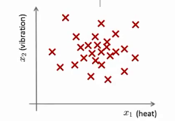
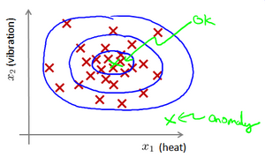
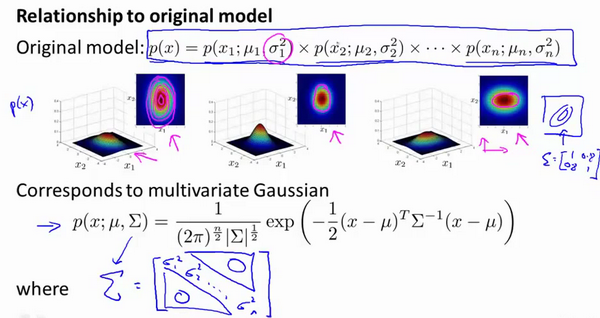

# 异常检测

[TOC]


## 1.异常检测的目的

异常检测是一种**非监督学习**，单从某些角度来看又类似于**监督学习**

- **问题的提出**

假想你是一个飞机引擎制造商，当你生产的飞机引擎从生产线上流出时，你需要进行**QA**(质量控制测试)，而作为这个测试的一部分，你测量了飞机引擎的一些特征变量，比如引擎运转时产生的热量，或者引擎的振动等等。

这样一来，你就有了一个数据集，从$x^{(1)}$到$x^{(m)}$，如果你生产了$m$个引擎的话，你将这些数据绘制成图表，看起来就是这个样子：



**每个点都是只有特征没有标签的数据**

有一个新的飞机引擎从生产线上流出，而你的新飞机引擎有特征变量$x_{test}$。所谓的异常检测问题就是：我们希望知道这个新的飞机引擎是否有某种异常，或者说，我们希望判断这个引擎是否需要进一步测试。


或者欺诈检测：

$x^{(i)} = {用户的第i个活动特征}$

模型$p(x)$ 为我们其属于一组数据的可能性，通过$p(x) < \varepsilon$检测非正常用户。

异常检测主要用来识别欺骗。


再一个例子是检测一个数据中心，特征可能包含：内存使用情况，被访问的磁盘数量，**CPU**的负载，网络的通信量等。根据这些特征可以构建一个模型，用来判断某些计算机是不是有可能出错了。

### 


- **异常检测**

给定数据集 $x^{(1)},x^{(2)},..,x^{(m)}$，我们假使数据集是正常的

我们希望知道新的数据 $x_{test}$ 是不是异常的，

我们所构建的模型应该能根据该测试数据的位置告诉我们其属于一组数据的可能性 $p(x)$。



在蓝色圈内的数据属于该组数据的可能性较高

而越是偏远的数据，其属于该组数据的可能性就越低。

这种方法称为密度估计，表达如下：
$$
if \quad p(x)
\begin{cases}
< \varepsilon & anomaly \\
> =\varepsilon & normal
\end{cases}
$$


## 2.高斯分布和异常检测算法

- **高斯分布（正太分布）**

    		$p(x,\mu,\sigma^2)=\frac{1}{\sqrt{2\pi}\sigma}\exp\left(-\frac{(x-\mu)^2}{2\sigma^2}\right)$

$\mu=\frac{1}{m}\sum\limits_{i=1}^{m}x^{(i)}​$  **均值**

$\sigma^2=\frac{1}{m}\sum\limits_{i=1}^{m}(x^{(i)}-\mu)^2$**标准差**

- **高斯分布异常检测算法**

每个特征X~j~应当都服从它自身的正态分布

​					$\mu_j=\frac{1}{m}\sum\limits_{i=1}^{m}x_j^{(i)}​$

​					$\sigma_j^2=\frac{1}{m}\sum\limits_{i=1}^m(x_j^{(i)}-\mu_j)^2$

一旦我们获得了平均值和方差的估计值，给定新的一个训练实例，根据模型计算 $p(x)$：每个特征出现概率的乘积

​	                $p(x)=\prod\limits_{j=1}^np(x_j;\mu_j,\sigma_j^2)=\prod\limits_{j=1}^1\frac{1}{\sqrt{2\pi}\sigma_j}exp(-\frac{(x_j-\mu_j)^2}{2\sigma_j^2})​$

当$p(x) < \varepsilon​$时，为异常。

下图是一个由两个特征的训练集，以及特征的分布情况：


## 3.开发和评估一个异常检测算法

异常检测算法是一个非监督学习算法，但是我们还是需要一小部分带有标签的数据集。

如：我们有10000台正常引擎的数据，有20台异常引擎的数据。 我们这样分配数据：

6000台正常引擎的数据作为训练集

2000台正常引擎和10台异常引擎的数据作为交叉检验集

2000台正常引擎和10台异常引擎的数据作为测试集


- **异常检测系统开发和评价过程：**

1. 根据测试集数据，我们估计特征的平均值和方差并构建$p(x)$函数
2. 对交叉检验集，我们尝试使用不同的$\varepsilon$值作为阀值，并预测数据是否异常，根据$F1$值或者查准率与查全率的比例来选择 $\varepsilon$
3. 选出 $\varepsilon$ 后，针对测试集进行预测，计算异常检验系统的$F1$值，或者查准率与查全率之比

## 4.异常检测VS监督学习

两者比较：

| 异常检测                                                     | 监督学习                                                     |
| ------------------------------------------------------------ | ------------------------------------------------------------ |
| 非常少量的正向类（异常数据 $y=1$）, 大量的负向类（$y=0$）    | 同时有大量的正向类和负向类                                   |
| 许多不同种类的异常。根据正向类数据来训练算法很难学习得到这些异常。 | 有足够多的正向类实例，足够用于训练 算法，未来遇到的正向类实例可能与训练集中的非常近似。 |
| 未来遇到的异常可能与已掌握的异常、非常的不同。               |                                                              |
| 例如： 欺诈行为检测 生产（例如飞机引擎）检测数据中心的计算机运行状况 | 例如：邮件过滤器 天气预报 肿瘤分类                           |

希望这节课能让你明白一个学习问题的什么样的特征，能让你把这个问题当做是一个异常检测，或者是一个监督学习的问题。另外，对于很多技术公司可能会遇到的一些问题，通常来说，正样本的数量很少，甚至有时候是0，也就是说，出现了太多没见过的不同的异常类型，那么对于这些问题，通常应该使用的算法就是异常检测算法。

## 5.异常检测的特征选择（增加新特征）

- **特征不服从正态分布**最好转换成正太分布，例如
  - x= log(x+c)$，其中 $c$ 为非负常数；
  -  $x=x^c$，$c$为 0-1 之间的一个分数，c可以从大到小自己试验

```python
：在python中，通常用`np.log1p()`函数，log1p就是 log(x+1)，可以避免出现负数结果，反向函数就是`np.expm1()`)
```


- **误差分析**

一些异常的数据也有可能有较高的P（x）概率

通常情况下是要要**增加特征**：

如下图只有X1时异常点在正常点群之中，但是增加了X2之后异常点就在点群之外了


在例如，cpu的负载和网络通信通常是成正比的，但是又一些异常的机器卡在死循环里，这种机器cpu负载很高，网络通信部高，于是我们可以用**CPU**负载与网络通信量的比例作为一个新的特征，如果该值异常地大，便有可能意味着该服务器是陷入了一些问题中。


增加新特征又会带来新的问题，就算离正常点群很远，但是我们的概率哈数P是每个特征独立乘积，其结果类似于圆形的等高线（红色）无法做到非线性的分类（蓝色），因此我们需要多元高斯分布，让两个特征不再是独立的

## 6.多元高斯分布

先回顾一元高斯分布

$p(x)=\prod\limits_{j=1}^np(x_j;\mu_j,\sigma_j^2)=\prod\limits_{j=1}^1\frac{1}{\sqrt{2\pi}\sigma_j}exp(-\frac{(x_j-\mu_j)^2}{2\sigma_j^2})​$

对于二元X1，X2来说

$\mu=\frac{1}{m}\sum_{i=1}^mx^{(i)}$

$\Sigma = \frac{1}{m}\sum_{i=1}^m(x^{(i)}-\mu)(x^{(i)}-\mu)^T=\frac{1}{m}(X-\mu)^T(X-\mu)$这个是协方差矩阵，等效于一元的标准差平方（方差）


多元高斯分布

$p(x)=\frac{1}{(2\pi)^{\frac{n}{2}}|\Sigma|^{\frac{1}{2}}}exp\left(-\frac{1}{2}(x-\mu)^T\Sigma^{-1}(x-\mu)\right)$


下面我们来看看协方差矩阵是如何影响模型的：


上图是5个不同的模型，从左往右依次分析：

1. 是一个一般的高斯分布模型
2. 通过协方差矩阵，令特征1拥有较小的偏差，同时保持特征2的偏差
3. 通过协方差矩阵，令特征2拥有较大的偏差，同时保持特征1的偏差
4. 通过协方差矩阵，在不改变两个特征的原有偏差的基础上，增加两者之间的正相关性
5. 通过协方差矩阵，在不改变两个特征的原有偏差的基础上，增加两者之间的负相关性

## 7 一元高斯VS多元高斯

- **一元高斯是多元高斯的特例**

$p(x)=\prod\limits_{j=1}^np(x_j;\mu_j,\sigma_j^2)=\prod\limits_{j=1}^1\frac{1}{\sqrt{2\pi}\sigma_j}exp(-\frac{(x_j-\mu_j)^2}{2\sigma_j^2})$

普通情况下，概率乘积意思是每个特征是独立的，也就是它们之间的协方差为0，所以普通一元高斯的乘积概率其实就是多元高斯协方差矩阵为对角阵的情形



- 模型的比较：

| 原高斯分布模型                                               | 多元高斯分布模型                                             |
| ------------------------------------------------------------ | ------------------------------------------------------------ |
| 不能捕捉特征之间的相关性 但可以通过将特征进行手动组合的方法来解决 | 自动捕捉特征之间的相关性                                     |
| 计算代价低，能适应大规模的特征                               | 计算代价较高 训练集较小时也同样适用                          |
| 适合所有大小的数据，即使m很小的情况                          | 必须要有 $m>n$，不然的话协方差矩阵$\Sigma$不可逆的，通常需要 $m>10n$ 另外特征冗余也会导致协方差矩阵不可逆 |

# python代码

- **二维特征，一元高斯分布**

```python
import numpy as np
import pandas as pd
import matplotlib.pyplot as plt
from scipy.io import loadmat
from scipy import stats

data = loadmat('./python代码/ex8-anomaly detection and recommendation/data/ex8data1.mat')
X = data['X']
# plt.figure(figsize=(10, 6), dpi=100)
# plt.scatter(X[:,0], X[:, 1])
# plt.show()

# 定义高斯分布的参数
def estimate_gaussian(X):
    mu = X.mean(axis=0)
    sigma = X.var(axis=0)

    return mu, sigma

# 带有标签的数据
Xval = data["Xval"]
yval = data['yval']
# 得到检验数据的均值和方差
mu, sigma = estimate_gaussian(X)
# 每个数据的概率密度
p = np.zeros((X.shape[0], X.shape[1]))
p[:,0] = stats.norm(mu[0], sigma[0]).pdf(X[:,0])
p[:,1] = stats.norm(mu[1], sigma[1]).pdf(X[:,1])

# 带有标签的数据 用样本的高斯分布的话得到的概率密度
pval = np.zeros((Xval.shape[0], Xval.shape[1]))
pval[:,0] = stats.norm(mu[0], sigma[0]).pdf(Xval[:,0])
pval[:,1] = stats.norm(mu[1], sigma[1]).pdf(Xval[:,1])
print( pval < pval.min())
# 需要一个函数找到最好的阈值，每个epsilon值计算F1分数
def select_threshold(pval, yval):
    best_epsilon = 0
    best_f1 = 0
    f1 = 0

    step = (pval.max() - pval.min()) / 1000

    for epsilon in np.arange(pval.min(), pval.max(), step):
        preds = pval < epsilon # 布尔数组，小于阈值的都是True

        tp = np.sum(np.logical_and(preds == 1, yval == 1)).astype(float)  # 真阳性
        fp = np.sum(np.logical_and(preds == 1, yval == 0)).astype(float)  # 预测是阳性，真实是0
        fn = np.sum(np.logical_and(preds == 0, yval == 1)).astype(float)  # 预测是0，真实是1

        precision = tp / (tp + fp)
        recall = tp / (tp + fn)
        f1 = (2 * precision * recall) / (precision + recall)

        if f1 > best_f1:
            best_f1 = f1
            best_epsilon = epsilon

    return best_epsilon, best_f1

# 得到最好的阈值和F1
epsilon, f1 = select_threshold(pval, yval)

# 运用到数据集
outliers = np.where(p < epsilon)

# 画图
fig, ax = plt.subplots(figsize=(12,8))
ax.scatter(X[:,0], X[:,1])
ax.scatter(X[outliers[0],0], X[outliers[0],1], s=50, color='r', marker='o')
plt.show()
```

