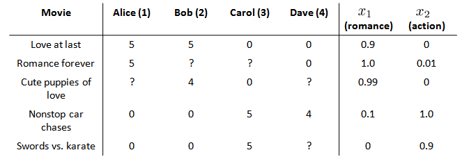

# 推荐算法

[TOC]


## 1.线性回归推荐算法

我们从一个例子开始定义推荐系统的问题。

假使我们是一个电影供应商，我们有 5 部电影和 4 个用户，我们要求用户为电影打分。



则每部电影都有一个特征向量，如$x^{(1)}$是第一部电影的特征向量为[0.9 0]。

下面引入一些标记：

- $n_u$ 代表用户的数量

- $n_m$ 代表电影的数量

- $r(i, j)​$ 如果用户j给电影 $i​$ 评过分则 $r(i,j)=1​$

- $y^{(i, j)}$ 代表用户 $j$ 给电影$i$的评分，当且仅当$r(i,j)=1$

- $m_j​$代表用户 $j​$ 评过分的电影的总数
- ${{\theta }^{(j)}}​$是第$j​$个用户的模型的参数向量。
- $x^{(i)}$电影 $i$ 的特征向量


- **推荐算法**

对于用户 $j$ 和电影 $i$，我们预测评分为：$(\theta^{(j)})^T x^{(i)}$

- **代价函数**

针对用户 $j$，该线性回归模型的代价为预测误差的平方和，加上正则化项：
$$
\min_{\theta (j)}\frac{1}{2}\sum_{i:r(i,j)=1}\left((\theta^{(j)})^Tx^{(i)}-y^{(i,j)}\right)^2+\frac{\lambda}{2}\left(\theta_{k}^{(j)}\right)^2
$$
该代价函数表示一个用户J对所有电影x的评价模型

其中 $i:r(i,j)$表示我们只计算那些用户 $j$ 评过分的电影。在一般的线性回归模型中，误差项和正则项应该都是乘以$1/2m$，在这里我们将$m$去掉。并且我们不对方差项$\theta_0$进行正则化处理。

**上面的代价函数只是针对一个用户的，为了学习所有用户，我们将所有用户的代价函数求和：**
$$
\min_{\theta^{(1)},...,\theta^{(n_u)}} \frac{1}{2}\sum_{j=1}^{n_u}\sum_{i:r(i,j)=1}\left((\theta^{(j)})^Tx^{(i)}-y^{(i,j)}\right)^2+\frac{\lambda}{2}\sum_{j=1}^{n_u}\sum_{k=1}^{n}(\theta_k^{(j)})^2
$$
该代价函数表示每个用户的评价模型求和，求得能够最小化J的所有${{\theta }^{(1)}}$，${{\theta }^{(2)}}$。。。。${{\theta }^{(j)}}$。。。。${{\theta }^{(n_u)}}​$


- **梯度下降**

如果我们要用梯度下降法来求解最优解，我们计算代价函数的偏导数后得到梯度下降的更新公式为：
$$
\theta_k^{(j)}:=\theta_k^{(j)}-\alpha\sum_{i:r(i,j)=1}((\theta^{(j)})^Tx^{(i)}-y^{(i,j)})x_{k}^{(i)} \quad (\text{for} \, k = 0)
$$

$$
\theta_k^{(j)}:=\theta_k^{(j)}-\alpha\left(\sum_{i:r(i,j)=1}((\theta^{(j)})^Tx^{(i)}-y^{(i,j)})x_{k}^{(i)}+\lambda\theta_k^{(j)}\right) \quad (\text{for} \, k\neq 0)
$$


## 2.协同过滤

- **知道特征X，求参数θ**

上文指出如果我们知道电影的一系列特征X，我们通过机器学习得到用户的参数θ

其代价函数为
$$
\min_{\theta^{(1)},...,\theta^{(n_u)}} \frac{1}{2}\sum_{j=1}^{n_u}\sum_{i:r(i,j)=1}\left((\theta^{(j)})^Tx^{(i)}-y^{(i,j)}\right)^2+\frac{\lambda}{2}\sum_{j=1}^{n_u}\sum_{k=1}^{n}(\theta_k^{(j)})^2
$$
该代价函数表示每个用户的评价模型求和，求得能够最小化J的所有${{\theta }^{(1)}}$，${{\theta }^{(2)}}$。。。。${{\theta }^{(j)}}$。。。。${{\theta }^{(n_u)}}$


- **知道参数θ求特征X**

其代价函数为（未知数和参数对换了位置）
$$
\mathop{min}\limits_{x^{(1)},...,x^{(n_m)}}\frac{1}{2}\sum_{i=1}^{n_m}\sum_{j{r(i,j)=1}}((\theta^{(j)})^Tx^{(i)}-y^{(i,j)})^2+\frac{\lambda}{2}\sum_{i=1}^{n_m}\sum_{k=1}^{n}(x_k^{(i)})^2
$$
但是如果我们既没有用户的


- **既不知道特征X也不知道参数θ**

但是如果我们既没有用户的参数，也没有电影的特征，这两种方法都不可行了。**协同过滤算法**可以同时学习这两者。

代价函数变为

**我们的优化目标便改为同时针对$x$和$\theta$进行。（X和θ）交替变换角色**

给定$\theta^{(1)},...,\theta^{(n_u)}$，估计$x^{(1)},...,x^{(n_m)}$：

同时最小化$x^{(1)},...,x^{(n_m)}$和$\theta^{(1)},...,\theta^{(n_u)}$：
$$
J(x^{(1)},...,x^{(n_m)},\theta^{(1)},...,\theta^{(n_u)})=\frac{1}{2}\sum_{(i,j):r(i,j)=1}((\theta^{(j)})^Tx^{(i)}-y^{(i,j)})^2+\frac{\lambda}{2}\sum_{i=1}^{n_m}\sum_{k=1}^{n}(x_k^{(i)})^2+\frac{\lambda}{2}\sum_{j=1}^{n_u}\sum_{k=1}^{n}(\theta_k^{(j)})^2
$$

$$
\min_{x^{(1)},...,x^{(n_m)} \\\ \theta^{(1)},...,\theta^{(n_u)}}J(x^{(1)},...,x^{(n_m)},\theta^{(1)},...,\theta^{(n_u)})
$$

对代价函数求偏导数的结果如下：
$$
x_k^{(i)}:=x_k^{(i)}-\alpha\left(\sum_{j:r(i,j)=1}((\theta^{(j)})^Tx^{(i)}-y^{(i,j)})\theta_k^{j}+\lambda x_k^{(i)}\right)
$$

$$
\theta_k^{(i)}:=\theta_k^{(i)}-\alpha\left(\sum_{i:r(i,j)=1}((\theta^{(j)})^Tx^{(i)}-y^{(i,j)})x_k^{(i)}+\lambda \theta_k^{(j)}\right)
$$

注：在协同过滤从算法中，我们通常不使用偏置项，如果需要的话，算法会自动学得。
协同过滤算法使用步骤如下：

1. 初始 $x^{(1)},x^{(1)},...x^{(nm)},\ \theta^{(1)},\theta^{(2)},...,\theta^{(n_u)}$为一些随机小值
2. 使用梯度下降算法最小化代价函数
3. 在训练完算法后，我们预测$(\theta^{(j)})^Tx^{(i)}$为用户 $j$ 给电影 $i$ 的评分

## 3.协同过滤算法向量化

如果我们有4个用户，5部电影如下图


| **Movie**            | **Alice (1)** | **Bob (2)** | **Carol (3)** | **Dave (4)** |
| -------------------- | ------------- | ----------- | ------------- | ------------ |
| Love at last         | 5             | 5           | 0             | 0            |
| Romance forever      | 5             | ?           | ?             | 0            |
| Cute puppies of love | ?             | 4           | 0             | ?            |
| Nonstop car chases   | 0             | 0           | 5             | 4            |
| Swords vs. karate    | 0             | 0           | 5             | ?            |

那么我们的y评分矩阵是


假设函数矩阵应该是


- **推荐电影**

电影 $i$ 有一个特征向量$x^{(i)}$，你是否能找到一部不同的电影 $j$，保证两部电影的特征向量之间的距离$x^{(i)}$和$x^{(j)}$很小，那就能很有力地表明电影$i$和电影 $j$ 在某种程度上有相似，至少在某种意义上，某些人喜欢电影 $i$，或许更有可能也对电影 $j$ 感兴趣。

例如，如果一位用户正在观看电影 $x^{(i)}$，我们可以寻找另一部电影$x^{(j)}$，依据两部电影的特征向量之间的距离$\left\| {{x}^{(i)}}-{{x}^{(j)}} \right\|$的大小。找到向量最小的电影推荐给他

## 4.均值归一化的好处

我们一般都会用均值来归一化处理评分数据，这样做是有好处的

比如说多了一个用户，但是他没有给任何一个电影评分


如果不归一化，我们训练出来的θ~5~就全部是0，


我们首先需要对结果 $Y $矩阵进行均值归一化处理，将每一个用户对某一部电影的评分减去所有用户对该电影评分的平均值：


然后我们利用这个新的 $Y$ 矩阵来训练算法。
如果我们要用新训练出的算法来预测评分，则需要将平均值重新加回去，预测$(\theta^{(j)})^T x^{(i)}+\mu_i$，对于**Eve**，我们的新模型会认为她给每部电影的评分都是该电影的平均分。

这样我们对新的电影评分时候就会合理许多，否则会有一个0分存在。

# 这个程序梯度下降有问题，代价函数是增大的

```python
import numpy as np
import pandas as pd
import matplotlib.pyplot as plt
from scipy.io import loadmat
from scipy.optimize import minimize

data = loadmat('./python代码/ex8-anomaly detection and recommendation/data/ex8_movies.mat')
Y = data['Y']  # (1682, 943)  这是943人给1682个电影评分
R = data['R']  # (1682, 943)  这是是否给电影评分，评分了则为1


params_data = loadmat('./python代码/ex8-anomaly detection and recommendation/data/ex8_movieParams.mat')
X = params_data['X']  # (1682, 10),
Theta = params_data['Theta']  # (943, 10)


def cost(params, Y, R, num_features, learning_rate):

    num_movies = Y.shape[0]
    num_users = Y.shape[1]

    # reshape the parameter array into parameter matrices
    X = np.reshape(params[:num_movies * num_features], (num_movies, num_features))  # (1682, 10)
    Theta = np.reshape(params[num_movies * num_features:], (num_users, num_features))  # (943, 10)

    # initializations
    J = 0
    X_grad = np.zeros(X.shape)  # (1682, 10)
    Theta_grad = np.zeros(Theta.shape)  # (943, 10)

    # compute the cost
    error = np.multiply((X @ Theta.T) - Y, R)  # (1682, 943)
    squared_error = np.power(error, 2)  # (1682, 943)
    J = (1. / 2) * np.sum(squared_error)

    # add the cost regularization
    J = J + ((learning_rate / 2) * np.sum(np.power(Theta, 2)))
    J = J + ((learning_rate / 2) * np.sum(np.power(X, 2)))

    # calculate the gradients with regularization
    X_grad = (error @ Theta) + (learning_rate * X)
    Theta_grad = (error.T @ X) + (learning_rate * Theta)
    grad = np.concatenate((np.ravel(X_grad), np.ravel(Theta_grad)))

    return J, grad


# 这是一个电影名字的txt文件
movie_idx = {}
f = open('./python代码/ex8-anomaly detection and recommendation/data/movie_ids.txt',encoding= 'gbk')
for line in f:
    tokens = line.split(' ')
    tokens[-1] = tokens[-1][:-1] # 去掉换行符
    movie_idx[int(tokens[0]) - 1] = ' '.join(tokens[1:]) # 拼接起来放入电影列表

# 使用给定的评分
ratings = np.zeros((1682, 1))

ratings[0] = 4
ratings[6] = 3
ratings[11] = 5
ratings[53] = 4
ratings[63] = 5
ratings[65] = 3
ratings[68] = 5
ratings[97] = 2
ratings[182] = 4
ratings[225] = 5
ratings[354] = 5

R = data['R']
Y = data['Y']
# 添加一行我们自己设置的电影评分
Y = np.append(Y, ratings, axis=1)
R = np.append(R, ratings != 0, axis=1)

movies = Y.shape[0]  # 1682
users = Y.shape[1]  # 944
features = 10
learning_rate = 0.1
# 随机初始化
X = np.random.random(size=(movies, features))
Theta = np.random.random(size=(users, features))
params = np.concatenate((np.ravel(X), np.ravel(Theta)))
# 算平均值
Ymean = np.zeros((movies, 1))
Ynorm = np.zeros((movies, users))

for i in range(movies):
    idx = np.where(R[i,:] == 1)[0]
    Ymean[i] = Y[i,idx].mean()
    Ynorm[i,idx] = Y[i,idx] - Ymean[i]
print(Ymean.shape)
# 优化
fmin = minimize(fun=cost, x0=params, args=(Ynorm, R, features, learning_rate),
                method='CG', jac=True, options={'maxiter': 1000})

X = np.reshape(fmin.x[:movies * features], (movies, features))
Theta = np.reshape(fmin.x[movies * features:], (users, features))
## 算一下计算完的代价
error = np.multiply((X @ Theta.T) - Y, R)  # (1682, 943)
squared_error = np.power(error, 2)  # (1682, 943)
J = (1. / 2) * np.sum(squared_error)

# add the cost regularization
J = J + ((learning_rate / 2) * np.sum(np.power(Theta, 2)))
J = J + ((learning_rate / 2) * np.sum(np.power(X, 2)))
print(J)
# 我们自己预测
predictions = X @ Theta.T
my_preds = predictions[:, -1] + Ymean.flatten()
print(my_preds.shape)
#
sorted_preds = np.sort(my_preds, axis=0)[::-1]
print(sorted_preds.shape)


idx = np.argsort(my_preds, axis=0)[::-1]
print(idx)
print("Top 10 movie predictions:")
for i in range(10):
    j = int(idx[i])
    print('Predicted rating of {0} for movie {1}.'.format(str(float(my_preds[j])), movie_idx[j]))
```

